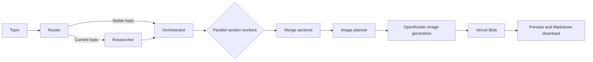

# Agent Writer

Agent Writer is a FastAPI and LangGraph application that turns a topic into a researched, illustrated Markdown article. It plans the article, writes sections in parallel, generates useful diagrams, stores all generated assets in Vercel Blob, and returns a browser preview with a downloadable Markdown file.

## Features

- Research-aware routing for stable and time-sensitive topics
- Tavily research with normalized, deduplicated evidence
- Structured article planning with Pydantic validation
- Parallel section writing with LangGraph `Send`
- Article-aware image planning and placement
- Diagram generation through OpenRouter
- Durable image and Markdown storage in Vercel Blob
- Optional PostgreSQL-backed LangGraph checkpoints
- Responsive FastAPI/Jinja web interface

## Architecture



Each request receives a unique thread ID. The same ID namespaces its images and Markdown document under `articles/<thread-id>/` in Vercel Blob, preventing collisions between generations.

## Technology

| Layer | Technology |
|---|---|
| API and web UI | FastAPI, Jinja2 |
| Agent workflow | LangGraph |
| Model integration | LangChain OpenAI through OpenRouter |
| Research | Tavily |
| Generated asset storage | Vercel Blob |
| Optional checkpoint persistence | PostgreSQL |

## Project Structure

```text
.
├── app.py               # FastAPI application and HTTP routes
├── backend.py           # LangGraph workflow and Blob persistence
├── templates/
│   └── index.html       # Browser interface and Markdown renderer
├── requirements.txt     # Production Python dependencies
├── vercel.json          # Vercel function configuration
├── .vercelignore        # Files excluded from deployments
└── .env.example         # Required environment variables
```

The `images/` and `outputs/` directories are intentionally not used. Runtime-generated files belong in Vercel Blob because Vercel Function filesystems are not durable application storage.

## Local Development

Create and activate a virtual environment:

```powershell
python -m venv .venv
.\.venv\Scripts\Activate.ps1
```

Install dependencies with pip:

```powershell
python -m pip install -r requirements.txt
```

Copy the environment template and fill in your credentials:

```powershell
Copy-Item .env.example .env
```

Required values:

```dotenv
OPENROUTER_API_KEY=your_openrouter_api_key
TAVILY_API_KEY=your_tavily_api_key
BLOB_READ_WRITE_TOKEN=your_vercel_blob_read_write_token
```

Run the app with the FastAPI CLI:

```powershell
fastapi dev app.py --port 8001
```

Open <http://127.0.0.1:8001>.

## Deploy to Vercel

Vercel automatically detects the `app` instance exported from `app.py`.

1. Link the repository to a Vercel project:

   ```powershell
   vercel link
   ```

2. In the Vercel dashboard, create a **public Blob store** and connect it to this project. Vercel adds `BLOB_READ_WRITE_TOKEN` to the project automatically.

3. Add these project environment variables for Production and Preview:

   - `OPENROUTER_API_KEY`
   - `TAVILY_API_KEY`
   - `BLOB_READ_WRITE_TOKEN`
   - `EXTERNAL_DATABASE_URL` (optional)

4. Test with Vercel's local runtime:

   ```powershell
   vercel dev
   ```

5. Deploy a preview or production build:

   ```powershell
   vercel
   vercel --prod
   ```

Alternatively, import the GitHub repository in Vercel. Every push to the production branch will then trigger a deployment.

The generation endpoint can make several model and image requests, so `vercel.json` gives the FastAPI function the Hobby plan's 300-second maximum duration.

## API

### Generate an article

```http
POST /api/generate
Content-Type: application/json
```

```json
{
  "topic": "How LangGraph coordinates parallel AI agents"
}
```

Example response:

```json
{
  "markdown": "# Generated article...",
  "output_url": "https://store.public.blob.vercel-storage.com/articles/thread-id/article.md?download=1",
  "thread_id": "unique-checkpoint-thread"
}
```

### Health check

```http
GET /health
```

## Production Notes

- Images use immutable, year-long Blob caching and unique filenames.
- Markdown downloads use a shorter cache lifetime and a human-readable filename.
- Image-generation failures are rendered as notices inside the article; they do not discard the completed text.
- Without `EXTERNAL_DATABASE_URL`, checkpoints use in-memory storage and should not be treated as durable across Vercel instances.
- The Blob store is public because generated images must load directly in the article preview. Do not store sensitive content there.
