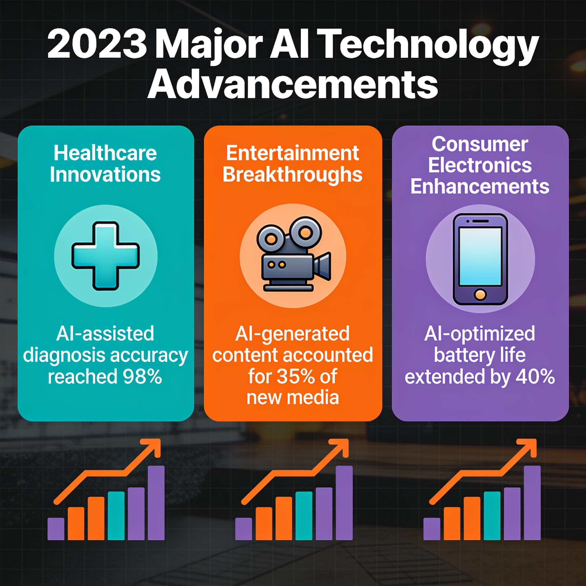
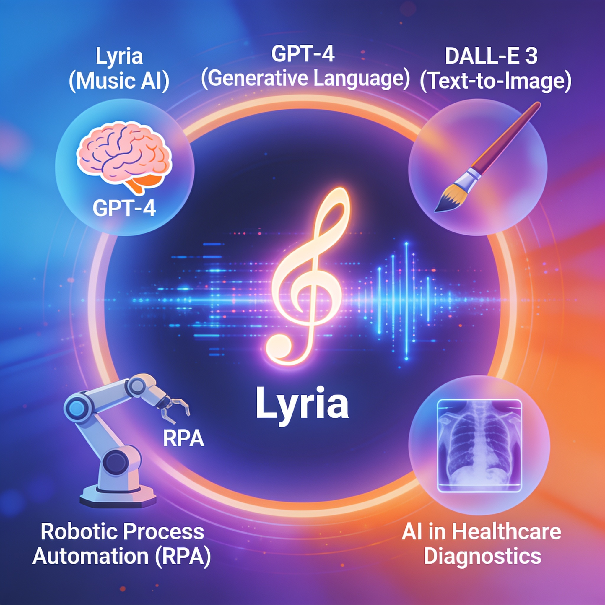
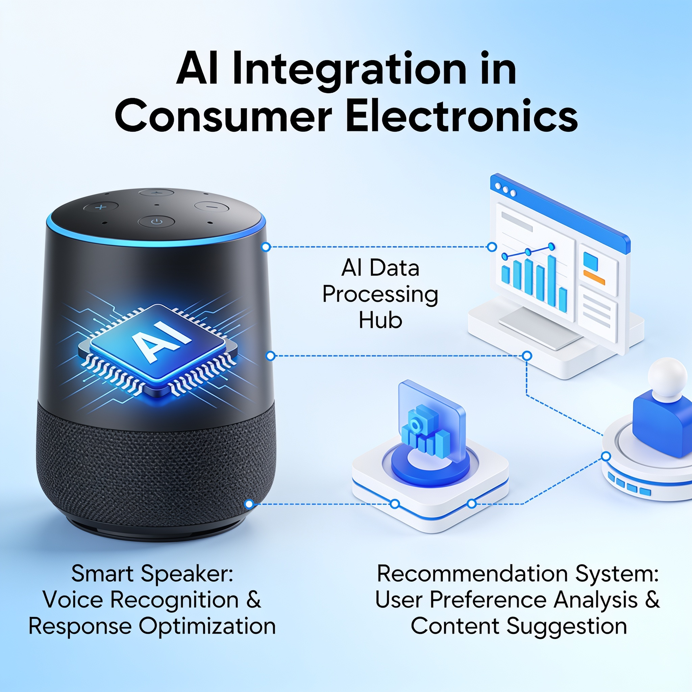

# Highlights from 2023: Recent Advancements in AI

## Introduction to AI Landscape in 2023

The year 2023 has proven to be a transformative period for artificial intelligence, ballooning its significance across various sectors and reshaping how we interact with technology. The advancements in AI have not only enhanced user experiences but have fundamentally altered operational approaches in industries ranging from healthcare to entertainment. 

Recent breakthroughs in generative AI have captured widespread attention, culminating in tools that facilitate everything from music creation to more personalized online shopping experiences. Industry giants are now integrating AI capabilities into their core services, exemplified by the increasing prevalence of AI-driven applications such as ChatGPT and advanced digital marketing solutions. 

Various sectors have felt the ripple effects of these technologies. In healthcare, for instance, AI is aiding in treatment planning and diagnosis, while in climate science, AI is refining predictive modeling for better resource management. As we delve into the specifics of these advancements, it is evident that 2023 is not merely a continuation of AI evolution—it is a pivotal chapter in its history, characterized by rapid adoption and legal considerations aimed at shaping a responsible future.

*The transformative impact of AI across various sectors in 2023.*
## Key Advances in AI Technologies

The landscape of artificial intelligence saw remarkable innovations in 2023, reinforcing its role as a cornerstone of modern technology. One of the standout introductions was **Lyria**, a state-of-the-art AI music generator that has captivated musicians and enthusiasts alike. Developed by leading AI researchers, Lyria leverages advanced neural networks to create diverse musical pieces that can adapt to users' preferences and moods. This development signals a new era of creativity where AI collaborates with artists, expanding the possibilities of music composition.

In addition to advancements in creative applications, 2023 also witnessed **significant improvements in graph algorithms and clustering techniques**. These enhancements have facilitated more efficient data analysis and pattern recognition, paving the way for innovations in various domains, from social network analysis to fraud detection. For instance, new algorithms allow businesses to process and interpret massive datasets faster than ever, providing real-time insights that were previously unattainable.

Moreover, the year marked a **flourishing emergence of generative AI** technologies across multiple industries. From content creation to simulations in healthcare, companies are integrating generative models to automate and enhance workflows. This has led to increased efficiency, as businesses harness AI to generate reports, design prototypes, and even draft marketing content. Notably, organizations that adopt generative AI have reported higher productivity levels, significantly streamlining complex processes.

As AI continues to evolve, it stands poised to transform not just technology sectors but the very fabric of our day-to-day interactions with digital systems. These advancements are just the tip of the iceberg, indicating a future where AI is fundamental to innovation and creative expression across all fields.

*Notable advances in AI technologies, showcasing tools like Lyria.*
## Impact of AI on Consumer Electronics

In 2023, the incorporation of artificial intelligence (AI) into consumer electronics reached unprecedented levels, significantly reshaping how users interact with technology. One of the standout advancements was **AI-driven personalization in online shopping experiences**. Retail platforms now leverage sophisticated algorithms to analyze user behavior, enabling them to offer tailored product recommendations that resonate deeply with individual preferences. As a result, shopping has become more intuitive and engaging, enhancing customer satisfaction and maximizing sales potential.

Simultaneously, **content streaming platforms** have experienced dramatic improvements through AI algorithms. Streaming giants are employing machine learning models to refine their recommendation systems, which now consider various factors, including viewing habits, time of day, and even mood indicators inferred from user interactions. This has not only led to an elevated user experience but also a greater retention rate as customers are presented with content that feels uniquely curated for them.

Moreover, the **increased integration of AI technologies in smart devices** has become commonplace in 2023. From smart speakers adapting to user preferences to home security systems that learn and optimize their functionality, AI now permeates our daily lives. Devices can communicate seamlessly, delivering an interconnected experience that enhances usability and automation. Such advancements demonstrate that AI is not just a trend but a foundational component that is transforming consumer electronics for the better.

As we reflect on 2023, it's clear that AI is steering consumer electronics into a new era, giving users smarter, more responsive technologies designed to meet their evolving demands. For a deeper dive, you can check out resources from [AI4 Blog](https://blog.ai4.io/highlights-from-2023-notable-advancements-in-ai) and [DeepMind](https://deepmind.google/blog/2023-a-year-of-groundbreaking-advances-in-ai-and-computing).

*The evolution of consumer electronics driven by AI integration in 2023.*
## Examples of AI Applications

The advancements in AI technology have surged across various sectors in 2023, yielding practical applications that enhance efficiency, improve outcomes, and address global challenges. Here are some noteworthy examples:

### AI-Assisted Treatment Planning in Healthcare
AI is revolutionizing patient care through advanced treatment planning systems. By analyzing patient data, AI algorithms can suggest personalized treatment options that lead to improved outcomes. As highlighted in a recent report, AI-assisted planning not only optimizes treatment effectiveness but also reduces the overall cost of care, enabling healthcare providers to deliver better services to their patients while managing resources more effectively.

### Autonomous Vehicles on the Rise
The automotive industry has witnessed a remarkable leap forward with the development of autonomous vehicles. In 2023, we are seeing these smart cars making strides toward mainstream adoption. Various companies have successfully tested self-driving prototypes in urban environments, demonstrating their potential to enhance safety and reduce traffic congestion. With regulatory frameworks evolving, the integration of AI technologies into everyday transport seems imminent.

### AI in Climate Modeling
Moreover, AI's role in climate science is becoming increasingly prominent. Researchers are utilizing AI to enhance climate modeling, allowing for more accurate predictions and effective disaster management strategies. AI tools can process vast amounts of environmental data, enabling scientists to simulate climate patterns better and identify areas most at risk. These insights are critical for developing proactive measures against climate-related disasters, ultimately supporting global sustainability efforts.

As we continue to observe these trends, the integration of AI into various industries is not just a possibility—it’s rapidly becoming reality, shaping the future of technology and society.
## Common Mistakes in AI Implementation

As organizations race to adopt AI technologies, they often stumble over common pitfalls that can hinder their success. Understanding these mistakes is crucial for leveraging AI's full potential.

### 1. Inadequate Training for Staff

One of the most significant errors organizations make when implementing AI tools is failing to adequately train their staff. AI solutions are only as effective as the people who operate them. Lack of proper training can lead to underutilization of these sophisticated systems and could expose the organization to data mishandling and operational inefficiencies. Therefore, investing in comprehensive training programs is essential to help employees navigate and maximize the capabilities of AI technologies.

### 2. Neglecting Data Quality

Data is the backbone of any AI initiative; without it, even the best algorithms are rendered useless. Organizations frequently overlook the importance of data quality, leading to suboptimal outcomes from their AI systems. Poor-quality data can result in inaccurate predictions and biased algorithms, undermining trust in AI solutions. Thus, prioritizing data governance practices and maintaining high-quality datasets is imperative for successful AI operations.

### 3. Overlooking Ethical Implications

With great power comes great responsibility. While deploying AI technologies, organizations often neglect the ethical implications inherent in their use. Issues such as bias, privacy concerns, and the impact of automation on employment are critical to consider. Failing to address these ethical dimensions can lead to reputational damage and regulatory repercussions. Companies should proactively engage with ethical guidelines and frameworks to ensure that their AI systems are not only effective but also responsible. 

By recognizing and addressing these common mistakes, organizations can better position themselves to harness the full capabilities of AI technologies and drive meaningful transformation in their processes and offerings.
## AI Legislation Trends in 2023

As artificial intelligence continues to reshape industries and daily life, 2023 marked a significant surge in legislative efforts, with over 800 AI-related bills introduced across various states in the U.S. This wave of proposed legislation underscores a growing recognition of the necessity for regulatory frameworks that promote the safe and ethical deployment of AI technologies. 

The urgency for regulation stems from the potential risks associated with AI, including privacy concerns, job displacement, and ethical dilemmas that arise from biased algorithms. Lawmakers are acutely aware that without proper oversight, the rapid advancement of AI can lead to unintended consequences, prompting them to take proactive measures to safeguard both consumers and the integrity of the technology itself.

A key challenge for legislators is striking the right balance between fostering innovation and implementing ethical considerations. While the potential for AI to drive economic growth and enhance productivity is immense, it is equally crucial to ensure that these advancements align with societal values. This means crafting policies that not only encourage technological progress but also address the ethical implications, such as transparency, accountability, and fairness within AI systems.

As we move forward, the ongoing dialogue between technologists, legislators, and the public will be vital in shaping a landscape where AI can thrive without compromising safety or ethical standards. This pivotal moment in AI legislation reflects a collective commitment to navigate the complexities of this transformative technology, ensuring that its benefits are realized responsibly and equitably.
## Conclusion: The Future of AI Beyond 2023

As we reflect on the transformative impacts of AI in various fields during 2023, it’s clear that this technology is reshaping the fabric of our daily lives. From enhanced personalization of online experiences to advances in autonomous vehicles, AI has bridged the gap between complex algorithms and user-friendly applications. It's vital for industry professionals and tech enthusiasts to maintain awareness and actively adapt to these evolving AI technologies, ensuring that society harnesses the benefits while mitigating potential risks.

Looking forward, we can anticipate ongoing developments that may pave the way for even more profound innovations. The surge in regulatory discussions, with over 800 bills introduced in response to AI's rapid growth, suggests a landscape where responsible AI practices will be prioritized. The journey does not end here; as we step into the future, the role of AI in shaping industries will only become more pronounced, inspiring further exploration and collaboration across sectors.