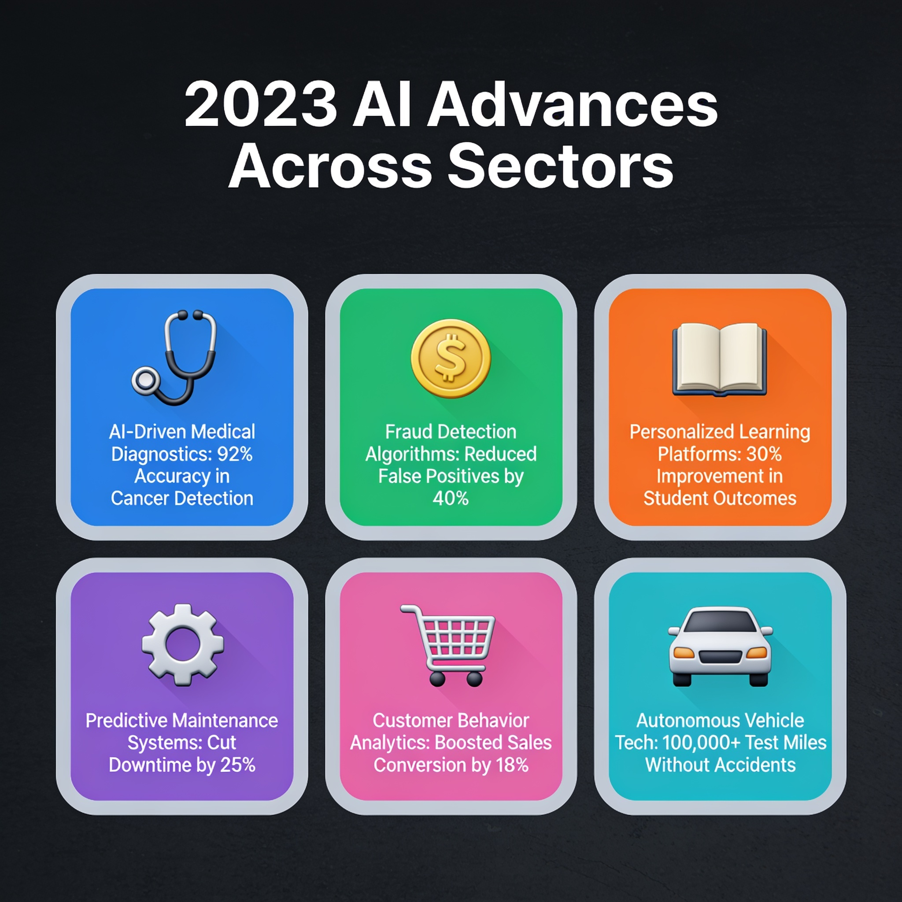
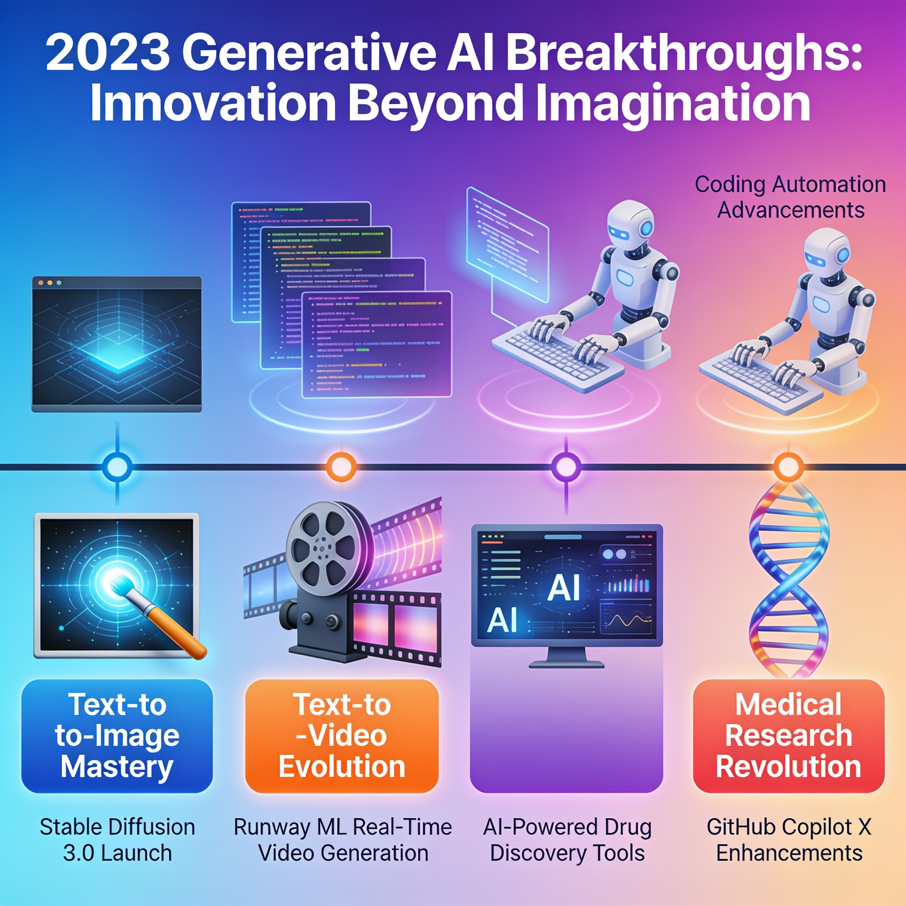
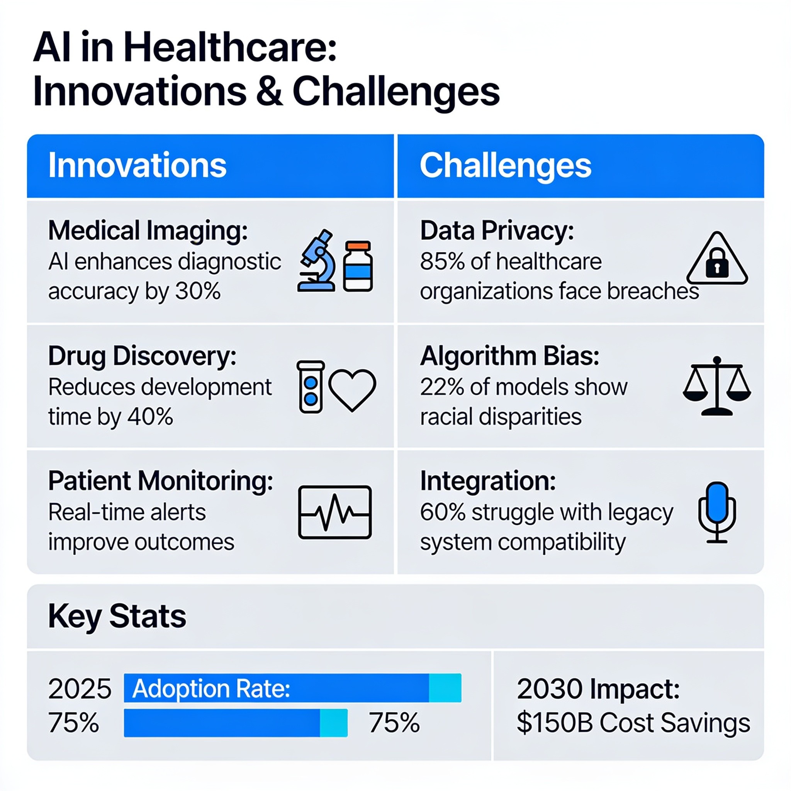

# Recent Advances in AI: Exploring Key Innovations of 2023

## Introduction to AI Advances in 2023

*Recent developments in AI were influential in many sectors in 2023.*

2023 has emerged as a pivotal year in the evolution of artificial intelligence, showcasing remarkable advancements that have influenced numerous sectors. A significant trend has been the rise of generative AI, which is revolutionizing natural language processing and content creation. This technology is not just a novelty; it's becoming essential for businesses looking to enhance their customer engagement and content strategies by enabling automated yet personalized interactions.

Moreover, the implications of AI advancements extend to daily technology applications, impacting everything from productivity tools to consumer services. As AI increasingly integrates into everyday tasks, its ability to streamline workflows and deliver insights is reshaping both personal and professional environments. Embracing these developments is crucial for organizations and individuals aiming to thrive in an increasingly AI-driven landscape.

## Introduction to AI Advances in 2023

2023 has emerged as a pivotal year in the evolution of artificial intelligence, showcasing remarkable advancements that have influenced numerous sectors. A significant trend has been the rise of generative AI, which is revolutionizing natural language processing and content creation. This technology is not just a novelty; it's becoming essential for businesses looking to enhance their customer engagement and content strategies by enabling automated yet personalized interactions.

Moreover, the implications of AI advancements extend to daily technology applications, impacting everything from productivity tools to consumer services. As AI increasingly integrates into everyday tasks, its ability to streamline workflows and deliver insights is reshaping both personal and professional environments. Embracing these developments is crucial for organizations and individuals aiming to thrive in an increasingly AI-driven landscape.

## Introduction to Recent AI Advances

The year 2023 marked a significant turning point in the realm of artificial intelligence, with its influence expanding across diverse sectors including healthcare, finance, and entertainment. This evolution underscores the essential role AI now plays in powering innovations that enhance productivity and effectiveness in various industries. 

One of the most prominent advancements has been the rise of generative AI, which enables models to generate human-like text, images, and other content. Tools like GPT-4 and Claude 2, for instance, have revolutionized creative content generation, showcasing remarkable improvements in their coding, mathematical reasoning, and overall chatbot interactions. This surge in capability has not only broadened the application landscape but also fueled a competitive race among leading tech firms striving to harness generative AI for business advantage.

In parallel, data-driven personalization has emerged as a cornerstone for user engagement, especially in online shopping and content streaming platforms. AI systems are adept at parsing vast datasets to tailor experiences according to individual user preferences, significantly enhancing satisfaction and interaction. This dual focus on generative capabilities and personalized user engagement emphasizes the transformative potential of AI technologies in reshaping customer experiences and driving business growth. For a deeper analysis of these themes, you can refer to the detailed insights provided in [A Comprehensive Overview of 2023's AI Advancements](https://medium.com/@ahmadsherkawi24/a-comprehensive-overview-of-2023s-ai-advancements-27e9af372786) and [Highlights from 2023: Notable Advancements in AI](https://blog.ai4.io/highlights-from-2023-notable-advancements-in-ai).

## Introduction to AI Advances in 2023

2023 has emerged as a pivotal year in the evolution of artificial intelligence, showcasing remarkable advancements that have influenced numerous sectors. A significant trend has been the rise of generative AI, which is revolutionizing natural language processing and content creation. This technology is not just a novelty; it's becoming essential for businesses looking to enhance their customer engagement and content strategies by enabling automated yet personalized interactions.

Moreover, the implications of AI advancements extend to daily technology applications, impacting everything from productivity tools to consumer services. As AI increasingly integrates into everyday tasks, its ability to streamline workflows and deliver insights is reshaping both personal and professional environments. Embracing these developments is crucial for organizations and individuals aiming to thrive in an increasingly AI-driven landscape.

## Introduction to AI Advances in 2023

2023 has emerged as a pivotal year in the evolution of artificial intelligence, showcasing remarkable advancements that have influenced numerous sectors. A significant trend has been the rise of generative AI, which is revolutionizing natural language processing and content creation. This technology is not just a novelty; it's becoming essential for businesses looking to enhance their customer engagement and content strategies by enabling automated yet personalized interactions.

Moreover, the implications of AI advancements extend to daily technology applications, impacting everything from productivity tools to consumer services. As AI increasingly integrates into everyday tasks, its ability to streamline workflows and deliver insights is reshaping both personal and professional environments. Embracing these developments is crucial for organizations and individuals aiming to thrive in an increasingly AI-driven landscape.

## Introduction to Recent AI Advances

The year 2023 marked a significant turning point in the realm of artificial intelligence, with its influence expanding across diverse sectors including healthcare, finance, and entertainment. This evolution underscores the essential role AI now plays in powering innovations that enhance productivity and effectiveness in various industries. 

One of the most prominent advancements has been the rise of generative AI, which enables models to generate human-like text, images, and other content. Tools like GPT-4 and Claude 2, for instance, have revolutionized creative content generation, showcasing remarkable improvements in their coding, mathematical reasoning, and overall chatbot interactions. This surge in capability has not only broadened the application landscape but also fueled a competitive race among leading tech firms striving to harness generative AI for business advantage.

In parallel, data-driven personalization has emerged as a cornerstone for user engagement, especially in online shopping and content streaming platforms. AI systems are adept at parsing vast datasets to tailor experiences according to individual user preferences, significantly enhancing satisfaction and interaction. This dual focus on generative capabilities and personalized user engagement emphasizes the transformative potential of AI technologies in reshaping customer experiences and driving business growth. For a deeper analysis of these themes, you can refer to the detailed insights provided in [A Comprehensive Overview of 2023's AI Advancements](https://medium.com/@ahmadsherkawi24/a-comprehensive-overview-of-2023s-ai-advancements-27e9af372786) and [Highlights from 2023: Notable Advancements in AI](https://blog.ai4.io/highlights-from-2023-notable-advancements-in-ai).

## Introduction: The AI Landscape in 2023

The rapid development of AI technologies over the past decade has culminated in a remarkable year for the field in 2023, marked by significant milestones that are reshaping industries. Key advancements include the rise of generative AI—highlighted by models like Claude 2 and Gemini—which have demonstrated improvements in natural language understanding and multimodal processing. This progress reflects a trend toward more sophisticated AI applications capable of handling diverse tasks ranging from text and image generation to complex reasoning and interaction.

The year also saw notable improvements in machine learning techniques, enhancing model performance and accessibility. For instance, frameworks that support federated learning are gaining traction, promising improved privacy and collaboration across devices. As businesses increasingly adopt AI solutions, the implications for various sectors such as healthcare, retail, and automotive are profound. In healthcare, AI-driven diagnostics are streamlining patient care; in retail, personalized shopping experiences powered by machine learning are changing consumer engagement; and in the automotive industry, AI advancements are paving the way for autonomous driving technologies.

These developments are not merely technical achievements; they are fundamentally transforming real-world applications and enriching consumer experiences. As organizations integrate AI into their operations, the technology’s potential to optimize processes and deliver greater value to users becomes increasingly evident. The innovations of 2023 are setting the groundwork for future advancements, suggesting that the AI landscape will continue to evolve at an unprecedented pace.

## Introduction to AI Advances in 2023

2023 has emerged as a pivotal year in the evolution of artificial intelligence, showcasing remarkable advancements that have influenced numerous sectors. A significant trend has been the rise of generative AI, which is revolutionizing natural language processing and content creation. This technology is not just a novelty; it's becoming essential for businesses looking to enhance their customer engagement and content strategies by enabling automated yet personalized interactions.

Moreover, the implications of AI advancements extend to daily technology applications, impacting everything from productivity tools to consumer services. As AI increasingly integrates into everyday tasks, its ability to streamline workflows and deliver insights is reshaping both personal and professional environments. Embracing these developments is crucial for organizations and individuals aiming to thrive in an increasingly AI-driven landscape.

## Introduction to AI Advances in 2023

2023 has emerged as a pivotal year in the evolution of artificial intelligence, showcasing remarkable advancements that have influenced numerous sectors. A significant trend has been the rise of generative AI, which is revolutionizing natural language processing and content creation. This technology is not just a novelty; it's becoming essential for businesses looking to enhance their customer engagement and content strategies by enabling automated yet personalized interactions.

Moreover, the implications of AI advancements extend to daily technology applications, impacting everything from productivity tools to consumer services. As AI increasingly integrates into everyday tasks, its ability to streamline workflows and deliver insights is reshaping both personal and professional environments. Embracing these developments is crucial for organizations and individuals aiming to thrive in an increasingly AI-driven landscape.

## Introduction to Recent AI Advances

The year 2023 marked a significant turning point in the realm of artificial intelligence, with its influence expanding across diverse sectors including healthcare, finance, and entertainment. This evolution underscores the essential role AI now plays in powering innovations that enhance productivity and effectiveness in various industries. 

One of the most prominent advancements has been the rise of generative AI, which enables models to generate human-like text, images, and other content. Tools like GPT-4 and Claude 2, for instance, have revolutionized creative content generation, showcasing remarkable improvements in their coding, mathematical reasoning, and overall chatbot interactions. This surge in capability has not only broadened the application landscape but also fueled a competitive race among leading tech firms striving to harness generative AI for business advantage.

In parallel, data-driven personalization has emerged as a cornerstone for user engagement, especially in online shopping and content streaming platforms. AI systems are adept at parsing vast datasets to tailor experiences according to individual user preferences, significantly enhancing satisfaction and interaction. This dual focus on generative capabilities and personalized user engagement emphasizes the transformative potential of AI technologies in reshaping customer experiences and driving business growth. For a deeper analysis of these themes, you can refer to the detailed insights provided in [A Comprehensive Overview of 2023's AI Advancements](https://medium.com/@ahmadsherkawi24/a-comprehensive-overview-of-2023s-ai-advancements-27e9af372786) and [Highlights from 2023: Notable Advancements in AI](https://blog.ai4.io/highlights-from-2023-notable-advancements-in-ai).

## Introduction to AI Advances in 2023

2023 has emerged as a pivotal year in the evolution of artificial intelligence, showcasing remarkable advancements that have influenced numerous sectors. A significant trend has been the rise of generative AI, which is revolutionizing natural language processing and content creation. This technology is not just a novelty; it's becoming essential for businesses looking to enhance their customer engagement and content strategies by enabling automated yet personalized interactions.

Moreover, the implications of AI advancements extend to daily technology applications, impacting everything from productivity tools to consumer services. As AI increasingly integrates into everyday tasks, its ability to streamline workflows and deliver insights is reshaping both personal and professional environments. Embracing these developments is crucial for organizations and individuals aiming to thrive in an increasingly AI-driven landscape.

## Introduction to AI Advances in 2023

2023 has emerged as a pivotal year in the evolution of artificial intelligence, showcasing remarkable advancements that have influenced numerous sectors. A significant trend has been the rise of generative AI, which is revolutionizing natural language processing and content creation. This technology is not just a novelty; it's becoming essential for businesses looking to enhance their customer engagement and content strategies by enabling automated yet personalized interactions.

Moreover, the implications of AI advancements extend to daily technology applications, impacting everything from productivity tools to consumer services. As AI increasingly integrates into everyday tasks, its ability to streamline workflows and deliver insights is reshaping both personal and professional environments. Embracing these developments is crucial for organizations and individuals aiming to thrive in an increasingly AI-driven landscape.

## Introduction to Recent AI Advances

The year 2023 marked a significant turning point in the realm of artificial intelligence, with its influence expanding across diverse sectors including healthcare, finance, and entertainment. This evolution underscores the essential role AI now plays in powering innovations that enhance productivity and effectiveness in various industries. 

One of the most prominent advancements has been the rise of generative AI, which enables models to generate human-like text, images, and other content. Tools like GPT-4 and Claude 2, for instance, have revolutionized creative content generation, showcasing remarkable improvements in their coding, mathematical reasoning, and overall chatbot interactions. This surge in capability has not only broadened the application landscape but also fueled a competitive race among leading tech firms striving to harness generative AI for business advantage.

In parallel, data-driven personalization has emerged as a cornerstone for user engagement, especially in online shopping and content streaming platforms. AI systems are adept at parsing vast datasets to tailor experiences according to individual user preferences, significantly enhancing satisfaction and interaction. This dual focus on generative capabilities and personalized user engagement emphasizes the transformative potential of AI technologies in reshaping customer experiences and driving business growth. For a deeper analysis of these themes, you can refer to the detailed insights provided in [A Comprehensive Overview of 2023's AI Advancements](https://medium.com/@ahmadsherkawi24/a-comprehensive-overview-of-2023s-ai-advancements-27e9af372786) and [Highlights from 2023: Notable Advancements in AI](https://blog.ai4.io/highlights-from-2023-notable-advancements-in-ai).

## Introduction: The AI Landscape in 2023

The rapid development of AI technologies over the past decade has culminated in a remarkable year for the field in 2023, marked by significant milestones that are reshaping industries. Key advancements include the rise of generative AI—highlighted by models like Claude 2 and Gemini—which have demonstrated improvements in natural language understanding and multimodal processing. This progress reflects a trend toward more sophisticated AI applications capable of handling diverse tasks ranging from text and image generation to complex reasoning and interaction.

The year also saw notable improvements in machine learning techniques, enhancing model performance and accessibility. For instance, frameworks that support federated learning are gaining traction, promising improved privacy and collaboration across devices. As businesses increasingly adopt AI solutions, the implications for various sectors such as healthcare, retail, and automotive are profound. In healthcare, AI-driven diagnostics are streamlining patient care; in retail, personalized shopping experiences powered by machine learning are changing consumer engagement; and in the automotive industry, AI advancements are paving the way for autonomous driving technologies.

These developments are not merely technical achievements; they are fundamentally transforming real-world applications and enriching consumer experiences. As organizations integrate AI into their operations, the technology’s potential to optimize processes and deliver greater value to users becomes increasingly evident. The innovations of 2023 are setting the groundwork for future advancements, suggesting that the AI landscape will continue to evolve at an unprecedented pace.

## Introduction to AI Advances in 2023

The year 2023 marks a significant milestone in artificial intelligence, characterized by groundbreaking developments that not only push technological boundaries but also reshape multiple industries. Key models like Claude 2 and Gemini have emerged, demonstrating remarkable enhancements in reasoning, coding, and multimodal capabilities. Claude 2, launched on July 11, 2023, has been particularly noted for its superior performance over earlier models, streamlining complex problem-solving tasks and fostering intricate interactions with users ([source](https://medium.com/@ahmadsherkawi24/a-comprehensive-overview-of-2023s-ai-advancements-27e9af372786)).

Simultaneously, generative AI has seen widespread adoption, transitioning from niche applications to mainstream platforms. Tools such as ChatGPT and Bard have catalyzed this shift, becoming integral to daily operational workflows in sectors ranging from content creation to software development. This trend signifies a broader acceptance and reliance on AI technologies, making them indispensable for both individuals and organizations ([source](https://bocasay.com/major-ai-trends-2023)).

Leading the charge in AI innovation are major companies like Google, with its release of Gemini, touted as one of the most advanced AI systems yet. This robust platform is designed to operate across various formats—text, audio, images, and videos—symbolizing a significant leap towards unified AI applications ([source](https://deepmind.google/blog/2023-a-year-of-groundbreaking-advances-in-ai-and-computing)). As more corporations embrace these innovations, the landscape of AI is shifting rapidly, opening new avenues and integrating AI further into everyday life ([source](https://hai.stanford.edu/news/2023-ai-index-year-technical-achievement-newfound-public-scrutiny)).

## Introduction to AI Advances in 2023

2023 has emerged as a pivotal year in the evolution of artificial intelligence, showcasing remarkable advancements that have influenced numerous sectors. A significant trend has been the rise of generative AI, which is revolutionizing natural language processing and content creation. This technology is not just a novelty; it's becoming essential for businesses looking to enhance their customer engagement and content strategies by enabling automated yet personalized interactions.

Moreover, the implications of AI advancements extend to daily technology applications, impacting everything from productivity tools to consumer services. As AI increasingly integrates into everyday tasks, its ability to streamline workflows and deliver insights is reshaping both personal and professional environments. Embracing these developments is crucial for organizations and individuals aiming to thrive in an increasingly AI-driven landscape.

## Introduction to AI Advances in 2023

2023 has emerged as a pivotal year in the evolution of artificial intelligence, showcasing remarkable advancements that have influenced numerous sectors. A significant trend has been the rise of generative AI, which is revolutionizing natural language processing and content creation. This technology is not just a novelty; it's becoming essential for businesses looking to enhance their customer engagement and content strategies by enabling automated yet personalized interactions.

Moreover, the implications of AI advancements extend to daily technology applications, impacting everything from productivity tools to consumer services. As AI increasingly integrates into everyday tasks, its ability to streamline workflows and deliver insights is reshaping both personal and professional environments. Embracing these developments is crucial for organizations and individuals aiming to thrive in an increasingly AI-driven landscape.

## Introduction to Recent AI Advances

The year 2023 marked a significant turning point in the realm of artificial intelligence, with its influence expanding across diverse sectors including healthcare, finance, and entertainment. This evolution underscores the essential role AI now plays in powering innovations that enhance productivity and effectiveness in various industries. 

One of the most prominent advancements has been the rise of generative AI, which enables models to generate human-like text, images, and other content. Tools like GPT-4 and Claude 2, for instance, have revolutionized creative content generation, showcasing remarkable improvements in their coding, mathematical reasoning, and overall chatbot interactions. This surge in capability has not only broadened the application landscape but also fueled a competitive race among leading tech firms striving to harness generative AI for business advantage.

In parallel, data-driven personalization has emerged as a cornerstone for user engagement, especially in online shopping and content streaming platforms. AI systems are adept at parsing vast datasets to tailor experiences according to individual user preferences, significantly enhancing satisfaction and interaction. This dual focus on generative capabilities and personalized user engagement emphasizes the transformative potential of AI technologies in reshaping customer experiences and driving business growth. For a deeper analysis of these themes, you can refer to the detailed insights provided in [A Comprehensive Overview of 2023's AI Advancements](https://medium.com/@ahmadsherkawi24/a-comprehensive-overview-of-2023s-ai-advancements-27e9af372786) and [Highlights from 2023: Notable Advancements in AI](https://blog.ai4.io/highlights-from-2023-notable-advancements-in-ai).

## Introduction to AI Advances in 2023

2023 has emerged as a pivotal year in the evolution of artificial intelligence, showcasing remarkable advancements that have influenced numerous sectors. A significant trend has been the rise of generative AI, which is revolutionizing natural language processing and content creation. This technology is not just a novelty; it's becoming essential for businesses looking to enhance their customer engagement and content strategies by enabling automated yet personalized interactions.

Moreover, the implications of AI advancements extend to daily technology applications, impacting everything from productivity tools to consumer services. As AI increasingly integrates into everyday tasks, its ability to streamline workflows and deliver insights is reshaping both personal and professional environments. Embracing these developments is crucial for organizations and individuals aiming to thrive in an increasingly AI-driven landscape.

## Introduction to AI Advances in 2023

2023 has emerged as a pivotal year in the evolution of artificial intelligence, showcasing remarkable advancements that have influenced numerous sectors. A significant trend has been the rise of generative AI, which is revolutionizing natural language processing and content creation. This technology is not just a novelty; it's becoming essential for businesses looking to enhance their customer engagement and content strategies by enabling automated yet personalized interactions.

Moreover, the implications of AI advancements extend to daily technology applications, impacting everything from productivity tools to consumer services. As AI increasingly integrates into everyday tasks, its ability to streamline workflows and deliver insights is reshaping both personal and professional environments. Embracing these developments is crucial for organizations and individuals aiming to thrive in an increasingly AI-driven landscape.

## Introduction to Recent AI Advances

The year 2023 marked a significant turning point in the realm of artificial intelligence, with its influence expanding across diverse sectors including healthcare, finance, and entertainment. This evolution underscores the essential role AI now plays in powering innovations that enhance productivity and effectiveness in various industries. 

One of the most prominent advancements has been the rise of generative AI, which enables models to generate human-like text, images, and other content. Tools like GPT-4 and Claude 2, for instance, have revolutionized creative content generation, showcasing remarkable improvements in their coding, mathematical reasoning, and overall chatbot interactions. This surge in capability has not only broadened the application landscape but also fueled a competitive race among leading tech firms striving to harness generative AI for business advantage.

In parallel, data-driven personalization has emerged as a cornerstone for user engagement, especially in online shopping and content streaming platforms. AI systems are adept at parsing vast datasets to tailor experiences according to individual user preferences, significantly enhancing satisfaction and interaction. This dual focus on generative capabilities and personalized user engagement emphasizes the transformative potential of AI technologies in reshaping customer experiences and driving business growth. For a deeper analysis of these themes, you can refer to the detailed insights provided in [A Comprehensive Overview of 2023's AI Advancements](https://medium.com/@ahmadsherkawi24/a-comprehensive-overview-of-2023s-ai-advancements-27e9af372786) and [Highlights from 2023: Notable Advancements in AI](https://blog.ai4.io/highlights-from-2023-notable-advancements-in-ai).

## Introduction: The AI Landscape in 2023

The rapid development of AI technologies over the past decade has culminated in a remarkable year for the field in 2023, marked by significant milestones that are reshaping industries. Key advancements include the rise of generative AI—highlighted by models like Claude 2 and Gemini—which have demonstrated improvements in natural language understanding and multimodal processing. This progress reflects a trend toward more sophisticated AI applications capable of handling diverse tasks ranging from text and image generation to complex reasoning and interaction.

The year also saw notable improvements in machine learning techniques, enhancing model performance and accessibility. For instance, frameworks that support federated learning are gaining traction, promising improved privacy and collaboration across devices. As businesses increasingly adopt AI solutions, the implications for various sectors such as healthcare, retail, and automotive are profound. In healthcare, AI-driven diagnostics are streamlining patient care; in retail, personalized shopping experiences powered by machine learning are changing consumer engagement; and in the automotive industry, AI advancements are paving the way for autonomous driving technologies.

These developments are not merely technical achievements; they are fundamentally transforming real-world applications and enriching consumer experiences. As organizations integrate AI into their operations, the technology’s potential to optimize processes and deliver greater value to users becomes increasingly evident. The innovations of 2023 are setting the groundwork for future advancements, suggesting that the AI landscape will continue to evolve at an unprecedented pace.

## Introduction to AI Advances in 2023

2023 has emerged as a pivotal year in the evolution of artificial intelligence, showcasing remarkable advancements that have influenced numerous sectors. A significant trend has been the rise of generative AI, which is revolutionizing natural language processing and content creation. This technology is not just a novelty; it's becoming essential for businesses looking to enhance their customer engagement and content strategies by enabling automated yet personalized interactions.

Moreover, the implications of AI advancements extend to daily technology applications, impacting everything from productivity tools to consumer services. As AI increasingly integrates into everyday tasks, its ability to streamline workflows and deliver insights is reshaping both personal and professional environments. Embracing these developments is crucial for organizations and individuals aiming to thrive in an increasingly AI-driven landscape.

## Introduction to AI Advances in 2023

2023 has emerged as a pivotal year in the evolution of artificial intelligence, showcasing remarkable advancements that have influenced numerous sectors. A significant trend has been the rise of generative AI, which is revolutionizing natural language processing and content creation. This technology is not just a novelty; it's becoming essential for businesses looking to enhance their customer engagement and content strategies by enabling automated yet personalized interactions.

Moreover, the implications of AI advancements extend to daily technology applications, impacting everything from productivity tools to consumer services. As AI increasingly integrates into everyday tasks, its ability to streamline workflows and deliver insights is reshaping both personal and professional environments. Embracing these developments is crucial for organizations and individuals aiming to thrive in an increasingly AI-driven landscape.

## Introduction to Recent AI Advances

The year 2023 marked a significant turning point in the realm of artificial intelligence, with its influence expanding across diverse sectors including healthcare, finance, and entertainment. This evolution underscores the essential role AI now plays in powering innovations that enhance productivity and effectiveness in various industries. 

One of the most prominent advancements has been the rise of generative AI, which enables models to generate human-like text, images, and other content. Tools like GPT-4 and Claude 2, for instance, have revolutionized creative content generation, showcasing remarkable improvements in their coding, mathematical reasoning, and overall chatbot interactions. This surge in capability has not only broadened the application landscape but also fueled a competitive race among leading tech firms striving to harness generative AI for business advantage.

In parallel, data-driven personalization has emerged as a cornerstone for user engagement, especially in online shopping and content streaming platforms. AI systems are adept at parsing vast datasets to tailor experiences according to individual user preferences, significantly enhancing satisfaction and interaction. This dual focus on generative capabilities and personalized user engagement emphasizes the transformative potential of AI technologies in reshaping customer experiences and driving business growth. For a deeper analysis of these themes, you can refer to the detailed insights provided in [A Comprehensive Overview of 2023's AI Advancements](https://medium.com/@ahmadsherkawi24/a-comprehensive-overview-of-2023s-ai-advancements-27e9af372786) and [Highlights from 2023: Notable Advancements in AI](https://blog.ai4.io/highlights-from-2023-notable-advancements-in-ai).

## Introduction to AI Advances in 2023

2023 has emerged as a pivotal year in the evolution of artificial intelligence, showcasing remarkable advancements that have influenced numerous sectors. A significant trend has been the rise of generative AI, which is revolutionizing natural language processing and content creation. This technology is not just a novelty; it's becoming essential for businesses looking to enhance their customer engagement and content strategies by enabling automated yet personalized interactions.

Moreover, the implications of AI advancements extend to daily technology applications, impacting everything from productivity tools to consumer services. As AI increasingly integrates into everyday tasks, its ability to streamline workflows and deliver insights is reshaping both personal and professional environments. Embracing these developments is crucial for organizations and individuals aiming to thrive in an increasingly AI-driven landscape.

## Introduction to AI Advances in 2023

2023 has emerged as a pivotal year in the evolution of artificial intelligence, showcasing remarkable advancements that have influenced numerous sectors. A significant trend has been the rise of generative AI, which is revolutionizing natural language processing and content creation. This technology is not just a novelty; it's becoming essential for businesses looking to enhance their customer engagement and content strategies by enabling automated yet personalized interactions.

Moreover, the implications of AI advancements extend to daily technology applications, impacting everything from productivity tools to consumer services. As AI increasingly integrates into everyday tasks, its ability to streamline workflows and deliver insights is reshaping both personal and professional environments. Embracing these developments is crucial for organizations and individuals aiming to thrive in an increasingly AI-driven landscape.

## Introduction to Recent AI Advances

The year 2023 marked a significant turning point in the realm of artificial intelligence, with its influence expanding across diverse sectors including healthcare, finance, and entertainment. This evolution underscores the essential role AI now plays in powering innovations that enhance productivity and effectiveness in various industries. 

One of the most prominent advancements has been the rise of generative AI, which enables models to generate human-like text, images, and other content. Tools like GPT-4 and Claude 2, for instance, have revolutionized creative content generation, showcasing remarkable improvements in their coding, mathematical reasoning, and overall chatbot interactions. This surge in capability has not only broadened the application landscape but also fueled a competitive race among leading tech firms striving to harness generative AI for business advantage.

In parallel, data-driven personalization has emerged as a cornerstone for user engagement, especially in online shopping and content streaming platforms. AI systems are adept at parsing vast datasets to tailor experiences according to individual user preferences, significantly enhancing satisfaction and interaction. This dual focus on generative capabilities and personalized user engagement emphasizes the transformative potential of AI technologies in reshaping customer experiences and driving business growth. For a deeper analysis of these themes, you can refer to the detailed insights provided in [A Comprehensive Overview of 2023's AI Advancements](https://medium.com/@ahmadsherkawi24/a-comprehensive-overview-of-2023s-ai-advancements-27e9af372786) and [Highlights from 2023: Notable Advancements in AI](https://blog.ai4.io/highlights-from-2023-notable-advancements-in-ai).

## Introduction: The AI Landscape in 2023

The rapid development of AI technologies over the past decade has culminated in a remarkable year for the field in 2023, marked by significant milestones that are reshaping industries. Key advancements include the rise of generative AI—highlighted by models like Claude 2 and Gemini—which have demonstrated improvements in natural language understanding and multimodal processing. This progress reflects a trend toward more sophisticated AI applications capable of handling diverse tasks ranging from text and image generation to complex reasoning and interaction.

The year also saw notable improvements in machine learning techniques, enhancing model performance and accessibility. For instance, frameworks that support federated learning are gaining traction, promising improved privacy and collaboration across devices. As businesses increasingly adopt AI solutions, the implications for various sectors such as healthcare, retail, and automotive are profound. In healthcare, AI-driven diagnostics are streamlining patient care; in retail, personalized shopping experiences powered by machine learning are changing consumer engagement; and in the automotive industry, AI advancements are paving the way for autonomous driving technologies.

These developments are not merely technical achievements; they are fundamentally transforming real-world applications and enriching consumer experiences. As organizations integrate AI into their operations, the technology’s potential to optimize processes and deliver greater value to users becomes increasingly evident. The innovations of 2023 are setting the groundwork for future advancements, suggesting that the AI landscape will continue to evolve at an unprecedented pace.

## Introduction to AI Advances in 2023

The year 2023 marks a significant milestone in artificial intelligence, characterized by groundbreaking developments that not only push technological boundaries but also reshape multiple industries. Key models like Claude 2 and Gemini have emerged, demonstrating remarkable enhancements in reasoning, coding, and multimodal capabilities. Claude 2, launched on July 11, 2023, has been particularly noted for its superior performance over earlier models, streamlining complex problem-solving tasks and fostering intricate interactions with users ([source](https://medium.com/@ahmadsherkawi24/a-comprehensive-overview-of-2023s-ai-advancements-27e9af372786)).

Simultaneously, generative AI has seen widespread adoption, transitioning from niche applications to mainstream platforms. Tools such as ChatGPT and Bard have catalyzed this shift, becoming integral to daily operational workflows in sectors ranging from content creation to software development. This trend signifies a broader acceptance and reliance on AI technologies, making them indispensable for both individuals and organizations ([source](https://bocasay.com/major-ai-trends-2023)).

Leading the charge in AI innovation are major companies like Google, with its release of Gemini, touted as one of the most advanced AI systems yet. This robust platform is designed to operate across various formats—text, audio, images, and videos—symbolizing a significant leap towards unified AI applications ([source](https://deepmind.google/blog/2023-a-year-of-groundbreaking-advances-in-ai-and-computing)). As more corporations embrace these innovations, the landscape of AI is shifting rapidly, opening new avenues and integrating AI further into everyday life ([source](https://hai.stanford.edu/news/2023-ai-index-year-technical-achievement-newfound-public-scrutiny)).

## Introduction to AI Advances in 2023

The year 2023 has proven pivotal for advancements in artificial intelligence, particularly with the rapid evolution of generative AI technologies. This field has expanded significantly, enabling machines to create human-like text, images, and even code, transforming how we approach creative problem-solving across disciplines. 

Key sectors impacted by these advancements include:

- **Healthcare**: AI is shaping diagnostics and personalized therapies, improving patient outcomes through more accurate data interpretation and optimized drug efficacy testing.
- **Creative Industries**: Generative AI tools are enhancing content creation processes, enabling professionals to generate ideas, designs, and media at unprecedented speeds.

Throughout this post, we will explore major themes encapsulating the achievements of 2023, highlighting both technical innovations and their real-world applications. By showcasing how these improvements manifest in practical scenarios, we aim to illustrate the broader implications of AI’s growth this year.

## Introduction to Recent Advances in AI

Recent advances in AI during 2023 have fundamentally shifted the technological landscape, fostering breakthroughs that are both significant and transformative. Key characteristics of these advances include enhanced capabilities in generative AI, novel clustering algorithms, and an expanded range of applications across various industries. Generative AI has emerged as a focal point, enabling systems to create realistic content, from text to visual arts, and has begun to see widespread adoption in sectors like marketing and entertainment (Source: McKinsey).

Tracking these developments is crucial as they indicate not just improvements in AI technology but also signal shifts in market dynamics and end-user experiences. For instance, the integration of AI in everyday applications has increased its visibility and relevance, suggesting a maturation of the technology that impacts both economic and social spheres (Source: Stanford HAI).

Specific themes reflect the trajectory of AI in 2023:

- **Generative AI**: Continued evolution in algorithms that allow for more sophisticated content generation, with implications for creativity and productivity.
- **Clustering Algorithms**: Innovations such as TeraHAC, which is designed to handle vast datasets efficiently, revealing new possibilities for data analysis and organization (Source: DeepMind).
- **Broader Applications**: AI is being harnessed in diverse fields, driving hyper-personalized experiences and enhancing operational efficiencies, thereby reshaping how businesses engage with their audiences (Source: Ai4 Blog).

Overall, these advances are not merely academic; they represent critical junctures in AI's progression that portend substantial future impacts across technology and society.

## Breakthrough Technologies in AI

In 2023, several technological innovations have significantly reshaped the AI landscape, making it more powerful and accessible than ever. Here are some of the key breakthroughs:

### Innovations in Graph Algorithms

One of the most noteworthy advancements is in graph algorithms, particularly with the introduction of TeraHAC, a hierarchical clustering algorithm designed for massive datasets. TeraHAC excels in processing trillion-edge graphs and enhances the state-of-the-art in clustering by allowing efficient computation of minimum cuts and correlation clustering approximations. These advancements facilitate better data clustering, enabling organizations to draw more meaningful insights from large datasets. According to DeepMind, these improvements are not only theoretical but have practical applications across fields such as social network analysis and bioinformatics [source](https://deepmind.google/blog/2023-a-year-of-groundbreaking-advances-in-ai-and-computing).

### Rise of Low-Code and No-Code Platforms

The emergence of low-code and no-code platforms has democratized access to AI technologies, allowing users with minimal programming experience to deploy sophisticated AI models. These platforms provide pre-built templates and modules, enabling rapid integration into existing workflows. As highlighted in recent analyses, this trend expands AI implementation beyond tech-savvy developers, fostering innovation across diverse industries [source](https://indiaai.gov.in/article/the-eight-trending-ai-technologies-in-2023).

### Improvements in Generative AI

Generative AI has seen substantial enhancements, propelled by major tech companies like OpenAI and Google. Improved models have led to applications ranging from creative content generation to high-fidelity simulations, significantly impacting sectors such as marketing and entertainment. As reported, the commercial use of generative AI is swiftly gaining traction, with many organizations already leveraging its capabilities for automated content creation and customer interaction [source](https://www.mckinsey.com/capabilities/quantumblack/our-insights/the-state-of-ai-in-2023-generative-ais-breakout-year).

These breakthroughs collectively signal a transformative year for AI, laying the groundwork for broader adoption and richer applications in the near future.

## Breakthrough Technologies in AI

In 2023, several technological innovations have significantly reshaped the AI landscape, making it more powerful and accessible than ever. Here are some of the key breakthroughs:

### Innovations in Graph Algorithms

One of the most noteworthy advancements is in graph algorithms, particularly with the introduction of TeraHAC, a hierarchical clustering algorithm designed for massive datasets. TeraHAC excels in processing trillion-edge graphs and enhances the state-of-the-art in clustering by allowing efficient computation of minimum cuts and correlation clustering approximations. These advancements facilitate better data clustering, enabling organizations to draw more meaningful insights from large datasets. According to DeepMind, these improvements are not only theoretical but have practical applications across fields such as social network analysis and bioinformatics [source](https://deepmind.google/blog/2023-a-year-of-groundbreaking-advances-in-ai-and-computing).

### Rise of Low-Code and No-Code Platforms

The emergence of low-code and no-code platforms has democratized access to AI technologies, allowing users with minimal programming experience to deploy sophisticated AI models. These platforms provide pre-built templates and modules, enabling rapid integration into existing workflows. As highlighted in recent analyses, this trend expands AI implementation beyond tech-savvy developers, fostering innovation across diverse industries [source](https://indiaai.gov.in/article/the-eight-trending-ai-technologies-in-2023).

### Improvements in Generative AI

Generative AI has seen substantial enhancements, propelled by major tech companies like OpenAI and Google. Improved models have led to applications ranging from creative content generation to high-fidelity simulations, significantly impacting sectors such as marketing and entertainment. As reported, the commercial use of generative AI is swiftly gaining traction, with many organizations already leveraging its capabilities for automated content creation and customer interaction [source](https://www.mckinsey.com/capabilities/quantumblack/our-insights/the-state-of-ai-in-2023-generative-ais-breakout-year).

These breakthroughs collectively signal a transformative year for AI, laying the groundwork for broader adoption and richer applications in the near future.

## Generative AI and Its Breakthroughs

*Generative AI technologies have evolved significantly.*

2023 has been a landmark year for generative AI, marked by significant milestones primarily through advancements in models like GPT-4 and Claude 2. These models exhibit remarkable capabilities, enabling unprecedented levels of creativity and utility in various applications.

### Advancements in Key Models

GPT-4 showcased enhancements in generating coherent and contextually relevant content, making it an essential tool for content creators across industries. Meanwhile, Claude 2, introduced on July 11, 2023, has advanced capabilities particularly in coding, mathematics, and logical reasoning tasks. These improvements are largely thanks to better training techniques and increased data sets, allowing the models to better understand and generate human-like responses in various scenarios.

### Applications in Content Creation

Generative AI continues to revolutionize content creation. From automated journalism to personalized marketing materials, tools like GPT-4 help streamline these processes, saving time and enhancing creativity. Additionally, AI's role in generating multimedia content, such as images and videos, has become more sophisticated, allowing creators to manipulate styles and themes dynamically.

### Use in Coding and Reasoning Tasks

The integration of generative AI in coding has proven immensely beneficial. Claude 2's capabilities in writing and debugging code have made it a valuable asset for developers, allowing them to generate code snippets and receive immediate feedback on logic. In mathematical contexts, generative models can solve complex problems and explain the reasoning behind their solutions, enhancing both learning and application in fields requiring logical deduction.

In summary, 2023 has solidified generative AI as a cornerstone of modern technology, enhancing content creation and computational reasoning across various domains, as discussed in sources like [A Comprehensive Overview of 2023's AI Advancements](https://medium.com/@ahmadsherkawi24/a-comprehensive-overview-of-2023s-ai-advancements-27e9af372786) and [The State of AI in 2023](https://www.mckinsey.com/capabilities/quantumblack/our-insights/the-state-of-ai-in-2023-generative-ais-breakout-year).

## Breakthrough Technologies in AI

In 2023, several technological innovations have significantly reshaped the AI landscape, making it more powerful and accessible than ever. Here are some of the key breakthroughs:

### Innovations in Graph Algorithms

One of the most noteworthy advancements is in graph algorithms, particularly with the introduction of TeraHAC, a hierarchical clustering algorithm designed for massive datasets. TeraHAC excels in processing trillion-edge graphs and enhances the state-of-the-art in clustering by allowing efficient computation of minimum cuts and correlation clustering approximations. These advancements facilitate better data clustering, enabling organizations to draw more meaningful insights from large datasets. According to DeepMind, these improvements are not only theoretical but have practical applications across fields such as social network analysis and bioinformatics [source](https://deepmind.google/blog/2023-a-year-of-groundbreaking-advances-in-ai-and-computing).

### Rise of Low-Code and No-Code Platforms

The emergence of low-code and no-code platforms has democratized access to AI technologies, allowing users with minimal programming experience to deploy sophisticated AI models. These platforms provide pre-built templates and modules, enabling rapid integration into existing workflows. As highlighted in recent analyses, this trend expands AI implementation beyond tech-savvy developers, fostering innovation across diverse industries [source](https://indiaai.gov.in/article/the-eight-trending-ai-technologies-in-2023).

### Improvements in Generative AI

Generative AI has seen substantial enhancements, propelled by major tech companies like OpenAI and Google. Improved models have led to applications ranging from creative content generation to high-fidelity simulations, significantly impacting sectors such as marketing and entertainment. As reported, the commercial use of generative AI is swiftly gaining traction, with many organizations already leveraging its capabilities for automated content creation and customer interaction [source](https://www.mckinsey.com/capabilities/quantumblack/our-insights/the-state-of-ai-in-2023-generative-ais-breakout-year).

These breakthroughs collectively signal a transformative year for AI, laying the groundwork for broader adoption and richer applications in the near future.

## Breakthrough Technologies in AI

In 2023, several technological innovations have significantly reshaped the AI landscape, making it more powerful and accessible than ever. Here are some of the key breakthroughs:

### Innovations in Graph Algorithms

One of the most noteworthy advancements is in graph algorithms, particularly with the introduction of TeraHAC, a hierarchical clustering algorithm designed for massive datasets. TeraHAC excels in processing trillion-edge graphs and enhances the state-of-the-art in clustering by allowing efficient computation of minimum cuts and correlation clustering approximations. These advancements facilitate better data clustering, enabling organizations to draw more meaningful insights from large datasets. According to DeepMind, these improvements are not only theoretical but have practical applications across fields such as social network analysis and bioinformatics [source](https://deepmind.google/blog/2023-a-year-of-groundbreaking-advances-in-ai-and-computing).

### Rise of Low-Code and No-Code Platforms

The emergence of low-code and no-code platforms has democratized access to AI technologies, allowing users with minimal programming experience to deploy sophisticated AI models. These platforms provide pre-built templates and modules, enabling rapid integration into existing workflows. As highlighted in recent analyses, this trend expands AI implementation beyond tech-savvy developers, fostering innovation across diverse industries [source](https://indiaai.gov.in/article/the-eight-trending-ai-technologies-in-2023).

### Improvements in Generative AI

Generative AI has seen substantial enhancements, propelled by major tech companies like OpenAI and Google. Improved models have led to applications ranging from creative content generation to high-fidelity simulations, significantly impacting sectors such as marketing and entertainment. As reported, the commercial use of generative AI is swiftly gaining traction, with many organizations already leveraging its capabilities for automated content creation and customer interaction [source](https://www.mckinsey.com/capabilities/quantumblack/our-insights/the-state-of-ai-in-2023-generative-ais-breakout-year).

These breakthroughs collectively signal a transformative year for AI, laying the groundwork for broader adoption and richer applications in the near future.

## Generative AI and Its Breakthroughs

2023 has been a landmark year for generative AI, marked by significant milestones primarily through advancements in models like GPT-4 and Claude 2. These models exhibit remarkable capabilities, enabling unprecedented levels of creativity and utility in various applications.

### Advancements in Key Models

GPT-4 showcased enhancements in generating coherent and contextually relevant content, making it an essential tool for content creators across industries. Meanwhile, Claude 2, introduced on July 11, 2023, has advanced capabilities particularly in coding, mathematics, and logical reasoning tasks. These improvements are largely thanks to better training techniques and increased data sets, allowing the models to better understand and generate human-like responses in various scenarios.

### Applications in Content Creation

Generative AI continues to revolutionize content creation. From automated journalism to personalized marketing materials, tools like GPT-4 help streamline these processes, saving time and enhancing creativity. Additionally, AI's role in generating multimedia content, such as images and videos, has become more sophisticated, allowing creators to manipulate styles and themes dynamically.

### Use in Coding and Reasoning Tasks

The integration of generative AI in coding has proven immensely beneficial. Claude 2's capabilities in writing and debugging code have made it a valuable asset for developers, allowing them to generate code snippets and receive immediate feedback on logic. In mathematical contexts, generative models can solve complex problems and explain the reasoning behind their solutions, enhancing both learning and application in fields requiring logical deduction.

In summary, 2023 has solidified generative AI as a cornerstone of modern technology, enhancing content creation and computational reasoning across various domains, as discussed in sources like [A Comprehensive Overview of 2023's AI Advancements](https://medium.com/@ahmadsherkawi24/a-comprehensive-overview-of-2023s-ai-advancements-27e9af372786) and [The State of AI in 2023](https://www.mckinsey.com/capabilities/quantumblack/our-insights/the-state-of-ai-in-2023-generative-ais-breakout-year).

## Key AI Innovations of 2023

In 2023, several groundbreaking advancements in artificial intelligence have emerged, significantly enhancing functionality across various domains. Here are the key innovations that are shaping the AI landscape:

### Claude 2 by Anthropic
The launch of Claude 2 represents a major leap forward in AI-driven conversational agents. This model has improved capabilities in coding, mathematics, and reasoning. Claude 2 is designed to understand complex coding queries better and can solve math problems with enhanced accuracy. These enhancements make it a valuable tool for developers and researchers, allowing them to automate tasks that require higher-level cognitive functions. It enables more intuitive user interactions, setting a new standard for AI chatbots in coding environments. [Read more on Medium](https://medium.com/@ahmadsherkawi24/a-comprehensive-overview-of-2023s-ai-advancements-27e9af372786).

### Google's Gemini
Google's introduction of Gemini marks a significant advance in multimodal AI. Unlike previous models, Gemini can seamlessly handle diverse types of input including text, audio, images, and videos. This capability allows for greater versatility in applications such as virtual assistants and content creation tools, where users can engage with AI in a more rich and integrated manner. The model's ability to interpret and respond to various media types simultaneously enables more enhanced user experiences across platforms. [Learn more on the DeepMind Blog](https://deepmind.google/blog/2023-a-year-of-groundbreaking-advances-in-ai-and-computing).

### Emergence of Mamba
The newly developed Mamba architecture introduces a fresh approach to language tasks, challenging the dominance of transformer models. This state space model architecture demonstrates substantial efficiency improvements, particularly in tasks requiring language modeling. By optimizing the processing of language tasks, Mamba offers the potential for faster and more effective AI solutions, which can significantly benefit industries that rely on natural language understanding. [Details can be found on IBM's Insights](https://www.ibm.com/think/insights/artificial-intelligence-trends).

### AI-driven Personalization
Advancements in AI-driven personalization have become increasingly evident in consumer applications, particularly in shopping and content streaming. Algorithms now analyze user behavior more accurately, leading to tailored recommendations that improve user satisfaction and engagement. This trend not only enhances the user experience but also drives engagement and conversion rates for businesses. Personalization powered by advanced AI models allows for a more intuitive shopping experience, as seen with various e-commerce platforms. [Explore this topic further on Ai4 Blog](https://blog.ai4.io/highlights-from-2023-notable-advancements-in-ai). 

These innovations not only represent technological advancements but also signify the growing integration of AI into daily life, influencing how we work, interact, and make decisions.

## Breakthrough Technologies in AI

In 2023, several technological innovations have significantly reshaped the AI landscape, making it more powerful and accessible than ever. Here are some of the key breakthroughs:

### Innovations in Graph Algorithms

One of the most noteworthy advancements is in graph algorithms, particularly with the introduction of TeraHAC, a hierarchical clustering algorithm designed for massive datasets. TeraHAC excels in processing trillion-edge graphs and enhances the state-of-the-art in clustering by allowing efficient computation of minimum cuts and correlation clustering approximations. These advancements facilitate better data clustering, enabling organizations to draw more meaningful insights from large datasets. According to DeepMind, these improvements are not only theoretical but have practical applications across fields such as social network analysis and bioinformatics [source](https://deepmind.google/blog/2023-a-year-of-groundbreaking-advances-in-ai-and-computing).

### Rise of Low-Code and No-Code Platforms

The emergence of low-code and no-code platforms has democratized access to AI technologies, allowing users with minimal programming experience to deploy sophisticated AI models. These platforms provide pre-built templates and modules, enabling rapid integration into existing workflows. As highlighted in recent analyses, this trend expands AI implementation beyond tech-savvy developers, fostering innovation across diverse industries [source](https://indiaai.gov.in/article/the-eight-trending-ai-technologies-in-2023).

### Improvements in Generative AI

Generative AI has seen substantial enhancements, propelled by major tech companies like OpenAI and Google. Improved models have led to applications ranging from creative content generation to high-fidelity simulations, significantly impacting sectors such as marketing and entertainment. As reported, the commercial use of generative AI is swiftly gaining traction, with many organizations already leveraging its capabilities for automated content creation and customer interaction [source](https://www.mckinsey.com/capabilities/quantumblack/our-insights/the-state-of-ai-in-2023-generative-ais-breakout-year).

These breakthroughs collectively signal a transformative year for AI, laying the groundwork for broader adoption and richer applications in the near future.

## Breakthrough Technologies in AI

In 2023, several technological innovations have significantly reshaped the AI landscape, making it more powerful and accessible than ever. Here are some of the key breakthroughs:

### Innovations in Graph Algorithms

One of the most noteworthy advancements is in graph algorithms, particularly with the introduction of TeraHAC, a hierarchical clustering algorithm designed for massive datasets. TeraHAC excels in processing trillion-edge graphs and enhances the state-of-the-art in clustering by allowing efficient computation of minimum cuts and correlation clustering approximations. These advancements facilitate better data clustering, enabling organizations to draw more meaningful insights from large datasets. According to DeepMind, these improvements are not only theoretical but have practical applications across fields such as social network analysis and bioinformatics [source](https://deepmind.google/blog/2023-a-year-of-groundbreaking-advances-in-ai-and-computing).

### Rise of Low-Code and No-Code Platforms

The emergence of low-code and no-code platforms has democratized access to AI technologies, allowing users with minimal programming experience to deploy sophisticated AI models. These platforms provide pre-built templates and modules, enabling rapid integration into existing workflows. As highlighted in recent analyses, this trend expands AI implementation beyond tech-savvy developers, fostering innovation across diverse industries [source](https://indiaai.gov.in/article/the-eight-trending-ai-technologies-in-2023).

### Improvements in Generative AI

Generative AI has seen substantial enhancements, propelled by major tech companies like OpenAI and Google. Improved models have led to applications ranging from creative content generation to high-fidelity simulations, significantly impacting sectors such as marketing and entertainment. As reported, the commercial use of generative AI is swiftly gaining traction, with many organizations already leveraging its capabilities for automated content creation and customer interaction [source](https://www.mckinsey.com/capabilities/quantumblack/our-insights/the-state-of-ai-in-2023-generative-ais-breakout-year).

These breakthroughs collectively signal a transformative year for AI, laying the groundwork for broader adoption and richer applications in the near future.

## Generative AI and Its Breakthroughs

2023 has been a landmark year for generative AI, marked by significant milestones primarily through advancements in models like GPT-4 and Claude 2. These models exhibit remarkable capabilities, enabling unprecedented levels of creativity and utility in various applications.

### Advancements in Key Models

GPT-4 showcased enhancements in generating coherent and contextually relevant content, making it an essential tool for content creators across industries. Meanwhile, Claude 2, introduced on July 11, 2023, has advanced capabilities particularly in coding, mathematics, and logical reasoning tasks. These improvements are largely thanks to better training techniques and increased data sets, allowing the models to better understand and generate human-like responses in various scenarios.

### Applications in Content Creation

Generative AI continues to revolutionize content creation. From automated journalism to personalized marketing materials, tools like GPT-4 help streamline these processes, saving time and enhancing creativity. Additionally, AI's role in generating multimedia content, such as images and videos, has become more sophisticated, allowing creators to manipulate styles and themes dynamically.

### Use in Coding and Reasoning Tasks

The integration of generative AI in coding has proven immensely beneficial. Claude 2's capabilities in writing and debugging code have made it a valuable asset for developers, allowing them to generate code snippets and receive immediate feedback on logic. In mathematical contexts, generative models can solve complex problems and explain the reasoning behind their solutions, enhancing both learning and application in fields requiring logical deduction.

In summary, 2023 has solidified generative AI as a cornerstone of modern technology, enhancing content creation and computational reasoning across various domains, as discussed in sources like [A Comprehensive Overview of 2023's AI Advancements](https://medium.com/@ahmadsherkawi24/a-comprehensive-overview-of-2023s-ai-advancements-27e9af372786) and [The State of AI in 2023](https://www.mckinsey.com/capabilities/quantumblack/our-insights/the-state-of-ai-in-2023-generative-ais-breakout-year).

## Breakthrough Technologies in AI

In 2023, several technological innovations have significantly reshaped the AI landscape, making it more powerful and accessible than ever. Here are some of the key breakthroughs:

### Innovations in Graph Algorithms

One of the most noteworthy advancements is in graph algorithms, particularly with the introduction of TeraHAC, a hierarchical clustering algorithm designed for massive datasets. TeraHAC excels in processing trillion-edge graphs and enhances the state-of-the-art in clustering by allowing efficient computation of minimum cuts and correlation clustering approximations. These advancements facilitate better data clustering, enabling organizations to draw more meaningful insights from large datasets. According to DeepMind, these improvements are not only theoretical but have practical applications across fields such as social network analysis and bioinformatics [source](https://deepmind.google/blog/2023-a-year-of-groundbreaking-advances-in-ai-and-computing).

### Rise of Low-Code and No-Code Platforms

The emergence of low-code and no-code platforms has democratized access to AI technologies, allowing users with minimal programming experience to deploy sophisticated AI models. These platforms provide pre-built templates and modules, enabling rapid integration into existing workflows. As highlighted in recent analyses, this trend expands AI implementation beyond tech-savvy developers, fostering innovation across diverse industries [source](https://indiaai.gov.in/article/the-eight-trending-ai-technologies-in-2023).

### Improvements in Generative AI

Generative AI has seen substantial enhancements, propelled by major tech companies like OpenAI and Google. Improved models have led to applications ranging from creative content generation to high-fidelity simulations, significantly impacting sectors such as marketing and entertainment. As reported, the commercial use of generative AI is swiftly gaining traction, with many organizations already leveraging its capabilities for automated content creation and customer interaction [source](https://www.mckinsey.com/capabilities/quantumblack/our-insights/the-state-of-ai-in-2023-generative-ais-breakout-year).

These breakthroughs collectively signal a transformative year for AI, laying the groundwork for broader adoption and richer applications in the near future.

## Breakthrough Technologies in AI

In 2023, several technological innovations have significantly reshaped the AI landscape, making it more powerful and accessible than ever. Here are some of the key breakthroughs:

### Innovations in Graph Algorithms

One of the most noteworthy advancements is in graph algorithms, particularly with the introduction of TeraHAC, a hierarchical clustering algorithm designed for massive datasets. TeraHAC excels in processing trillion-edge graphs and enhances the state-of-the-art in clustering by allowing efficient computation of minimum cuts and correlation clustering approximations. These advancements facilitate better data clustering, enabling organizations to draw more meaningful insights from large datasets. According to DeepMind, these improvements are not only theoretical but have practical applications across fields such as social network analysis and bioinformatics [source](https://deepmind.google/blog/2023-a-year-of-groundbreaking-advances-in-ai-and-computing).

### Rise of Low-Code and No-Code Platforms

The emergence of low-code and no-code platforms has democratized access to AI technologies, allowing users with minimal programming experience to deploy sophisticated AI models. These platforms provide pre-built templates and modules, enabling rapid integration into existing workflows. As highlighted in recent analyses, this trend expands AI implementation beyond tech-savvy developers, fostering innovation across diverse industries [source](https://indiaai.gov.in/article/the-eight-trending-ai-technologies-in-2023).

### Improvements in Generative AI

Generative AI has seen substantial enhancements, propelled by major tech companies like OpenAI and Google. Improved models have led to applications ranging from creative content generation to high-fidelity simulations, significantly impacting sectors such as marketing and entertainment. As reported, the commercial use of generative AI is swiftly gaining traction, with many organizations already leveraging its capabilities for automated content creation and customer interaction [source](https://www.mckinsey.com/capabilities/quantumblack/our-insights/the-state-of-ai-in-2023-generative-ais-breakout-year).

These breakthroughs collectively signal a transformative year for AI, laying the groundwork for broader adoption and richer applications in the near future.

## Generative AI and Its Breakthroughs

2023 has been a landmark year for generative AI, marked by significant milestones primarily through advancements in models like GPT-4 and Claude 2. These models exhibit remarkable capabilities, enabling unprecedented levels of creativity and utility in various applications.

### Advancements in Key Models

GPT-4 showcased enhancements in generating coherent and contextually relevant content, making it an essential tool for content creators across industries. Meanwhile, Claude 2, introduced on July 11, 2023, has advanced capabilities particularly in coding, mathematics, and logical reasoning tasks. These improvements are largely thanks to better training techniques and increased data sets, allowing the models to better understand and generate human-like responses in various scenarios.

### Applications in Content Creation

Generative AI continues to revolutionize content creation. From automated journalism to personalized marketing materials, tools like GPT-4 help streamline these processes, saving time and enhancing creativity. Additionally, AI's role in generating multimedia content, such as images and videos, has become more sophisticated, allowing creators to manipulate styles and themes dynamically.

### Use in Coding and Reasoning Tasks

The integration of generative AI in coding has proven immensely beneficial. Claude 2's capabilities in writing and debugging code have made it a valuable asset for developers, allowing them to generate code snippets and receive immediate feedback on logic. In mathematical contexts, generative models can solve complex problems and explain the reasoning behind their solutions, enhancing both learning and application in fields requiring logical deduction.

In summary, 2023 has solidified generative AI as a cornerstone of modern technology, enhancing content creation and computational reasoning across various domains, as discussed in sources like [A Comprehensive Overview of 2023's AI Advancements](https://medium.com/@ahmadsherkawi24/a-comprehensive-overview-of-2023s-ai-advancements-27e9af372786) and [The State of AI in 2023](https://www.mckinsey.com/capabilities/quantumblack/our-insights/the-state-of-ai-in-2023-generative-ais-breakout-year).

## Key AI Innovations of 2023

In 2023, several groundbreaking advancements in artificial intelligence have emerged, significantly enhancing functionality across various domains. Here are the key innovations that are shaping the AI landscape:

### Claude 2 by Anthropic
The launch of Claude 2 represents a major leap forward in AI-driven conversational agents. This model has improved capabilities in coding, mathematics, and reasoning. Claude 2 is designed to understand complex coding queries better and can solve math problems with enhanced accuracy. These enhancements make it a valuable tool for developers and researchers, allowing them to automate tasks that require higher-level cognitive functions. It enables more intuitive user interactions, setting a new standard for AI chatbots in coding environments. [Read more on Medium](https://medium.com/@ahmadsherkawi24/a-comprehensive-overview-of-2023s-ai-advancements-27e9af372786).

### Google's Gemini
Google's introduction of Gemini marks a significant advance in multimodal AI. Unlike previous models, Gemini can seamlessly handle diverse types of input including text, audio, images, and videos. This capability allows for greater versatility in applications such as virtual assistants and content creation tools, where users can engage with AI in a more rich and integrated manner. The model's ability to interpret and respond to various media types simultaneously enables more enhanced user experiences across platforms. [Learn more on the DeepMind Blog](https://deepmind.google/blog/2023-a-year-of-groundbreaking-advances-in-ai-and-computing).

### Emergence of Mamba
The newly developed Mamba architecture introduces a fresh approach to language tasks, challenging the dominance of transformer models. This state space model architecture demonstrates substantial efficiency improvements, particularly in tasks requiring language modeling. By optimizing the processing of language tasks, Mamba offers the potential for faster and more effective AI solutions, which can significantly benefit industries that rely on natural language understanding. [Details can be found on IBM's Insights](https://www.ibm.com/think/insights/artificial-intelligence-trends).

### AI-driven Personalization
Advancements in AI-driven personalization have become increasingly evident in consumer applications, particularly in shopping and content streaming. Algorithms now analyze user behavior more accurately, leading to tailored recommendations that improve user satisfaction and engagement. This trend not only enhances the user experience but also drives engagement and conversion rates for businesses. Personalization powered by advanced AI models allows for a more intuitive shopping experience, as seen with various e-commerce platforms. [Explore this topic further on Ai4 Blog](https://blog.ai4.io/highlights-from-2023-notable-advancements-in-ai). 

These innovations not only represent technological advancements but also signify the growing integration of AI into daily life, influencing how we work, interact, and make decisions.

## Key AI Models and Technologies of 2023

In 2023, notable advancements in AI have been marked by the introduction of Claude 2 and Gemini, each showcasing groundbreaking capabilities in coding, reasoning, and multimodal processing.

### Claude 2

Released on July 11, 2023, Claude 2 significantly enhances coding and reasoning tasks compared to its predecessor. Key improvements include:

- **Enhanced Reasoning**: Claude 2 addresses complex mathematical and coding problems more efficiently, providing solutions that demonstrate deeper logical understanding.
- **Improved Performance**: Benchmark tests reveal that it outperforms earlier models in both speed and accuracy, making it a compelling choice for developers needing reliable AI assistance in coding projects.

For instance, when tasked with debugging an API call, Claude 2 not only identifies the issue but also suggests concise snippets to rectify the error, reinforcing its utility in practical development scenarios [source](https://medium.com/@ahmadsherkawi24/a-comprehensive-overview-of-2023s-ai-advancements-27e9af372786).

### Gemini

Launched in December 2023 by Google, Gemini is poised to be one of the largest AI systems available, built to handle multiple forms of input. Key aspects include:

- **Multimodal Capabilities**: Gemini processes text, audio, images, and video, allowing it to engage in a plethora of applications, from content creation to advanced data analysis.
- **Versatile Use Cases**: By seamlessly combining various data modalities, Gemini serves enterprises in areas such as marketing and creative design, where integrating visual and textual information is paramount [source](https://deepmind.google/blog/2023-a-year-of-groundbreaking-advances-in-ai-and-computing).

### Performance Comparison

When comparing Claude 2, Gemini, and their predecessors, several performance metrics stand out:

- **Task Efficiency**: Claude 2 excels in coding tasks, while Gemini leads in multimodal applications.
- **Accuracy Rates**: Claude 2 shows superior results in single-domain tasks, while Gemini demonstrates equal proficiency across diverse modalities.
- **Response Time**: Both models vastly improve response time over earlier versions, with Claude 2 showing reduced latency in coding contexts and Gemini maintaining quick processing across various input types.

These advancements illustrate the ongoing evolution in AI technologies, emphasizing the importance of employing the right model for specific applications [source](https://aimagazine.com/top10/top-10-innovations-of-2023).

## Breakthrough Technologies in AI

In 2023, several technological innovations have significantly reshaped the AI landscape, making it more powerful and accessible than ever. Here are some of the key breakthroughs:

### Innovations in Graph Algorithms

One of the most noteworthy advancements is in graph algorithms, particularly with the introduction of TeraHAC, a hierarchical clustering algorithm designed for massive datasets. TeraHAC excels in processing trillion-edge graphs and enhances the state-of-the-art in clustering by allowing efficient computation of minimum cuts and correlation clustering approximations. These advancements facilitate better data clustering, enabling organizations to draw more meaningful insights from large datasets. According to DeepMind, these improvements are not only theoretical but have practical applications across fields such as social network analysis and bioinformatics [source](https://deepmind.google/blog/2023-a-year-of-groundbreaking-advances-in-ai-and-computing).

### Rise of Low-Code and No-Code Platforms

The emergence of low-code and no-code platforms has democratized access to AI technologies, allowing users with minimal programming experience to deploy sophisticated AI models. These platforms provide pre-built templates and modules, enabling rapid integration into existing workflows. As highlighted in recent analyses, this trend expands AI implementation beyond tech-savvy developers, fostering innovation across diverse industries [source](https://indiaai.gov.in/article/the-eight-trending-ai-technologies-in-2023).

### Improvements in Generative AI

Generative AI has seen substantial enhancements, propelled by major tech companies like OpenAI and Google. Improved models have led to applications ranging from creative content generation to high-fidelity simulations, significantly impacting sectors such as marketing and entertainment. As reported, the commercial use of generative AI is swiftly gaining traction, with many organizations already leveraging its capabilities for automated content creation and customer interaction [source](https://www.mckinsey.com/capabilities/quantumblack/our-insights/the-state-of-ai-in-2023-generative-ais-breakout-year).

These breakthroughs collectively signal a transformative year for AI, laying the groundwork for broader adoption and richer applications in the near future.

## Breakthrough Technologies in AI

In 2023, several technological innovations have significantly reshaped the AI landscape, making it more powerful and accessible than ever. Here are some of the key breakthroughs:

### Innovations in Graph Algorithms

One of the most noteworthy advancements is in graph algorithms, particularly with the introduction of TeraHAC, a hierarchical clustering algorithm designed for massive datasets. TeraHAC excels in processing trillion-edge graphs and enhances the state-of-the-art in clustering by allowing efficient computation of minimum cuts and correlation clustering approximations. These advancements facilitate better data clustering, enabling organizations to draw more meaningful insights from large datasets. According to DeepMind, these improvements are not only theoretical but have practical applications across fields such as social network analysis and bioinformatics [source](https://deepmind.google/blog/2023-a-year-of-groundbreaking-advances-in-ai-and-computing).

### Rise of Low-Code and No-Code Platforms

The emergence of low-code and no-code platforms has democratized access to AI technologies, allowing users with minimal programming experience to deploy sophisticated AI models. These platforms provide pre-built templates and modules, enabling rapid integration into existing workflows. As highlighted in recent analyses, this trend expands AI implementation beyond tech-savvy developers, fostering innovation across diverse industries [source](https://indiaai.gov.in/article/the-eight-trending-ai-technologies-in-2023).

### Improvements in Generative AI

Generative AI has seen substantial enhancements, propelled by major tech companies like OpenAI and Google. Improved models have led to applications ranging from creative content generation to high-fidelity simulations, significantly impacting sectors such as marketing and entertainment. As reported, the commercial use of generative AI is swiftly gaining traction, with many organizations already leveraging its capabilities for automated content creation and customer interaction [source](https://www.mckinsey.com/capabilities/quantumblack/our-insights/the-state-of-ai-in-2023-generative-ais-breakout-year).

These breakthroughs collectively signal a transformative year for AI, laying the groundwork for broader adoption and richer applications in the near future.

## Generative AI and Its Breakthroughs

2023 has been a landmark year for generative AI, marked by significant milestones primarily through advancements in models like GPT-4 and Claude 2. These models exhibit remarkable capabilities, enabling unprecedented levels of creativity and utility in various applications.

### Advancements in Key Models

GPT-4 showcased enhancements in generating coherent and contextually relevant content, making it an essential tool for content creators across industries. Meanwhile, Claude 2, introduced on July 11, 2023, has advanced capabilities particularly in coding, mathematics, and logical reasoning tasks. These improvements are largely thanks to better training techniques and increased data sets, allowing the models to better understand and generate human-like responses in various scenarios.

### Applications in Content Creation

Generative AI continues to revolutionize content creation. From automated journalism to personalized marketing materials, tools like GPT-4 help streamline these processes, saving time and enhancing creativity. Additionally, AI's role in generating multimedia content, such as images and videos, has become more sophisticated, allowing creators to manipulate styles and themes dynamically.

### Use in Coding and Reasoning Tasks

The integration of generative AI in coding has proven immensely beneficial. Claude 2's capabilities in writing and debugging code have made it a valuable asset for developers, allowing them to generate code snippets and receive immediate feedback on logic. In mathematical contexts, generative models can solve complex problems and explain the reasoning behind their solutions, enhancing both learning and application in fields requiring logical deduction.

In summary, 2023 has solidified generative AI as a cornerstone of modern technology, enhancing content creation and computational reasoning across various domains, as discussed in sources like [A Comprehensive Overview of 2023's AI Advancements](https://medium.com/@ahmadsherkawi24/a-comprehensive-overview-of-2023s-ai-advancements-27e9af372786) and [The State of AI in 2023](https://www.mckinsey.com/capabilities/quantumblack/our-insights/the-state-of-ai-in-2023-generative-ais-breakout-year).

## Breakthrough Technologies in AI

In 2023, several technological innovations have significantly reshaped the AI landscape, making it more powerful and accessible than ever. Here are some of the key breakthroughs:

### Innovations in Graph Algorithms

One of the most noteworthy advancements is in graph algorithms, particularly with the introduction of TeraHAC, a hierarchical clustering algorithm designed for massive datasets. TeraHAC excels in processing trillion-edge graphs and enhances the state-of-the-art in clustering by allowing efficient computation of minimum cuts and correlation clustering approximations. These advancements facilitate better data clustering, enabling organizations to draw more meaningful insights from large datasets. According to DeepMind, these improvements are not only theoretical but have practical applications across fields such as social network analysis and bioinformatics [source](https://deepmind.google/blog/2023-a-year-of-groundbreaking-advances-in-ai-and-computing).

### Rise of Low-Code and No-Code Platforms

The emergence of low-code and no-code platforms has democratized access to AI technologies, allowing users with minimal programming experience to deploy sophisticated AI models. These platforms provide pre-built templates and modules, enabling rapid integration into existing workflows. As highlighted in recent analyses, this trend expands AI implementation beyond tech-savvy developers, fostering innovation across diverse industries [source](https://indiaai.gov.in/article/the-eight-trending-ai-technologies-in-2023).

### Improvements in Generative AI

Generative AI has seen substantial enhancements, propelled by major tech companies like OpenAI and Google. Improved models have led to applications ranging from creative content generation to high-fidelity simulations, significantly impacting sectors such as marketing and entertainment. As reported, the commercial use of generative AI is swiftly gaining traction, with many organizations already leveraging its capabilities for automated content creation and customer interaction [source](https://www.mckinsey.com/capabilities/quantumblack/our-insights/the-state-of-ai-in-2023-generative-ais-breakout-year).

These breakthroughs collectively signal a transformative year for AI, laying the groundwork for broader adoption and richer applications in the near future.

## Breakthrough Technologies in AI

In 2023, several technological innovations have significantly reshaped the AI landscape, making it more powerful and accessible than ever. Here are some of the key breakthroughs:

### Innovations in Graph Algorithms

One of the most noteworthy advancements is in graph algorithms, particularly with the introduction of TeraHAC, a hierarchical clustering algorithm designed for massive datasets. TeraHAC excels in processing trillion-edge graphs and enhances the state-of-the-art in clustering by allowing efficient computation of minimum cuts and correlation clustering approximations. These advancements facilitate better data clustering, enabling organizations to draw more meaningful insights from large datasets. According to DeepMind, these improvements are not only theoretical but have practical applications across fields such as social network analysis and bioinformatics [source](https://deepmind.google/blog/2023-a-year-of-groundbreaking-advances-in-ai-and-computing).

### Rise of Low-Code and No-Code Platforms

The emergence of low-code and no-code platforms has democratized access to AI technologies, allowing users with minimal programming experience to deploy sophisticated AI models. These platforms provide pre-built templates and modules, enabling rapid integration into existing workflows. As highlighted in recent analyses, this trend expands AI implementation beyond tech-savvy developers, fostering innovation across diverse industries [source](https://indiaai.gov.in/article/the-eight-trending-ai-technologies-in-2023).

### Improvements in Generative AI

Generative AI has seen substantial enhancements, propelled by major tech companies like OpenAI and Google. Improved models have led to applications ranging from creative content generation to high-fidelity simulations, significantly impacting sectors such as marketing and entertainment. As reported, the commercial use of generative AI is swiftly gaining traction, with many organizations already leveraging its capabilities for automated content creation and customer interaction [source](https://www.mckinsey.com/capabilities/quantumblack/our-insights/the-state-of-ai-in-2023-generative-ais-breakout-year).

These breakthroughs collectively signal a transformative year for AI, laying the groundwork for broader adoption and richer applications in the near future.

## Generative AI and Its Breakthroughs

2023 has been a landmark year for generative AI, marked by significant milestones primarily through advancements in models like GPT-4 and Claude 2. These models exhibit remarkable capabilities, enabling unprecedented levels of creativity and utility in various applications.

### Advancements in Key Models

GPT-4 showcased enhancements in generating coherent and contextually relevant content, making it an essential tool for content creators across industries. Meanwhile, Claude 2, introduced on July 11, 2023, has advanced capabilities particularly in coding, mathematics, and logical reasoning tasks. These improvements are largely thanks to better training techniques and increased data sets, allowing the models to better understand and generate human-like responses in various scenarios.

### Applications in Content Creation

Generative AI continues to revolutionize content creation. From automated journalism to personalized marketing materials, tools like GPT-4 help streamline these processes, saving time and enhancing creativity. Additionally, AI's role in generating multimedia content, such as images and videos, has become more sophisticated, allowing creators to manipulate styles and themes dynamically.

### Use in Coding and Reasoning Tasks

The integration of generative AI in coding has proven immensely beneficial. Claude 2's capabilities in writing and debugging code have made it a valuable asset for developers, allowing them to generate code snippets and receive immediate feedback on logic. In mathematical contexts, generative models can solve complex problems and explain the reasoning behind their solutions, enhancing both learning and application in fields requiring logical deduction.

In summary, 2023 has solidified generative AI as a cornerstone of modern technology, enhancing content creation and computational reasoning across various domains, as discussed in sources like [A Comprehensive Overview of 2023's AI Advancements](https://medium.com/@ahmadsherkawi24/a-comprehensive-overview-of-2023s-ai-advancements-27e9af372786) and [The State of AI in 2023](https://www.mckinsey.com/capabilities/quantumblack/our-insights/the-state-of-ai-in-2023-generative-ais-breakout-year).

## Key AI Innovations of 2023

In 2023, several groundbreaking advancements in artificial intelligence have emerged, significantly enhancing functionality across various domains. Here are the key innovations that are shaping the AI landscape:

### Claude 2 by Anthropic
The launch of Claude 2 represents a major leap forward in AI-driven conversational agents. This model has improved capabilities in coding, mathematics, and reasoning. Claude 2 is designed to understand complex coding queries better and can solve math problems with enhanced accuracy. These enhancements make it a valuable tool for developers and researchers, allowing them to automate tasks that require higher-level cognitive functions. It enables more intuitive user interactions, setting a new standard for AI chatbots in coding environments. [Read more on Medium](https://medium.com/@ahmadsherkawi24/a-comprehensive-overview-of-2023s-ai-advancements-27e9af372786).

### Google's Gemini
Google's introduction of Gemini marks a significant advance in multimodal AI. Unlike previous models, Gemini can seamlessly handle diverse types of input including text, audio, images, and videos. This capability allows for greater versatility in applications such as virtual assistants and content creation tools, where users can engage with AI in a more rich and integrated manner. The model's ability to interpret and respond to various media types simultaneously enables more enhanced user experiences across platforms. [Learn more on the DeepMind Blog](https://deepmind.google/blog/2023-a-year-of-groundbreaking-advances-in-ai-and-computing).

### Emergence of Mamba
The newly developed Mamba architecture introduces a fresh approach to language tasks, challenging the dominance of transformer models. This state space model architecture demonstrates substantial efficiency improvements, particularly in tasks requiring language modeling. By optimizing the processing of language tasks, Mamba offers the potential for faster and more effective AI solutions, which can significantly benefit industries that rely on natural language understanding. [Details can be found on IBM's Insights](https://www.ibm.com/think/insights/artificial-intelligence-trends).

### AI-driven Personalization
Advancements in AI-driven personalization have become increasingly evident in consumer applications, particularly in shopping and content streaming. Algorithms now analyze user behavior more accurately, leading to tailored recommendations that improve user satisfaction and engagement. This trend not only enhances the user experience but also drives engagement and conversion rates for businesses. Personalization powered by advanced AI models allows for a more intuitive shopping experience, as seen with various e-commerce platforms. [Explore this topic further on Ai4 Blog](https://blog.ai4.io/highlights-from-2023-notable-advancements-in-ai). 

These innovations not only represent technological advancements but also signify the growing integration of AI into daily life, influencing how we work, interact, and make decisions.

## Breakthrough Technologies in AI

In 2023, several technological innovations have significantly reshaped the AI landscape, making it more powerful and accessible than ever. Here are some of the key breakthroughs:

### Innovations in Graph Algorithms

One of the most noteworthy advancements is in graph algorithms, particularly with the introduction of TeraHAC, a hierarchical clustering algorithm designed for massive datasets. TeraHAC excels in processing trillion-edge graphs and enhances the state-of-the-art in clustering by allowing efficient computation of minimum cuts and correlation clustering approximations. These advancements facilitate better data clustering, enabling organizations to draw more meaningful insights from large datasets. According to DeepMind, these improvements are not only theoretical but have practical applications across fields such as social network analysis and bioinformatics [source](https://deepmind.google/blog/2023-a-year-of-groundbreaking-advances-in-ai-and-computing).

### Rise of Low-Code and No-Code Platforms

The emergence of low-code and no-code platforms has democratized access to AI technologies, allowing users with minimal programming experience to deploy sophisticated AI models. These platforms provide pre-built templates and modules, enabling rapid integration into existing workflows. As highlighted in recent analyses, this trend expands AI implementation beyond tech-savvy developers, fostering innovation across diverse industries [source](https://indiaai.gov.in/article/the-eight-trending-ai-technologies-in-2023).

### Improvements in Generative AI

Generative AI has seen substantial enhancements, propelled by major tech companies like OpenAI and Google. Improved models have led to applications ranging from creative content generation to high-fidelity simulations, significantly impacting sectors such as marketing and entertainment. As reported, the commercial use of generative AI is swiftly gaining traction, with many organizations already leveraging its capabilities for automated content creation and customer interaction [source](https://www.mckinsey.com/capabilities/quantumblack/our-insights/the-state-of-ai-in-2023-generative-ais-breakout-year).

These breakthroughs collectively signal a transformative year for AI, laying the groundwork for broader adoption and richer applications in the near future.

## Breakthrough Technologies in AI

In 2023, several technological innovations have significantly reshaped the AI landscape, making it more powerful and accessible than ever. Here are some of the key breakthroughs:

### Innovations in Graph Algorithms

One of the most noteworthy advancements is in graph algorithms, particularly with the introduction of TeraHAC, a hierarchical clustering algorithm designed for massive datasets. TeraHAC excels in processing trillion-edge graphs and enhances the state-of-the-art in clustering by allowing efficient computation of minimum cuts and correlation clustering approximations. These advancements facilitate better data clustering, enabling organizations to draw more meaningful insights from large datasets. According to DeepMind, these improvements are not only theoretical but have practical applications across fields such as social network analysis and bioinformatics [source](https://deepmind.google/blog/2023-a-year-of-groundbreaking-advances-in-ai-and-computing).

### Rise of Low-Code and No-Code Platforms

The emergence of low-code and no-code platforms has democratized access to AI technologies, allowing users with minimal programming experience to deploy sophisticated AI models. These platforms provide pre-built templates and modules, enabling rapid integration into existing workflows. As highlighted in recent analyses, this trend expands AI implementation beyond tech-savvy developers, fostering innovation across diverse industries [source](https://indiaai.gov.in/article/the-eight-trending-ai-technologies-in-2023).

### Improvements in Generative AI

Generative AI has seen substantial enhancements, propelled by major tech companies like OpenAI and Google. Improved models have led to applications ranging from creative content generation to high-fidelity simulations, significantly impacting sectors such as marketing and entertainment. As reported, the commercial use of generative AI is swiftly gaining traction, with many organizations already leveraging its capabilities for automated content creation and customer interaction [source](https://www.mckinsey.com/capabilities/quantumblack/our-insights/the-state-of-ai-in-2023-generative-ais-breakout-year).

These breakthroughs collectively signal a transformative year for AI, laying the groundwork for broader adoption and richer applications in the near future.

## Generative AI and Its Breakthroughs

2023 has been a landmark year for generative AI, marked by significant milestones primarily through advancements in models like GPT-4 and Claude 2. These models exhibit remarkable capabilities, enabling unprecedented levels of creativity and utility in various applications.

### Advancements in Key Models

GPT-4 showcased enhancements in generating coherent and contextually relevant content, making it an essential tool for content creators across industries. Meanwhile, Claude 2, introduced on July 11, 2023, has advanced capabilities particularly in coding, mathematics, and logical reasoning tasks. These improvements are largely thanks to better training techniques and increased data sets, allowing the models to better understand and generate human-like responses in various scenarios.

### Applications in Content Creation

Generative AI continues to revolutionize content creation. From automated journalism to personalized marketing materials, tools like GPT-4 help streamline these processes, saving time and enhancing creativity. Additionally, AI's role in generating multimedia content, such as images and videos, has become more sophisticated, allowing creators to manipulate styles and themes dynamically.

### Use in Coding and Reasoning Tasks

The integration of generative AI in coding has proven immensely beneficial. Claude 2's capabilities in writing and debugging code have made it a valuable asset for developers, allowing them to generate code snippets and receive immediate feedback on logic. In mathematical contexts, generative models can solve complex problems and explain the reasoning behind their solutions, enhancing both learning and application in fields requiring logical deduction.

In summary, 2023 has solidified generative AI as a cornerstone of modern technology, enhancing content creation and computational reasoning across various domains, as discussed in sources like [A Comprehensive Overview of 2023's AI Advancements](https://medium.com/@ahmadsherkawi24/a-comprehensive-overview-of-2023s-ai-advancements-27e9af372786) and [The State of AI in 2023](https://www.mckinsey.com/capabilities/quantumblack/our-insights/the-state-of-ai-in-2023-generative-ais-breakout-year).

## Breakthrough Technologies in AI

In 2023, several technological innovations have significantly reshaped the AI landscape, making it more powerful and accessible than ever. Here are some of the key breakthroughs:

### Innovations in Graph Algorithms

One of the most noteworthy advancements is in graph algorithms, particularly with the introduction of TeraHAC, a hierarchical clustering algorithm designed for massive datasets. TeraHAC excels in processing trillion-edge graphs and enhances the state-of-the-art in clustering by allowing efficient computation of minimum cuts and correlation clustering approximations. These advancements facilitate better data clustering, enabling organizations to draw more meaningful insights from large datasets. According to DeepMind, these improvements are not only theoretical but have practical applications across fields such as social network analysis and bioinformatics [source](https://deepmind.google/blog/2023-a-year-of-groundbreaking-advances-in-ai-and-computing).

### Rise of Low-Code and No-Code Platforms

The emergence of low-code and no-code platforms has democratized access to AI technologies, allowing users with minimal programming experience to deploy sophisticated AI models. These platforms provide pre-built templates and modules, enabling rapid integration into existing workflows. As highlighted in recent analyses, this trend expands AI implementation beyond tech-savvy developers, fostering innovation across diverse industries [source](https://indiaai.gov.in/article/the-eight-trending-ai-technologies-in-2023).

### Improvements in Generative AI

Generative AI has seen substantial enhancements, propelled by major tech companies like OpenAI and Google. Improved models have led to applications ranging from creative content generation to high-fidelity simulations, significantly impacting sectors such as marketing and entertainment. As reported, the commercial use of generative AI is swiftly gaining traction, with many organizations already leveraging its capabilities for automated content creation and customer interaction [source](https://www.mckinsey.com/capabilities/quantumblack/our-insights/the-state-of-ai-in-2023-generative-ais-breakout-year).

These breakthroughs collectively signal a transformative year for AI, laying the groundwork for broader adoption and richer applications in the near future.

## Breakthrough Technologies in AI

In 2023, several technological innovations have significantly reshaped the AI landscape, making it more powerful and accessible than ever. Here are some of the key breakthroughs:

### Innovations in Graph Algorithms

One of the most noteworthy advancements is in graph algorithms, particularly with the introduction of TeraHAC, a hierarchical clustering algorithm designed for massive datasets. TeraHAC excels in processing trillion-edge graphs and enhances the state-of-the-art in clustering by allowing efficient computation of minimum cuts and correlation clustering approximations. These advancements facilitate better data clustering, enabling organizations to draw more meaningful insights from large datasets. According to DeepMind, these improvements are not only theoretical but have practical applications across fields such as social network analysis and bioinformatics [source](https://deepmind.google/blog/2023-a-year-of-groundbreaking-advances-in-ai-and-computing).

### Rise of Low-Code and No-Code Platforms

The emergence of low-code and no-code platforms has democratized access to AI technologies, allowing users with minimal programming experience to deploy sophisticated AI models. These platforms provide pre-built templates and modules, enabling rapid integration into existing workflows. As highlighted in recent analyses, this trend expands AI implementation beyond tech-savvy developers, fostering innovation across diverse industries [source](https://indiaai.gov.in/article/the-eight-trending-ai-technologies-in-2023).

### Improvements in Generative AI

Generative AI has seen substantial enhancements, propelled by major tech companies like OpenAI and Google. Improved models have led to applications ranging from creative content generation to high-fidelity simulations, significantly impacting sectors such as marketing and entertainment. As reported, the commercial use of generative AI is swiftly gaining traction, with many organizations already leveraging its capabilities for automated content creation and customer interaction [source](https://www.mckinsey.com/capabilities/quantumblack/our-insights/the-state-of-ai-in-2023-generative-ais-breakout-year).

These breakthroughs collectively signal a transformative year for AI, laying the groundwork for broader adoption and richer applications in the near future.

## Generative AI and Its Breakthroughs

2023 has been a landmark year for generative AI, marked by significant milestones primarily through advancements in models like GPT-4 and Claude 2. These models exhibit remarkable capabilities, enabling unprecedented levels of creativity and utility in various applications.

### Advancements in Key Models

GPT-4 showcased enhancements in generating coherent and contextually relevant content, making it an essential tool for content creators across industries. Meanwhile, Claude 2, introduced on July 11, 2023, has advanced capabilities particularly in coding, mathematics, and logical reasoning tasks. These improvements are largely thanks to better training techniques and increased data sets, allowing the models to better understand and generate human-like responses in various scenarios.

### Applications in Content Creation

Generative AI continues to revolutionize content creation. From automated journalism to personalized marketing materials, tools like GPT-4 help streamline these processes, saving time and enhancing creativity. Additionally, AI's role in generating multimedia content, such as images and videos, has become more sophisticated, allowing creators to manipulate styles and themes dynamically.

### Use in Coding and Reasoning Tasks

The integration of generative AI in coding has proven immensely beneficial. Claude 2's capabilities in writing and debugging code have made it a valuable asset for developers, allowing them to generate code snippets and receive immediate feedback on logic. In mathematical contexts, generative models can solve complex problems and explain the reasoning behind their solutions, enhancing both learning and application in fields requiring logical deduction.

In summary, 2023 has solidified generative AI as a cornerstone of modern technology, enhancing content creation and computational reasoning across various domains, as discussed in sources like [A Comprehensive Overview of 2023's AI Advancements](https://medium.com/@ahmadsherkawi24/a-comprehensive-overview-of-2023s-ai-advancements-27e9af372786) and [The State of AI in 2023](https://www.mckinsey.com/capabilities/quantumblack/our-insights/the-state-of-ai-in-2023-generative-ais-breakout-year).

## Key AI Innovations of 2023

In 2023, several groundbreaking advancements in artificial intelligence have emerged, significantly enhancing functionality across various domains. Here are the key innovations that are shaping the AI landscape:

### Claude 2 by Anthropic
The launch of Claude 2 represents a major leap forward in AI-driven conversational agents. This model has improved capabilities in coding, mathematics, and reasoning. Claude 2 is designed to understand complex coding queries better and can solve math problems with enhanced accuracy. These enhancements make it a valuable tool for developers and researchers, allowing them to automate tasks that require higher-level cognitive functions. It enables more intuitive user interactions, setting a new standard for AI chatbots in coding environments. [Read more on Medium](https://medium.com/@ahmadsherkawi24/a-comprehensive-overview-of-2023s-ai-advancements-27e9af372786).

### Google's Gemini
Google's introduction of Gemini marks a significant advance in multimodal AI. Unlike previous models, Gemini can seamlessly handle diverse types of input including text, audio, images, and videos. This capability allows for greater versatility in applications such as virtual assistants and content creation tools, where users can engage with AI in a more rich and integrated manner. The model's ability to interpret and respond to various media types simultaneously enables more enhanced user experiences across platforms. [Learn more on the DeepMind Blog](https://deepmind.google/blog/2023-a-year-of-groundbreaking-advances-in-ai-and-computing).

### Emergence of Mamba
The newly developed Mamba architecture introduces a fresh approach to language tasks, challenging the dominance of transformer models. This state space model architecture demonstrates substantial efficiency improvements, particularly in tasks requiring language modeling. By optimizing the processing of language tasks, Mamba offers the potential for faster and more effective AI solutions, which can significantly benefit industries that rely on natural language understanding. [Details can be found on IBM's Insights](https://www.ibm.com/think/insights/artificial-intelligence-trends).

### AI-driven Personalization
Advancements in AI-driven personalization have become increasingly evident in consumer applications, particularly in shopping and content streaming. Algorithms now analyze user behavior more accurately, leading to tailored recommendations that improve user satisfaction and engagement. This trend not only enhances the user experience but also drives engagement and conversion rates for businesses. Personalization powered by advanced AI models allows for a more intuitive shopping experience, as seen with various e-commerce platforms. [Explore this topic further on Ai4 Blog](https://blog.ai4.io/highlights-from-2023-notable-advancements-in-ai). 

These innovations not only represent technological advancements but also signify the growing integration of AI into daily life, influencing how we work, interact, and make decisions.

## Key AI Models and Technologies of 2023

In 2023, notable advancements in AI have been marked by the introduction of Claude 2 and Gemini, each showcasing groundbreaking capabilities in coding, reasoning, and multimodal processing.

### Claude 2

Released on July 11, 2023, Claude 2 significantly enhances coding and reasoning tasks compared to its predecessor. Key improvements include:

- **Enhanced Reasoning**: Claude 2 addresses complex mathematical and coding problems more efficiently, providing solutions that demonstrate deeper logical understanding.
- **Improved Performance**: Benchmark tests reveal that it outperforms earlier models in both speed and accuracy, making it a compelling choice for developers needing reliable AI assistance in coding projects.

For instance, when tasked with debugging an API call, Claude 2 not only identifies the issue but also suggests concise snippets to rectify the error, reinforcing its utility in practical development scenarios [source](https://medium.com/@ahmadsherkawi24/a-comprehensive-overview-of-2023s-ai-advancements-27e9af372786).

### Gemini

Launched in December 2023 by Google, Gemini is poised to be one of the largest AI systems available, built to handle multiple forms of input. Key aspects include:

- **Multimodal Capabilities**: Gemini processes text, audio, images, and video, allowing it to engage in a plethora of applications, from content creation to advanced data analysis.
- **Versatile Use Cases**: By seamlessly combining various data modalities, Gemini serves enterprises in areas such as marketing and creative design, where integrating visual and textual information is paramount [source](https://deepmind.google/blog/2023-a-year-of-groundbreaking-advances-in-ai-and-computing).

### Performance Comparison

When comparing Claude 2, Gemini, and their predecessors, several performance metrics stand out:

- **Task Efficiency**: Claude 2 excels in coding tasks, while Gemini leads in multimodal applications.
- **Accuracy Rates**: Claude 2 shows superior results in single-domain tasks, while Gemini demonstrates equal proficiency across diverse modalities.
- **Response Time**: Both models vastly improve response time over earlier versions, with Claude 2 showing reduced latency in coding contexts and Gemini maintaining quick processing across various input types.

These advancements illustrate the ongoing evolution in AI technologies, emphasizing the importance of employing the right model for specific applications [source](https://aimagazine.com/top10/top-10-innovations-of-2023).

## Technological Breakthroughs in AI

In 2023, significant advancements in AI algorithms and frameworks have emerged, particularly from DeepMind. Their developments in clustering and graph algorithms have set a new industry standard. The introduction of TeraHAC, a novel hierarchical clustering algorithm, allows for efficient processing of trillion-edge graphs, optimizing tasks that were previously computationally prohibitive.

### Clustering and Graph Algorithms

DeepMind's enhancements have focused on improving techniques for minimum-cut computations and approximating correlation clustering. Here’s a breakdown of the advancements:

- **Massively Parallel Graph Clustering**: This technique accelerates the clustering process for large datasets, enabling researchers and developers to work with efficiently structured data sets that were once too cumbersome.
- **TeraHAC**: This algorithm uniquely partitions massive graphs, achieving greater speed and accuracy in clustering results. By leveraging advancements in parallel processing, TeraHAC efficiently handles exponentially larger datasets than traditional methods.

### Efficient Data Processing Techniques

AI's capability in processing large datasets has also seen a notable boost in 2023. New methodologies for data ingestion and transformation, combined with scalable computation frameworks, have enhanced the following:

- **Large-scale Data Processing**: Techniques that use distributed computing architectures have improved the speed of data processing, enabling real-time analytics and decision-making systems.
- **Memory Management Improvements**: Optimized memory use in training models allows for handling larger datasets without exceeding hardware limitations, which directly contributes to improved model training times.

### Machine Learning Models

This year has also marked advancements in machine learning models that optimize both accuracy and inference speed. 

- **Ensemble Methods**: Enhanced ensemble techniques integrate multiple models’ results to improve overall predictive performance, particularly in complex scenarios.
- **Model Compression Techniques**: These innovations have made it possible to deploy smaller, faster models without significant loss in accuracy, enabling broader applications in mobile and edge devices.

These breakthroughs illustrate the rapidly evolving landscape of AI technology, where algorithmic and architectural improvements significantly enhance operational efficiency, enabling AI systems to tackle increasingly complex problems more effectively. For further details on these advancements, refer to DeepMind's reporting on their progress [here](https://deepmind.google/blog/2023-a-year-of-groundbreaking-advances-in-ai-and-computing).

## Generative AI: The Breakout Technology of 2023

In 2023, generative AI has established itself as a transformative force across multiple industries, including marketing, entertainment, healthcare, and beyond. This milestone reflects significant investments and advancements in deep learning models, making generative AI tools more accessible and powerful than ever. Companies are harnessing this technology to revolutionize their workflows, enhance creativity, and deliver personalized experiences.

### Applications of Generative AI

1. **Content Creation**: Generative AI models like OpenAI's GPT and Google's Bard are extensively used for creating written content, blogs, and marketing materials. Businesses leverage these tools to produce high-quality copy at scale, reducing both time and costs.
   
2. **Product Design**: Platforms such as Autodesk's Dreamcatcher utilize generative design algorithms, enabling designers to explore a vast range of options for product development. This method enhances creativity while also optimizing for performance and material usage.

3. **Media and Entertainment**: In the film industry, AI-generated scripts and video content are emerging in production pipelines. For example, AI algorithms can generate realistic visual effects, significantly speeding up the post-production phase.

### Challenges and Ethical Considerations

Despite its potential, the adoption of generative AI raises several challenges, particularly around ethics and misuse:

- **Misinformation**: The ability to generate believable text and images can lead to the spread of false information. Ensuring truthful AI-generated outputs remains a critical concern.
  
- **Intellectual Property Issues**: As generative AI produces content based on existing works, questions arise about copyright and ownership. Organizations must navigate these legal complexities to avoid infringement.

- **Bias and Fairness**: AI models trained on historical data can perpetuate and amplify existing biases. Addressing this issue requires ongoing vigilance in model training and evaluation.

As generative AI continues to evolve, industries must balance innovation with responsible use, paving the way for advancements that enhance human creativity while mitigating potential risks. In the words of the McKinsey report, it’s a pivotal moment as companies who adopt generative tools gain competitive advantages in the marketplace [^1].

[^1]: [The state of AI in 2023: Generative AI's breakout year | McKinsey](https://www.mckinsey.com/capabilities/quantumblack/our-insights/the-state-of-ai-in-2023-generative-ais-breakout-year)

## The Role of Generative AI

Generative AI has emerged as a transformative force in 2023, rapidly altering business workflows and invigorating creative industries. This technology, which creates content ranging from text to images and music, has been widely adopted due to its ability to enhance productivity and foster innovation.

### Rapid Adoption in Business Workflows and Creative Industries

Businesses across various sectors have integrated generative AI to streamline operations and drive efficiency. For instance, marketing teams utilize generative AI to automate the creation of personalized content, leading to more effective campaigns and higher engagement rates. In the creative realm, artists and designers are leveraging tools like DALL-E and MidJourney to generate artwork, enabling them to explore new styles and ideas with unprecedented speed. According to a McKinsey report, companies employing generative AI are gaining a competitive edge by optimizing resources and reducing time-to-market for new products.

### Leading Companies Leveraging Generative AI

Several notable companies illustrate the diverse applications of generative AI:

- **OpenAI** has integrated its advanced language models into platforms like ChatGPT, enabling businesses to create conversational agents that enhance customer interactions.
- **Adobe** is using generative AI in its Creative Cloud suite, allowing users to generate graphics and video content efficiently through intuitive prompts.
- **Google** has deployed generative AI in search enhancements, providing users with more accurate and relevant results based on user intent.

These companies are not only enhancing existing products but also creating entirely new revenue streams and expanding their market presence.

### Challenges of Integration

Despite its advantages, integrating generative AI into established frameworks remains challenging. Organizations face various hurdles, including:

- **Data Quality:** Generative AI relies on large datasets, and the quality of input data critically affects output. Low-quality or biased data can lead to undesired results.
- **Cultural Resistance:** Workforce adoption can be stymied by a lack of familiarity or fear of replacement, hindering effective implementation.
- **Compliance and Ethical Concerns:** Ensuring compliance with emerging regulations and addressing ethical considerations require ongoing vigilance and adaptation of business policies.

As generative AI continues to evolve, addressing these challenges will be crucial for leveraging its full potential while maintaining operational integrity.

## The Role of Generative AI

Generative AI has emerged as a transformative force in 2023, rapidly altering business workflows and invigorating creative industries. This technology, which creates content ranging from text to images and music, has been widely adopted due to its ability to enhance productivity and foster innovation.

### Rapid Adoption in Business Workflows and Creative Industries

Businesses across various sectors have integrated generative AI to streamline operations and drive efficiency. For instance, marketing teams utilize generative AI to automate the creation of personalized content, leading to more effective campaigns and higher engagement rates. In the creative realm, artists and designers are leveraging tools like DALL-E and MidJourney to generate artwork, enabling them to explore new styles and ideas with unprecedented speed. According to a McKinsey report, companies employing generative AI are gaining a competitive edge by optimizing resources and reducing time-to-market for new products.

### Leading Companies Leveraging Generative AI

Several notable companies illustrate the diverse applications of generative AI:

- **OpenAI** has integrated its advanced language models into platforms like ChatGPT, enabling businesses to create conversational agents that enhance customer interactions.
- **Adobe** is using generative AI in its Creative Cloud suite, allowing users to generate graphics and video content efficiently through intuitive prompts.
- **Google** has deployed generative AI in search enhancements, providing users with more accurate and relevant results based on user intent.

These companies are not only enhancing existing products but also creating entirely new revenue streams and expanding their market presence.

### Challenges of Integration

Despite its advantages, integrating generative AI into established frameworks remains challenging. Organizations face various hurdles, including:

- **Data Quality:** Generative AI relies on large datasets, and the quality of input data critically affects output. Low-quality or biased data can lead to undesired results.
- **Cultural Resistance:** Workforce adoption can be stymied by a lack of familiarity or fear of replacement, hindering effective implementation.
- **Compliance and Ethical Concerns:** Ensuring compliance with emerging regulations and addressing ethical considerations require ongoing vigilance and adaptation of business policies.

As generative AI continues to evolve, addressing these challenges will be crucial for leveraging its full potential while maintaining operational integrity.

## AI in Healthcare: Innovations and Challenges

*AI's role in transforming healthcare practices.*

AI is making significant strides in the healthcare sector, enhancing patient care through predictive analytics, personalizing treatment plans, and streamlining administrative processes. For instance, AI algorithms can analyze vast amounts of patient data to identify potential health risks early, allowing healthcare providers to intervene before conditions become critical. Additionally, AI-powered systems like chatbots are improving patient engagement by providing instant responses to queries, thus reducing the workload on healthcare staff.

However, the integration of AI in healthcare comes with serious implications surrounding data privacy. The sensitive nature of health information makes it a prime target for breaches. With AI systems requiring extensive data to learn and improve, maintaining patient confidentiality while using this data can be challenging. Healthcare organizations must be vigilant about compliance with regulations such as HIPAA in the U.S. This involves implementing robust cybersecurity measures and ensuring that data processing practices align with privacy laws to protect patient information effectively.

Moreover, regulatory compliance remains an ongoing challenge for healthcare AI initiatives. Different regions may have varying standards for AI deployment in healthcare settings, complicating efforts for global healthcare providers. For instance, the European Union's GDPR imposes strict guidelines on data usage, which can hinder swift adoption of AI technologies. Navigating this compliance landscape requires a dedicated strategy, encompassing ongoing monitoring and adaptation to regulatory changes. As the technology evolves, healthcare organizations must be prepared to continuously refine their practices to align with emerging laws to ensure they can leverage AI's full potential.

In summary, while AI is poised to revolutionize patient care and operational efficiency in healthcare, practitioners must remain cognizant of data privacy concerns and regulatory requirements to ensure ethical and compliant use of these powerful technologies. For a broader perspective on AI advancements in 2023, you can check out the detailed overview at [A Comprehensive Overview of 2023's AI Advancements](https://medium.com/@ahmadsherkawi24/a-comprehensive-overview-of-2023s-ai-advancements-27e9af372786).

## The Role of Generative AI

Generative AI has emerged as a transformative force in 2023, rapidly altering business workflows and invigorating creative industries. This technology, which creates content ranging from text to images and music, has been widely adopted due to its ability to enhance productivity and foster innovation.

### Rapid Adoption in Business Workflows and Creative Industries

Businesses across various sectors have integrated generative AI to streamline operations and drive efficiency. For instance, marketing teams utilize generative AI to automate the creation of personalized content, leading to more effective campaigns and higher engagement rates. In the creative realm, artists and designers are leveraging tools like DALL-E and MidJourney to generate artwork, enabling them to explore new styles and ideas with unprecedented speed. According to a McKinsey report, companies employing generative AI are gaining a competitive edge by optimizing resources and reducing time-to-market for new products.

### Leading Companies Leveraging Generative AI

Several notable companies illustrate the diverse applications of generative AI:

- **OpenAI** has integrated its advanced language models into platforms like ChatGPT, enabling businesses to create conversational agents that enhance customer interactions.
- **Adobe** is using generative AI in its Creative Cloud suite, allowing users to generate graphics and video content efficiently through intuitive prompts.
- **Google** has deployed generative AI in search enhancements, providing users with more accurate and relevant results based on user intent.

These companies are not only enhancing existing products but also creating entirely new revenue streams and expanding their market presence.

### Challenges of Integration

Despite its advantages, integrating generative AI into established frameworks remains challenging. Organizations face various hurdles, including:

- **Data Quality:** Generative AI relies on large datasets, and the quality of input data critically affects output. Low-quality or biased data can lead to undesired results.
- **Cultural Resistance:** Workforce adoption can be stymied by a lack of familiarity or fear of replacement, hindering effective implementation.
- **Compliance and Ethical Concerns:** Ensuring compliance with emerging regulations and addressing ethical considerations require ongoing vigilance and adaptation of business policies.

As generative AI continues to evolve, addressing these challenges will be crucial for leveraging its full potential while maintaining operational integrity.

## The Role of Generative AI

Generative AI has emerged as a transformative force in 2023, rapidly altering business workflows and invigorating creative industries. This technology, which creates content ranging from text to images and music, has been widely adopted due to its ability to enhance productivity and foster innovation.

### Rapid Adoption in Business Workflows and Creative Industries

Businesses across various sectors have integrated generative AI to streamline operations and drive efficiency. For instance, marketing teams utilize generative AI to automate the creation of personalized content, leading to more effective campaigns and higher engagement rates. In the creative realm, artists and designers are leveraging tools like DALL-E and MidJourney to generate artwork, enabling them to explore new styles and ideas with unprecedented speed. According to a McKinsey report, companies employing generative AI are gaining a competitive edge by optimizing resources and reducing time-to-market for new products.

### Leading Companies Leveraging Generative AI

Several notable companies illustrate the diverse applications of generative AI:

- **OpenAI** has integrated its advanced language models into platforms like ChatGPT, enabling businesses to create conversational agents that enhance customer interactions.
- **Adobe** is using generative AI in its Creative Cloud suite, allowing users to generate graphics and video content efficiently through intuitive prompts.
- **Google** has deployed generative AI in search enhancements, providing users with more accurate and relevant results based on user intent.

These companies are not only enhancing existing products but also creating entirely new revenue streams and expanding their market presence.

### Challenges of Integration

Despite its advantages, integrating generative AI into established frameworks remains challenging. Organizations face various hurdles, including:

- **Data Quality:** Generative AI relies on large datasets, and the quality of input data critically affects output. Low-quality or biased data can lead to undesired results.
- **Cultural Resistance:** Workforce adoption can be stymied by a lack of familiarity or fear of replacement, hindering effective implementation.
- **Compliance and Ethical Concerns:** Ensuring compliance with emerging regulations and addressing ethical considerations require ongoing vigilance and adaptation of business policies.

As generative AI continues to evolve, addressing these challenges will be crucial for leveraging its full potential while maintaining operational integrity.

## AI in Healthcare: Innovations and Challenges

AI is making significant strides in the healthcare sector, enhancing patient care through predictive analytics, personalizing treatment plans, and streamlining administrative processes. For instance, AI algorithms can analyze vast amounts of patient data to identify potential health risks early, allowing healthcare providers to intervene before conditions become critical. Additionally, AI-powered systems like chatbots are improving patient engagement by providing instant responses to queries, thus reducing the workload on healthcare staff.

However, the integration of AI in healthcare comes with serious implications surrounding data privacy. The sensitive nature of health information makes it a prime target for breaches. With AI systems requiring extensive data to learn and improve, maintaining patient confidentiality while using this data can be challenging. Healthcare organizations must be vigilant about compliance with regulations such as HIPAA in the U.S. This involves implementing robust cybersecurity measures and ensuring that data processing practices align with privacy laws to protect patient information effectively.

Moreover, regulatory compliance remains an ongoing challenge for healthcare AI initiatives. Different regions may have varying standards for AI deployment in healthcare settings, complicating efforts for global healthcare providers. For instance, the European Union's GDPR imposes strict guidelines on data usage, which can hinder swift adoption of AI technologies. Navigating this compliance landscape requires a dedicated strategy, encompassing ongoing monitoring and adaptation to regulatory changes. As the technology evolves, healthcare organizations must be prepared to continuously refine their practices to align with emerging laws to ensure they can leverage AI's full potential.

In summary, while AI is poised to revolutionize patient care and operational efficiency in healthcare, practitioners must remain cognizant of data privacy concerns and regulatory requirements to ensure ethical and compliant use of these powerful technologies. For a broader perspective on AI advancements in 2023, you can check out the detailed overview at [A Comprehensive Overview of 2023's AI Advancements](https://medium.com/@ahmadsherkawi24/a-comprehensive-overview-of-2023s-ai-advancements-27e9af372786).

## Generative AI: Transforming Industries

Generative AI represents a leap forward in AI technology, focusing on the ability to create new content and solutions across various sectors. This technology utilizes foundational algorithms such as Generative Adversarial Networks (GANs) and Transformer models, allowing machines to generate text, images, code, and even music based on learned patterns from existing data. As the capabilities of generative AI expand, we see notable applications in multiple industries, reshaping workflows, enhancing productivity, and driving innovation.

### Applications Across Sectors
Generative AI's adaptability makes it suitable for various sectors, including:

- **Marketing and Advertising:** Automated content creation and personalized campaigns.
- **Entertainment:** Scriptwriting, music composition, and video game design.
- **Healthcare:** Drug discovery and personalized treatment plans.
- **Manufacturing:** Rapid prototyping and design generation.

For example, in 2023, companies like OpenAI and Anthropic have integrated generative AI in their platforms to streamline product development, resulting in faster iteration cycles and reduced time-to-market for new features. 

### Case Studies
Several organizations have successfully harnessed generative AI for significant outcomes:

- **Coca-Cola:** Leveraged generative design algorithms to create unique packaging that aligns with consumer preferences and seasonal trends.
- **Netflix:** Utilized AI for generating movie trailers, enhancing viewer engagement through personalized content previews.

These implementations demonstrate how generative AI can optimize marketing strategies and customer interactions, directly impacting customer satisfaction and brand loyalty.

### Implications on Workforce Dynamics
The rise of generative AI also impacts workforce dynamics across various fields. While this technology enhances productivity by automating repetitive tasks, it raises concerns about the evolving role of employees:

- **Job Transformation:** Traditional roles may shift towards more creative and analytical positions, where employees collaborate with AI to enhance outputs rather than perform manual tasks.
- **Skill Requirements:** Workers will need to develop new skills, from managing AI tools to interpreting AI-generated insights, to stay relevant in the job market.

As this technology continues to evolve, understanding its implications on job roles and industry practices becomes crucial for professionals seeking to leverage generative AI effectively.

## The Role of Generative AI

Generative AI has emerged as a transformative force in 2023, rapidly altering business workflows and invigorating creative industries. This technology, which creates content ranging from text to images and music, has been widely adopted due to its ability to enhance productivity and foster innovation.

### Rapid Adoption in Business Workflows and Creative Industries

Businesses across various sectors have integrated generative AI to streamline operations and drive efficiency. For instance, marketing teams utilize generative AI to automate the creation of personalized content, leading to more effective campaigns and higher engagement rates. In the creative realm, artists and designers are leveraging tools like DALL-E and MidJourney to generate artwork, enabling them to explore new styles and ideas with unprecedented speed. According to a McKinsey report, companies employing generative AI are gaining a competitive edge by optimizing resources and reducing time-to-market for new products.

### Leading Companies Leveraging Generative AI

Several notable companies illustrate the diverse applications of generative AI:

- **OpenAI** has integrated its advanced language models into platforms like ChatGPT, enabling businesses to create conversational agents that enhance customer interactions.
- **Adobe** is using generative AI in its Creative Cloud suite, allowing users to generate graphics and video content efficiently through intuitive prompts.
- **Google** has deployed generative AI in search enhancements, providing users with more accurate and relevant results based on user intent.

These companies are not only enhancing existing products but also creating entirely new revenue streams and expanding their market presence.

### Challenges of Integration

Despite its advantages, integrating generative AI into established frameworks remains challenging. Organizations face various hurdles, including:

- **Data Quality:** Generative AI relies on large datasets, and the quality of input data critically affects output. Low-quality or biased data can lead to undesired results.
- **Cultural Resistance:** Workforce adoption can be stymied by a lack of familiarity or fear of replacement, hindering effective implementation.
- **Compliance and Ethical Concerns:** Ensuring compliance with emerging regulations and addressing ethical considerations require ongoing vigilance and adaptation of business policies.

As generative AI continues to evolve, addressing these challenges will be crucial for leveraging its full potential while maintaining operational integrity.

## The Role of Generative AI

Generative AI has emerged as a transformative force in 2023, rapidly altering business workflows and invigorating creative industries. This technology, which creates content ranging from text to images and music, has been widely adopted due to its ability to enhance productivity and foster innovation.

### Rapid Adoption in Business Workflows and Creative Industries

Businesses across various sectors have integrated generative AI to streamline operations and drive efficiency. For instance, marketing teams utilize generative AI to automate the creation of personalized content, leading to more effective campaigns and higher engagement rates. In the creative realm, artists and designers are leveraging tools like DALL-E and MidJourney to generate artwork, enabling them to explore new styles and ideas with unprecedented speed. According to a McKinsey report, companies employing generative AI are gaining a competitive edge by optimizing resources and reducing time-to-market for new products.

### Leading Companies Leveraging Generative AI

Several notable companies illustrate the diverse applications of generative AI:

- **OpenAI** has integrated its advanced language models into platforms like ChatGPT, enabling businesses to create conversational agents that enhance customer interactions.
- **Adobe** is using generative AI in its Creative Cloud suite, allowing users to generate graphics and video content efficiently through intuitive prompts.
- **Google** has deployed generative AI in search enhancements, providing users with more accurate and relevant results based on user intent.

These companies are not only enhancing existing products but also creating entirely new revenue streams and expanding their market presence.

### Challenges of Integration

Despite its advantages, integrating generative AI into established frameworks remains challenging. Organizations face various hurdles, including:

- **Data Quality:** Generative AI relies on large datasets, and the quality of input data critically affects output. Low-quality or biased data can lead to undesired results.
- **Cultural Resistance:** Workforce adoption can be stymied by a lack of familiarity or fear of replacement, hindering effective implementation.
- **Compliance and Ethical Concerns:** Ensuring compliance with emerging regulations and addressing ethical considerations require ongoing vigilance and adaptation of business policies.

As generative AI continues to evolve, addressing these challenges will be crucial for leveraging its full potential while maintaining operational integrity.

## AI in Healthcare: Innovations and Challenges

AI is making significant strides in the healthcare sector, enhancing patient care through predictive analytics, personalizing treatment plans, and streamlining administrative processes. For instance, AI algorithms can analyze vast amounts of patient data to identify potential health risks early, allowing healthcare providers to intervene before conditions become critical. Additionally, AI-powered systems like chatbots are improving patient engagement by providing instant responses to queries, thus reducing the workload on healthcare staff.

However, the integration of AI in healthcare comes with serious implications surrounding data privacy. The sensitive nature of health information makes it a prime target for breaches. With AI systems requiring extensive data to learn and improve, maintaining patient confidentiality while using this data can be challenging. Healthcare organizations must be vigilant about compliance with regulations such as HIPAA in the U.S. This involves implementing robust cybersecurity measures and ensuring that data processing practices align with privacy laws to protect patient information effectively.

Moreover, regulatory compliance remains an ongoing challenge for healthcare AI initiatives. Different regions may have varying standards for AI deployment in healthcare settings, complicating efforts for global healthcare providers. For instance, the European Union's GDPR imposes strict guidelines on data usage, which can hinder swift adoption of AI technologies. Navigating this compliance landscape requires a dedicated strategy, encompassing ongoing monitoring and adaptation to regulatory changes. As the technology evolves, healthcare organizations must be prepared to continuously refine their practices to align with emerging laws to ensure they can leverage AI's full potential.

In summary, while AI is poised to revolutionize patient care and operational efficiency in healthcare, practitioners must remain cognizant of data privacy concerns and regulatory requirements to ensure ethical and compliant use of these powerful technologies. For a broader perspective on AI advancements in 2023, you can check out the detailed overview at [A Comprehensive Overview of 2023's AI Advancements](https://medium.com/@ahmadsherkawi24/a-comprehensive-overview-of-2023s-ai-advancements-27e9af372786).

## The Role of Generative AI

Generative AI has emerged as a transformative force in 2023, rapidly altering business workflows and invigorating creative industries. This technology, which creates content ranging from text to images and music, has been widely adopted due to its ability to enhance productivity and foster innovation.

### Rapid Adoption in Business Workflows and Creative Industries

Businesses across various sectors have integrated generative AI to streamline operations and drive efficiency. For instance, marketing teams utilize generative AI to automate the creation of personalized content, leading to more effective campaigns and higher engagement rates. In the creative realm, artists and designers are leveraging tools like DALL-E and MidJourney to generate artwork, enabling them to explore new styles and ideas with unprecedented speed. According to a McKinsey report, companies employing generative AI are gaining a competitive edge by optimizing resources and reducing time-to-market for new products.

### Leading Companies Leveraging Generative AI

Several notable companies illustrate the diverse applications of generative AI:

- **OpenAI** has integrated its advanced language models into platforms like ChatGPT, enabling businesses to create conversational agents that enhance customer interactions.
- **Adobe** is using generative AI in its Creative Cloud suite, allowing users to generate graphics and video content efficiently through intuitive prompts.
- **Google** has deployed generative AI in search enhancements, providing users with more accurate and relevant results based on user intent.

These companies are not only enhancing existing products but also creating entirely new revenue streams and expanding their market presence.

### Challenges of Integration

Despite its advantages, integrating generative AI into established frameworks remains challenging. Organizations face various hurdles, including:

- **Data Quality:** Generative AI relies on large datasets, and the quality of input data critically affects output. Low-quality or biased data can lead to undesired results.
- **Cultural Resistance:** Workforce adoption can be stymied by a lack of familiarity or fear of replacement, hindering effective implementation.
- **Compliance and Ethical Concerns:** Ensuring compliance with emerging regulations and addressing ethical considerations require ongoing vigilance and adaptation of business policies.

As generative AI continues to evolve, addressing these challenges will be crucial for leveraging its full potential while maintaining operational integrity.

## The Role of Generative AI

Generative AI has emerged as a transformative force in 2023, rapidly altering business workflows and invigorating creative industries. This technology, which creates content ranging from text to images and music, has been widely adopted due to its ability to enhance productivity and foster innovation.

### Rapid Adoption in Business Workflows and Creative Industries

Businesses across various sectors have integrated generative AI to streamline operations and drive efficiency. For instance, marketing teams utilize generative AI to automate the creation of personalized content, leading to more effective campaigns and higher engagement rates. In the creative realm, artists and designers are leveraging tools like DALL-E and MidJourney to generate artwork, enabling them to explore new styles and ideas with unprecedented speed. According to a McKinsey report, companies employing generative AI are gaining a competitive edge by optimizing resources and reducing time-to-market for new products.

### Leading Companies Leveraging Generative AI

Several notable companies illustrate the diverse applications of generative AI:

- **OpenAI** has integrated its advanced language models into platforms like ChatGPT, enabling businesses to create conversational agents that enhance customer interactions.
- **Adobe** is using generative AI in its Creative Cloud suite, allowing users to generate graphics and video content efficiently through intuitive prompts.
- **Google** has deployed generative AI in search enhancements, providing users with more accurate and relevant results based on user intent.

These companies are not only enhancing existing products but also creating entirely new revenue streams and expanding their market presence.

### Challenges of Integration

Despite its advantages, integrating generative AI into established frameworks remains challenging. Organizations face various hurdles, including:

- **Data Quality:** Generative AI relies on large datasets, and the quality of input data critically affects output. Low-quality or biased data can lead to undesired results.
- **Cultural Resistance:** Workforce adoption can be stymied by a lack of familiarity or fear of replacement, hindering effective implementation.
- **Compliance and Ethical Concerns:** Ensuring compliance with emerging regulations and addressing ethical considerations require ongoing vigilance and adaptation of business policies.

As generative AI continues to evolve, addressing these challenges will be crucial for leveraging its full potential while maintaining operational integrity.

## AI in Healthcare: Innovations and Challenges

AI is making significant strides in the healthcare sector, enhancing patient care through predictive analytics, personalizing treatment plans, and streamlining administrative processes. For instance, AI algorithms can analyze vast amounts of patient data to identify potential health risks early, allowing healthcare providers to intervene before conditions become critical. Additionally, AI-powered systems like chatbots are improving patient engagement by providing instant responses to queries, thus reducing the workload on healthcare staff.

However, the integration of AI in healthcare comes with serious implications surrounding data privacy. The sensitive nature of health information makes it a prime target for breaches. With AI systems requiring extensive data to learn and improve, maintaining patient confidentiality while using this data can be challenging. Healthcare organizations must be vigilant about compliance with regulations such as HIPAA in the U.S. This involves implementing robust cybersecurity measures and ensuring that data processing practices align with privacy laws to protect patient information effectively.

Moreover, regulatory compliance remains an ongoing challenge for healthcare AI initiatives. Different regions may have varying standards for AI deployment in healthcare settings, complicating efforts for global healthcare providers. For instance, the European Union's GDPR imposes strict guidelines on data usage, which can hinder swift adoption of AI technologies. Navigating this compliance landscape requires a dedicated strategy, encompassing ongoing monitoring and adaptation to regulatory changes. As the technology evolves, healthcare organizations must be prepared to continuously refine their practices to align with emerging laws to ensure they can leverage AI's full potential.

In summary, while AI is poised to revolutionize patient care and operational efficiency in healthcare, practitioners must remain cognizant of data privacy concerns and regulatory requirements to ensure ethical and compliant use of these powerful technologies. For a broader perspective on AI advancements in 2023, you can check out the detailed overview at [A Comprehensive Overview of 2023's AI Advancements](https://medium.com/@ahmadsherkawi24/a-comprehensive-overview-of-2023s-ai-advancements-27e9af372786).

## Generative AI: Transforming Industries

Generative AI represents a leap forward in AI technology, focusing on the ability to create new content and solutions across various sectors. This technology utilizes foundational algorithms such as Generative Adversarial Networks (GANs) and Transformer models, allowing machines to generate text, images, code, and even music based on learned patterns from existing data. As the capabilities of generative AI expand, we see notable applications in multiple industries, reshaping workflows, enhancing productivity, and driving innovation.

### Applications Across Sectors
Generative AI's adaptability makes it suitable for various sectors, including:

- **Marketing and Advertising:** Automated content creation and personalized campaigns.
- **Entertainment:** Scriptwriting, music composition, and video game design.
- **Healthcare:** Drug discovery and personalized treatment plans.
- **Manufacturing:** Rapid prototyping and design generation.

For example, in 2023, companies like OpenAI and Anthropic have integrated generative AI in their platforms to streamline product development, resulting in faster iteration cycles and reduced time-to-market for new features. 

### Case Studies
Several organizations have successfully harnessed generative AI for significant outcomes:

- **Coca-Cola:** Leveraged generative design algorithms to create unique packaging that aligns with consumer preferences and seasonal trends.
- **Netflix:** Utilized AI for generating movie trailers, enhancing viewer engagement through personalized content previews.

These implementations demonstrate how generative AI can optimize marketing strategies and customer interactions, directly impacting customer satisfaction and brand loyalty.

### Implications on Workforce Dynamics
The rise of generative AI also impacts workforce dynamics across various fields. While this technology enhances productivity by automating repetitive tasks, it raises concerns about the evolving role of employees:

- **Job Transformation:** Traditional roles may shift towards more creative and analytical positions, where employees collaborate with AI to enhance outputs rather than perform manual tasks.
- **Skill Requirements:** Workers will need to develop new skills, from managing AI tools to interpreting AI-generated insights, to stay relevant in the job market.

As this technology continues to evolve, understanding its implications on job roles and industry practices becomes crucial for professionals seeking to leverage generative AI effectively.

## Generative AI: The Mainstream Revolution

Generative AI has surged into the spotlight in 2023, with tools like ChatGPT, Bard, and Claude 2 revolutionizing multiple sectors through their advanced capabilities in language generation and understanding. These models enable users to produce coherent and contextually relevant text, automate responses, and even assist in creative processes. As generative AI continues to evolve and improve, its integration into various industries shows no sign of stopping.

### Popular Generative AI Tools

- **ChatGPT**: Developed by OpenAI, this tool excels in conversational interfaces, generating human-like text based on user prompts. With applications ranging from customer service chatbots to content creation, it has become a go-to for developers and businesses alike.
- **Bard**: Google's Bard focuses on retrieving and synthesizing information dynamically, providing users with conversational replies that are informative and relevant. Its intent is to blend AI capabilities with search functionalities to deliver enhanced user experiences.
- **Claude 2**: Launched in July 2023, Claude 2 demonstrates superior performance in incorporating reasoning and problem-solving skills, making it effective in coding assistance and complex inquiries (see [A Comprehensive Overview of 2023's AI Advancements](https://medium.com/@ahmadsherkawi24/a-comprehensive-overview-of-2023s-ai-advancements-27e9af372786)).

### Industry Applications

Generative AI's adaptability makes it suitable for numerous applications:

- **Advertising**: Marketers use generative AI to create targeted ad copy, conduct A/B testing for various creative strategies, and analyze consumer engagement, optimizing campaigns in real-time.
- **Content Creation**: Journalism and content production benefit from rapid news summarization and article drafting, allowing creators to enhance their productivity while maintaining content quality.
- **Healthcare**: In the medical field, generative AI assists in patient communication through automated chatbots while also contributing to research by summarizing current studies and generating hypotheses for further investigation.

### Ethical Considerations and Challenges

Despite its potential, generative AI raises ethical concerns:

- **Bias and Misrepresentation**: AI models reflect the data they are trained on, which can lead to biased outputs if not addressed. For instance, generating misleading information can perpetuate stereotypes or misinformation.
- **Plagiarism**: As these models generate content, there's a challenge in distinguishing between original content and derivative work, raising concerns over intellectual property.
- **Content Authenticity**: The ability of generative AI to produce convincing text challenges traditional notions of authorship and trust, necessitating frameworks to ensure transparency in AI-generated content (see [The state of AI in 2023: Generative AI's breakout year](https://www.mckinsey.com/capabilities/quantumblack/our-insights/the-state-of-ai-in-2023-generative-ais-breakout-year)).

By understanding these tools, their applications, and the associated ethical considerations, researchers and developers can navigate the evolving landscape of generative AI more effectively.

## The Role of Generative AI

Generative AI has emerged as a transformative force in 2023, rapidly altering business workflows and invigorating creative industries. This technology, which creates content ranging from text to images and music, has been widely adopted due to its ability to enhance productivity and foster innovation.

### Rapid Adoption in Business Workflows and Creative Industries

Businesses across various sectors have integrated generative AI to streamline operations and drive efficiency. For instance, marketing teams utilize generative AI to automate the creation of personalized content, leading to more effective campaigns and higher engagement rates. In the creative realm, artists and designers are leveraging tools like DALL-E and MidJourney to generate artwork, enabling them to explore new styles and ideas with unprecedented speed. According to a McKinsey report, companies employing generative AI are gaining a competitive edge by optimizing resources and reducing time-to-market for new products.

### Leading Companies Leveraging Generative AI

Several notable companies illustrate the diverse applications of generative AI:

- **OpenAI** has integrated its advanced language models into platforms like ChatGPT, enabling businesses to create conversational agents that enhance customer interactions.
- **Adobe** is using generative AI in its Creative Cloud suite, allowing users to generate graphics and video content efficiently through intuitive prompts.
- **Google** has deployed generative AI in search enhancements, providing users with more accurate and relevant results based on user intent.

These companies are not only enhancing existing products but also creating entirely new revenue streams and expanding their market presence.

### Challenges of Integration

Despite its advantages, integrating generative AI into established frameworks remains challenging. Organizations face various hurdles, including:

- **Data Quality:** Generative AI relies on large datasets, and the quality of input data critically affects output. Low-quality or biased data can lead to undesired results.
- **Cultural Resistance:** Workforce adoption can be stymied by a lack of familiarity or fear of replacement, hindering effective implementation.
- **Compliance and Ethical Concerns:** Ensuring compliance with emerging regulations and addressing ethical considerations require ongoing vigilance and adaptation of business policies.

As generative AI continues to evolve, addressing these challenges will be crucial for leveraging its full potential while maintaining operational integrity.

## The Role of Generative AI

Generative AI has emerged as a transformative force in 2023, rapidly altering business workflows and invigorating creative industries. This technology, which creates content ranging from text to images and music, has been widely adopted due to its ability to enhance productivity and foster innovation.

### Rapid Adoption in Business Workflows and Creative Industries

Businesses across various sectors have integrated generative AI to streamline operations and drive efficiency. For instance, marketing teams utilize generative AI to automate the creation of personalized content, leading to more effective campaigns and higher engagement rates. In the creative realm, artists and designers are leveraging tools like DALL-E and MidJourney to generate artwork, enabling them to explore new styles and ideas with unprecedented speed. According to a McKinsey report, companies employing generative AI are gaining a competitive edge by optimizing resources and reducing time-to-market for new products.

### Leading Companies Leveraging Generative AI

Several notable companies illustrate the diverse applications of generative AI:

- **OpenAI** has integrated its advanced language models into platforms like ChatGPT, enabling businesses to create conversational agents that enhance customer interactions.
- **Adobe** is using generative AI in its Creative Cloud suite, allowing users to generate graphics and video content efficiently through intuitive prompts.
- **Google** has deployed generative AI in search enhancements, providing users with more accurate and relevant results based on user intent.

These companies are not only enhancing existing products but also creating entirely new revenue streams and expanding their market presence.

### Challenges of Integration

Despite its advantages, integrating generative AI into established frameworks remains challenging. Organizations face various hurdles, including:

- **Data Quality:** Generative AI relies on large datasets, and the quality of input data critically affects output. Low-quality or biased data can lead to undesired results.
- **Cultural Resistance:** Workforce adoption can be stymied by a lack of familiarity or fear of replacement, hindering effective implementation.
- **Compliance and Ethical Concerns:** Ensuring compliance with emerging regulations and addressing ethical considerations require ongoing vigilance and adaptation of business policies.

As generative AI continues to evolve, addressing these challenges will be crucial for leveraging its full potential while maintaining operational integrity.

## AI in Healthcare: Innovations and Challenges

AI is making significant strides in the healthcare sector, enhancing patient care through predictive analytics, personalizing treatment plans, and streamlining administrative processes. For instance, AI algorithms can analyze vast amounts of patient data to identify potential health risks early, allowing healthcare providers to intervene before conditions become critical. Additionally, AI-powered systems like chatbots are improving patient engagement by providing instant responses to queries, thus reducing the workload on healthcare staff.

However, the integration of AI in healthcare comes with serious implications surrounding data privacy. The sensitive nature of health information makes it a prime target for breaches. With AI systems requiring extensive data to learn and improve, maintaining patient confidentiality while using this data can be challenging. Healthcare organizations must be vigilant about compliance with regulations such as HIPAA in the U.S. This involves implementing robust cybersecurity measures and ensuring that data processing practices align with privacy laws to protect patient information effectively.

Moreover, regulatory compliance remains an ongoing challenge for healthcare AI initiatives. Different regions may have varying standards for AI deployment in healthcare settings, complicating efforts for global healthcare providers. For instance, the European Union's GDPR imposes strict guidelines on data usage, which can hinder swift adoption of AI technologies. Navigating this compliance landscape requires a dedicated strategy, encompassing ongoing monitoring and adaptation to regulatory changes. As the technology evolves, healthcare organizations must be prepared to continuously refine their practices to align with emerging laws to ensure they can leverage AI's full potential.

In summary, while AI is poised to revolutionize patient care and operational efficiency in healthcare, practitioners must remain cognizant of data privacy concerns and regulatory requirements to ensure ethical and compliant use of these powerful technologies. For a broader perspective on AI advancements in 2023, you can check out the detailed overview at [A Comprehensive Overview of 2023's AI Advancements](https://medium.com/@ahmadsherkawi24/a-comprehensive-overview-of-2023s-ai-advancements-27e9af372786).

## The Role of Generative AI

Generative AI has emerged as a transformative force in 2023, rapidly altering business workflows and invigorating creative industries. This technology, which creates content ranging from text to images and music, has been widely adopted due to its ability to enhance productivity and foster innovation.

### Rapid Adoption in Business Workflows and Creative Industries

Businesses across various sectors have integrated generative AI to streamline operations and drive efficiency. For instance, marketing teams utilize generative AI to automate the creation of personalized content, leading to more effective campaigns and higher engagement rates. In the creative realm, artists and designers are leveraging tools like DALL-E and MidJourney to generate artwork, enabling them to explore new styles and ideas with unprecedented speed. According to a McKinsey report, companies employing generative AI are gaining a competitive edge by optimizing resources and reducing time-to-market for new products.

### Leading Companies Leveraging Generative AI

Several notable companies illustrate the diverse applications of generative AI:

- **OpenAI** has integrated its advanced language models into platforms like ChatGPT, enabling businesses to create conversational agents that enhance customer interactions.
- **Adobe** is using generative AI in its Creative Cloud suite, allowing users to generate graphics and video content efficiently through intuitive prompts.
- **Google** has deployed generative AI in search enhancements, providing users with more accurate and relevant results based on user intent.

These companies are not only enhancing existing products but also creating entirely new revenue streams and expanding their market presence.

### Challenges of Integration

Despite its advantages, integrating generative AI into established frameworks remains challenging. Organizations face various hurdles, including:

- **Data Quality:** Generative AI relies on large datasets, and the quality of input data critically affects output. Low-quality or biased data can lead to undesired results.
- **Cultural Resistance:** Workforce adoption can be stymied by a lack of familiarity or fear of replacement, hindering effective implementation.
- **Compliance and Ethical Concerns:** Ensuring compliance with emerging regulations and addressing ethical considerations require ongoing vigilance and adaptation of business policies.

As generative AI continues to evolve, addressing these challenges will be crucial for leveraging its full potential while maintaining operational integrity.

## The Role of Generative AI

Generative AI has emerged as a transformative force in 2023, rapidly altering business workflows and invigorating creative industries. This technology, which creates content ranging from text to images and music, has been widely adopted due to its ability to enhance productivity and foster innovation.

### Rapid Adoption in Business Workflows and Creative Industries

Businesses across various sectors have integrated generative AI to streamline operations and drive efficiency. For instance, marketing teams utilize generative AI to automate the creation of personalized content, leading to more effective campaigns and higher engagement rates. In the creative realm, artists and designers are leveraging tools like DALL-E and MidJourney to generate artwork, enabling them to explore new styles and ideas with unprecedented speed. According to a McKinsey report, companies employing generative AI are gaining a competitive edge by optimizing resources and reducing time-to-market for new products.

### Leading Companies Leveraging Generative AI

Several notable companies illustrate the diverse applications of generative AI:

- **OpenAI** has integrated its advanced language models into platforms like ChatGPT, enabling businesses to create conversational agents that enhance customer interactions.
- **Adobe** is using generative AI in its Creative Cloud suite, allowing users to generate graphics and video content efficiently through intuitive prompts.
- **Google** has deployed generative AI in search enhancements, providing users with more accurate and relevant results based on user intent.

These companies are not only enhancing existing products but also creating entirely new revenue streams and expanding their market presence.

### Challenges of Integration

Despite its advantages, integrating generative AI into established frameworks remains challenging. Organizations face various hurdles, including:

- **Data Quality:** Generative AI relies on large datasets, and the quality of input data critically affects output. Low-quality or biased data can lead to undesired results.
- **Cultural Resistance:** Workforce adoption can be stymied by a lack of familiarity or fear of replacement, hindering effective implementation.
- **Compliance and Ethical Concerns:** Ensuring compliance with emerging regulations and addressing ethical considerations require ongoing vigilance and adaptation of business policies.

As generative AI continues to evolve, addressing these challenges will be crucial for leveraging its full potential while maintaining operational integrity.

## AI in Healthcare: Innovations and Challenges

AI is making significant strides in the healthcare sector, enhancing patient care through predictive analytics, personalizing treatment plans, and streamlining administrative processes. For instance, AI algorithms can analyze vast amounts of patient data to identify potential health risks early, allowing healthcare providers to intervene before conditions become critical. Additionally, AI-powered systems like chatbots are improving patient engagement by providing instant responses to queries, thus reducing the workload on healthcare staff.

However, the integration of AI in healthcare comes with serious implications surrounding data privacy. The sensitive nature of health information makes it a prime target for breaches. With AI systems requiring extensive data to learn and improve, maintaining patient confidentiality while using this data can be challenging. Healthcare organizations must be vigilant about compliance with regulations such as HIPAA in the U.S. This involves implementing robust cybersecurity measures and ensuring that data processing practices align with privacy laws to protect patient information effectively.

Moreover, regulatory compliance remains an ongoing challenge for healthcare AI initiatives. Different regions may have varying standards for AI deployment in healthcare settings, complicating efforts for global healthcare providers. For instance, the European Union's GDPR imposes strict guidelines on data usage, which can hinder swift adoption of AI technologies. Navigating this compliance landscape requires a dedicated strategy, encompassing ongoing monitoring and adaptation to regulatory changes. As the technology evolves, healthcare organizations must be prepared to continuously refine their practices to align with emerging laws to ensure they can leverage AI's full potential.

In summary, while AI is poised to revolutionize patient care and operational efficiency in healthcare, practitioners must remain cognizant of data privacy concerns and regulatory requirements to ensure ethical and compliant use of these powerful technologies. For a broader perspective on AI advancements in 2023, you can check out the detailed overview at [A Comprehensive Overview of 2023's AI Advancements](https://medium.com/@ahmadsherkawi24/a-comprehensive-overview-of-2023s-ai-advancements-27e9af372786).

## Generative AI: Transforming Industries

Generative AI represents a leap forward in AI technology, focusing on the ability to create new content and solutions across various sectors. This technology utilizes foundational algorithms such as Generative Adversarial Networks (GANs) and Transformer models, allowing machines to generate text, images, code, and even music based on learned patterns from existing data. As the capabilities of generative AI expand, we see notable applications in multiple industries, reshaping workflows, enhancing productivity, and driving innovation.

### Applications Across Sectors
Generative AI's adaptability makes it suitable for various sectors, including:

- **Marketing and Advertising:** Automated content creation and personalized campaigns.
- **Entertainment:** Scriptwriting, music composition, and video game design.
- **Healthcare:** Drug discovery and personalized treatment plans.
- **Manufacturing:** Rapid prototyping and design generation.

For example, in 2023, companies like OpenAI and Anthropic have integrated generative AI in their platforms to streamline product development, resulting in faster iteration cycles and reduced time-to-market for new features. 

### Case Studies
Several organizations have successfully harnessed generative AI for significant outcomes:

- **Coca-Cola:** Leveraged generative design algorithms to create unique packaging that aligns with consumer preferences and seasonal trends.
- **Netflix:** Utilized AI for generating movie trailers, enhancing viewer engagement through personalized content previews.

These implementations demonstrate how generative AI can optimize marketing strategies and customer interactions, directly impacting customer satisfaction and brand loyalty.

### Implications on Workforce Dynamics
The rise of generative AI also impacts workforce dynamics across various fields. While this technology enhances productivity by automating repetitive tasks, it raises concerns about the evolving role of employees:

- **Job Transformation:** Traditional roles may shift towards more creative and analytical positions, where employees collaborate with AI to enhance outputs rather than perform manual tasks.
- **Skill Requirements:** Workers will need to develop new skills, from managing AI tools to interpreting AI-generated insights, to stay relevant in the job market.

As this technology continues to evolve, understanding its implications on job roles and industry practices becomes crucial for professionals seeking to leverage generative AI effectively.

## The Role of Generative AI

Generative AI has emerged as a transformative force in 2023, rapidly altering business workflows and invigorating creative industries. This technology, which creates content ranging from text to images and music, has been widely adopted due to its ability to enhance productivity and foster innovation.

### Rapid Adoption in Business Workflows and Creative Industries

Businesses across various sectors have integrated generative AI to streamline operations and drive efficiency. For instance, marketing teams utilize generative AI to automate the creation of personalized content, leading to more effective campaigns and higher engagement rates. In the creative realm, artists and designers are leveraging tools like DALL-E and MidJourney to generate artwork, enabling them to explore new styles and ideas with unprecedented speed. According to a McKinsey report, companies employing generative AI are gaining a competitive edge by optimizing resources and reducing time-to-market for new products.

### Leading Companies Leveraging Generative AI

Several notable companies illustrate the diverse applications of generative AI:

- **OpenAI** has integrated its advanced language models into platforms like ChatGPT, enabling businesses to create conversational agents that enhance customer interactions.
- **Adobe** is using generative AI in its Creative Cloud suite, allowing users to generate graphics and video content efficiently through intuitive prompts.
- **Google** has deployed generative AI in search enhancements, providing users with more accurate and relevant results based on user intent.

These companies are not only enhancing existing products but also creating entirely new revenue streams and expanding their market presence.

### Challenges of Integration

Despite its advantages, integrating generative AI into established frameworks remains challenging. Organizations face various hurdles, including:

- **Data Quality:** Generative AI relies on large datasets, and the quality of input data critically affects output. Low-quality or biased data can lead to undesired results.
- **Cultural Resistance:** Workforce adoption can be stymied by a lack of familiarity or fear of replacement, hindering effective implementation.
- **Compliance and Ethical Concerns:** Ensuring compliance with emerging regulations and addressing ethical considerations require ongoing vigilance and adaptation of business policies.

As generative AI continues to evolve, addressing these challenges will be crucial for leveraging its full potential while maintaining operational integrity.

## The Role of Generative AI

Generative AI has emerged as a transformative force in 2023, rapidly altering business workflows and invigorating creative industries. This technology, which creates content ranging from text to images and music, has been widely adopted due to its ability to enhance productivity and foster innovation.

### Rapid Adoption in Business Workflows and Creative Industries

Businesses across various sectors have integrated generative AI to streamline operations and drive efficiency. For instance, marketing teams utilize generative AI to automate the creation of personalized content, leading to more effective campaigns and higher engagement rates. In the creative realm, artists and designers are leveraging tools like DALL-E and MidJourney to generate artwork, enabling them to explore new styles and ideas with unprecedented speed. According to a McKinsey report, companies employing generative AI are gaining a competitive edge by optimizing resources and reducing time-to-market for new products.

### Leading Companies Leveraging Generative AI

Several notable companies illustrate the diverse applications of generative AI:

- **OpenAI** has integrated its advanced language models into platforms like ChatGPT, enabling businesses to create conversational agents that enhance customer interactions.
- **Adobe** is using generative AI in its Creative Cloud suite, allowing users to generate graphics and video content efficiently through intuitive prompts.
- **Google** has deployed generative AI in search enhancements, providing users with more accurate and relevant results based on user intent.

These companies are not only enhancing existing products but also creating entirely new revenue streams and expanding their market presence.

### Challenges of Integration

Despite its advantages, integrating generative AI into established frameworks remains challenging. Organizations face various hurdles, including:

- **Data Quality:** Generative AI relies on large datasets, and the quality of input data critically affects output. Low-quality or biased data can lead to undesired results.
- **Cultural Resistance:** Workforce adoption can be stymied by a lack of familiarity or fear of replacement, hindering effective implementation.
- **Compliance and Ethical Concerns:** Ensuring compliance with emerging regulations and addressing ethical considerations require ongoing vigilance and adaptation of business policies.

As generative AI continues to evolve, addressing these challenges will be crucial for leveraging its full potential while maintaining operational integrity.

## AI in Healthcare: Innovations and Challenges

AI is making significant strides in the healthcare sector, enhancing patient care through predictive analytics, personalizing treatment plans, and streamlining administrative processes. For instance, AI algorithms can analyze vast amounts of patient data to identify potential health risks early, allowing healthcare providers to intervene before conditions become critical. Additionally, AI-powered systems like chatbots are improving patient engagement by providing instant responses to queries, thus reducing the workload on healthcare staff.

However, the integration of AI in healthcare comes with serious implications surrounding data privacy. The sensitive nature of health information makes it a prime target for breaches. With AI systems requiring extensive data to learn and improve, maintaining patient confidentiality while using this data can be challenging. Healthcare organizations must be vigilant about compliance with regulations such as HIPAA in the U.S. This involves implementing robust cybersecurity measures and ensuring that data processing practices align with privacy laws to protect patient information effectively.

Moreover, regulatory compliance remains an ongoing challenge for healthcare AI initiatives. Different regions may have varying standards for AI deployment in healthcare settings, complicating efforts for global healthcare providers. For instance, the European Union's GDPR imposes strict guidelines on data usage, which can hinder swift adoption of AI technologies. Navigating this compliance landscape requires a dedicated strategy, encompassing ongoing monitoring and adaptation to regulatory changes. As the technology evolves, healthcare organizations must be prepared to continuously refine their practices to align with emerging laws to ensure they can leverage AI's full potential.

In summary, while AI is poised to revolutionize patient care and operational efficiency in healthcare, practitioners must remain cognizant of data privacy concerns and regulatory requirements to ensure ethical and compliant use of these powerful technologies. For a broader perspective on AI advancements in 2023, you can check out the detailed overview at [A Comprehensive Overview of 2023's AI Advancements](https://medium.com/@ahmadsherkawi24/a-comprehensive-overview-of-2023s-ai-advancements-27e9af372786).

## The Role of Generative AI

Generative AI has emerged as a transformative force in 2023, rapidly altering business workflows and invigorating creative industries. This technology, which creates content ranging from text to images and music, has been widely adopted due to its ability to enhance productivity and foster innovation.

### Rapid Adoption in Business Workflows and Creative Industries

Businesses across various sectors have integrated generative AI to streamline operations and drive efficiency. For instance, marketing teams utilize generative AI to automate the creation of personalized content, leading to more effective campaigns and higher engagement rates. In the creative realm, artists and designers are leveraging tools like DALL-E and MidJourney to generate artwork, enabling them to explore new styles and ideas with unprecedented speed. According to a McKinsey report, companies employing generative AI are gaining a competitive edge by optimizing resources and reducing time-to-market for new products.

### Leading Companies Leveraging Generative AI

Several notable companies illustrate the diverse applications of generative AI:

- **OpenAI** has integrated its advanced language models into platforms like ChatGPT, enabling businesses to create conversational agents that enhance customer interactions.
- **Adobe** is using generative AI in its Creative Cloud suite, allowing users to generate graphics and video content efficiently through intuitive prompts.
- **Google** has deployed generative AI in search enhancements, providing users with more accurate and relevant results based on user intent.

These companies are not only enhancing existing products but also creating entirely new revenue streams and expanding their market presence.

### Challenges of Integration

Despite its advantages, integrating generative AI into established frameworks remains challenging. Organizations face various hurdles, including:

- **Data Quality:** Generative AI relies on large datasets, and the quality of input data critically affects output. Low-quality or biased data can lead to undesired results.
- **Cultural Resistance:** Workforce adoption can be stymied by a lack of familiarity or fear of replacement, hindering effective implementation.
- **Compliance and Ethical Concerns:** Ensuring compliance with emerging regulations and addressing ethical considerations require ongoing vigilance and adaptation of business policies.

As generative AI continues to evolve, addressing these challenges will be crucial for leveraging its full potential while maintaining operational integrity.

## The Role of Generative AI

Generative AI has emerged as a transformative force in 2023, rapidly altering business workflows and invigorating creative industries. This technology, which creates content ranging from text to images and music, has been widely adopted due to its ability to enhance productivity and foster innovation.

### Rapid Adoption in Business Workflows and Creative Industries

Businesses across various sectors have integrated generative AI to streamline operations and drive efficiency. For instance, marketing teams utilize generative AI to automate the creation of personalized content, leading to more effective campaigns and higher engagement rates. In the creative realm, artists and designers are leveraging tools like DALL-E and MidJourney to generate artwork, enabling them to explore new styles and ideas with unprecedented speed. According to a McKinsey report, companies employing generative AI are gaining a competitive edge by optimizing resources and reducing time-to-market for new products.

### Leading Companies Leveraging Generative AI

Several notable companies illustrate the diverse applications of generative AI:

- **OpenAI** has integrated its advanced language models into platforms like ChatGPT, enabling businesses to create conversational agents that enhance customer interactions.
- **Adobe** is using generative AI in its Creative Cloud suite, allowing users to generate graphics and video content efficiently through intuitive prompts.
- **Google** has deployed generative AI in search enhancements, providing users with more accurate and relevant results based on user intent.

These companies are not only enhancing existing products but also creating entirely new revenue streams and expanding their market presence.

### Challenges of Integration

Despite its advantages, integrating generative AI into established frameworks remains challenging. Organizations face various hurdles, including:

- **Data Quality:** Generative AI relies on large datasets, and the quality of input data critically affects output. Low-quality or biased data can lead to undesired results.
- **Cultural Resistance:** Workforce adoption can be stymied by a lack of familiarity or fear of replacement, hindering effective implementation.
- **Compliance and Ethical Concerns:** Ensuring compliance with emerging regulations and addressing ethical considerations require ongoing vigilance and adaptation of business policies.

As generative AI continues to evolve, addressing these challenges will be crucial for leveraging its full potential while maintaining operational integrity.

## AI in Healthcare: Innovations and Challenges

AI is making significant strides in the healthcare sector, enhancing patient care through predictive analytics, personalizing treatment plans, and streamlining administrative processes. For instance, AI algorithms can analyze vast amounts of patient data to identify potential health risks early, allowing healthcare providers to intervene before conditions become critical. Additionally, AI-powered systems like chatbots are improving patient engagement by providing instant responses to queries, thus reducing the workload on healthcare staff.

However, the integration of AI in healthcare comes with serious implications surrounding data privacy. The sensitive nature of health information makes it a prime target for breaches. With AI systems requiring extensive data to learn and improve, maintaining patient confidentiality while using this data can be challenging. Healthcare organizations must be vigilant about compliance with regulations such as HIPAA in the U.S. This involves implementing robust cybersecurity measures and ensuring that data processing practices align with privacy laws to protect patient information effectively.

Moreover, regulatory compliance remains an ongoing challenge for healthcare AI initiatives. Different regions may have varying standards for AI deployment in healthcare settings, complicating efforts for global healthcare providers. For instance, the European Union's GDPR imposes strict guidelines on data usage, which can hinder swift adoption of AI technologies. Navigating this compliance landscape requires a dedicated strategy, encompassing ongoing monitoring and adaptation to regulatory changes. As the technology evolves, healthcare organizations must be prepared to continuously refine their practices to align with emerging laws to ensure they can leverage AI's full potential.

In summary, while AI is poised to revolutionize patient care and operational efficiency in healthcare, practitioners must remain cognizant of data privacy concerns and regulatory requirements to ensure ethical and compliant use of these powerful technologies. For a broader perspective on AI advancements in 2023, you can check out the detailed overview at [A Comprehensive Overview of 2023's AI Advancements](https://medium.com/@ahmadsherkawi24/a-comprehensive-overview-of-2023s-ai-advancements-27e9af372786).

## Generative AI: Transforming Industries

Generative AI represents a leap forward in AI technology, focusing on the ability to create new content and solutions across various sectors. This technology utilizes foundational algorithms such as Generative Adversarial Networks (GANs) and Transformer models, allowing machines to generate text, images, code, and even music based on learned patterns from existing data. As the capabilities of generative AI expand, we see notable applications in multiple industries, reshaping workflows, enhancing productivity, and driving innovation.

### Applications Across Sectors
Generative AI's adaptability makes it suitable for various sectors, including:

- **Marketing and Advertising:** Automated content creation and personalized campaigns.
- **Entertainment:** Scriptwriting, music composition, and video game design.
- **Healthcare:** Drug discovery and personalized treatment plans.
- **Manufacturing:** Rapid prototyping and design generation.

For example, in 2023, companies like OpenAI and Anthropic have integrated generative AI in their platforms to streamline product development, resulting in faster iteration cycles and reduced time-to-market for new features. 

### Case Studies
Several organizations have successfully harnessed generative AI for significant outcomes:

- **Coca-Cola:** Leveraged generative design algorithms to create unique packaging that aligns with consumer preferences and seasonal trends.
- **Netflix:** Utilized AI for generating movie trailers, enhancing viewer engagement through personalized content previews.

These implementations demonstrate how generative AI can optimize marketing strategies and customer interactions, directly impacting customer satisfaction and brand loyalty.

### Implications on Workforce Dynamics
The rise of generative AI also impacts workforce dynamics across various fields. While this technology enhances productivity by automating repetitive tasks, it raises concerns about the evolving role of employees:

- **Job Transformation:** Traditional roles may shift towards more creative and analytical positions, where employees collaborate with AI to enhance outputs rather than perform manual tasks.
- **Skill Requirements:** Workers will need to develop new skills, from managing AI tools to interpreting AI-generated insights, to stay relevant in the job market.

As this technology continues to evolve, understanding its implications on job roles and industry practices becomes crucial for professionals seeking to leverage generative AI effectively.

## Generative AI: The Mainstream Revolution

Generative AI has surged into the spotlight in 2023, with tools like ChatGPT, Bard, and Claude 2 revolutionizing multiple sectors through their advanced capabilities in language generation and understanding. These models enable users to produce coherent and contextually relevant text, automate responses, and even assist in creative processes. As generative AI continues to evolve and improve, its integration into various industries shows no sign of stopping.

### Popular Generative AI Tools

- **ChatGPT**: Developed by OpenAI, this tool excels in conversational interfaces, generating human-like text based on user prompts. With applications ranging from customer service chatbots to content creation, it has become a go-to for developers and businesses alike.
- **Bard**: Google's Bard focuses on retrieving and synthesizing information dynamically, providing users with conversational replies that are informative and relevant. Its intent is to blend AI capabilities with search functionalities to deliver enhanced user experiences.
- **Claude 2**: Launched in July 2023, Claude 2 demonstrates superior performance in incorporating reasoning and problem-solving skills, making it effective in coding assistance and complex inquiries (see [A Comprehensive Overview of 2023's AI Advancements](https://medium.com/@ahmadsherkawi24/a-comprehensive-overview-of-2023s-ai-advancements-27e9af372786)).

### Industry Applications

Generative AI's adaptability makes it suitable for numerous applications:

- **Advertising**: Marketers use generative AI to create targeted ad copy, conduct A/B testing for various creative strategies, and analyze consumer engagement, optimizing campaigns in real-time.
- **Content Creation**: Journalism and content production benefit from rapid news summarization and article drafting, allowing creators to enhance their productivity while maintaining content quality.
- **Healthcare**: In the medical field, generative AI assists in patient communication through automated chatbots while also contributing to research by summarizing current studies and generating hypotheses for further investigation.

### Ethical Considerations and Challenges

Despite its potential, generative AI raises ethical concerns:

- **Bias and Misrepresentation**: AI models reflect the data they are trained on, which can lead to biased outputs if not addressed. For instance, generating misleading information can perpetuate stereotypes or misinformation.
- **Plagiarism**: As these models generate content, there's a challenge in distinguishing between original content and derivative work, raising concerns over intellectual property.
- **Content Authenticity**: The ability of generative AI to produce convincing text challenges traditional notions of authorship and trust, necessitating frameworks to ensure transparency in AI-generated content (see [The state of AI in 2023: Generative AI's breakout year](https://www.mckinsey.com/capabilities/quantumblack/our-insights/the-state-of-ai-in-2023-generative-ais-breakout-year)).

By understanding these tools, their applications, and the associated ethical considerations, researchers and developers can navigate the evolving landscape of generative AI more effectively.

## Generative AI and Its Impact

Generative AI refers to algorithms capable of creating new content from input data. It encompasses various domains, including:

- **Text Generation**: Models like GPT-4 produce coherent essays, articles, and code snippets.
- **Image Generation**: Tools like DALL-E create visuals based on text prompts, enabling designers to quickly prototype ideas.
- **Code Generation**: AI platforms such as GitHub Copilot assist developers by generating code snippets based on comments and context.

The adoption of generative AI technologies has surged across numerous sectors, particularly in marketing and entertainment. In marketing, brands utilize AI to generate personalized content, from social media posts to email campaigns. This strategy not only enhances engagement but also reduces time spent on content creation. According to a McKinsey report, companies leveraging generative AI capabilities have reported improved customer interaction and brand loyalty.

In the entertainment industry, generative AI transforms the creative process. For instance, Netflix employs these tools to script initial concepts for new shows, helping writers develop storylines and dialogues quickly. A case study of a major film studio revealed that they utilized AI to generate concept art, which significantly reduced the pre-production timeline, providing a competitive edge over rivals.

As generative AI continues to evolve, its impact is expected to expand, pushing industries toward more efficient and innovative practices. Whether through automating tedious tasks or enhancing creativity, generative AI is reshaping how businesses operate and interact with their audiences. For a deeper dive into the advancements in generative AI, refer to the insights provided by sources like [DeepMind](https://deepmind.google/blog/2023-a-year-of-groundbreaking-advances-in-ai-and-computing) and [CB Insights](https://www.cbinsights.com/research/report/ai-trends-2023).

## Advancements in Clustering and Graph Algorithms

Recent developments in clustering and graph algorithms have significantly enhanced their performance and scalability, particularly with the introduction of TeraHAC and other advanced techniques. 

### TeraHAC: Clustering for Trillion-Edge Graphs

TeraHAC, a novel hierarchical clustering algorithm, has been designed explicitly for handling graphs with trillions of edges. Traditional clustering algorithms often struggle with such large datasets, leading to scalability and memory issues. TeraHAC addresses these challenges by employing a hierarchical approach, which allows it to efficiently draw meaningful clusters while maintaining low computational overhead. This capability is crucial in applications such as social network analysis or large-scale recommendation systems, where the volume of data can quickly become unmanageable. The innovations in TeraHAC position it as a game-changer for industries dealing with extensive graph data ([DeepMind](https://deepmind.google/blog/2023-a-year-of-groundbreaking-advances-in-ai-and-computing)).

### Improved Clustering Algorithms for AI Applications

The latest improvements in clustering algorithms are equally significant. Advances in techniques such as minimum-cut computation and approximation of correlation clustering are particularly noted, providing enhanced accuracy and speed. These algorithms play a vital role in various AI applications, from natural language processing to image segmentation. Better clustering leads to better data preprocessing, which is essential for training robust machine learning models. Moreover, the increased precision in clustering helps in organizing data into more coherent groups, ultimately enhancing the performance of downstream AI tasks ([Stanford HAI](https://hai.stanford.edu/news/2023-ai-index-year-technical-achievement-newfound-public-scrutiny)).

### Parallel Graph Clustering Improvements

Parallel graph clustering techniques have emerged as a critical focus area, enabling the processing of large graphs more efficiently by leveraging multi-core and distributed computing environments. These parallelized approaches handle significant datasets by breaking down computations into manageable chunks that run concurrently. The implications for scalability are profound; as data grows, traditional single-threaded operations become impractical. With improvements in parallel processing capabilities, graph clustering can accommodate the rapid expansion of data, ensuring timely insights for real-time applications ([CB Insights](https://www.cbinsights.com/research/report/ai-trends-2023)). 

In summary, the advancements in algorithms like TeraHAC and parallel processing techniques are steering clustering and graph analysis to new heights, making them increasingly suitable for contemporary AI challenges.

## Market Trends and Economic Impact

In 2023, the AI sector is witnessing transformative shifts in market dynamics and economic impacts, particularly in telecommunications and network management. According to projections, the telecommunications market is expected to soar from $1.23 billion in 2023 to approximately $46.33 billion by 2033, fueled by advances in AI-driven network management technologies. The smooth integration of AI can enhance network efficiencies, reduce operational costs, and improve service reliability, making it a key player in economic growth.

However, the year has also seen a notable decline in the formation of new AI unicorns, with only 22 created in 2023, down 39% from 36 the previous year. This downturn reflects larger economic uncertainties and market saturation, leading investors to be more selective. As startups become increasingly cautious in raising funds, traditional seed financing models might not suffice, urging them to explore alternative financing structures.

An interesting trend within the investment landscape is the increase in average deal sizes, which have risen past the $100 million mark for new funding rounds. This concentration in larger investments suggests that venture capital is shifting toward established players with proven technologies, leaving emerging startups to face greater challenges in securing necessary capital. The implications of these larger deals pivot the market focus towards fewer, more robust solutions that can demonstrate rapid scalability and effectiveness.

In summary, while the AI sector is primed for significant growth in strategic areas, the changing funding landscape and reduced number of unicorns may necessitate adaptations from new market entrants and established firms alike.

## Market Trends and Economic Impact

In 2023, the AI sector is witnessing transformative shifts in market dynamics and economic impacts, particularly in telecommunications and network management. According to projections, the telecommunications market is expected to soar from $1.23 billion in 2023 to approximately $46.33 billion by 2033, fueled by advances in AI-driven network management technologies. The smooth integration of AI can enhance network efficiencies, reduce operational costs, and improve service reliability, making it a key player in economic growth.

However, the year has also seen a notable decline in the formation of new AI unicorns, with only 22 created in 2023, down 39% from 36 the previous year. This downturn reflects larger economic uncertainties and market saturation, leading investors to be more selective. As startups become increasingly cautious in raising funds, traditional seed financing models might not suffice, urging them to explore alternative financing structures.

An interesting trend within the investment landscape is the increase in average deal sizes, which have risen past the $100 million mark for new funding rounds. This concentration in larger investments suggests that venture capital is shifting toward established players with proven technologies, leaving emerging startups to face greater challenges in securing necessary capital. The implications of these larger deals pivot the market focus towards fewer, more robust solutions that can demonstrate rapid scalability and effectiveness.

In summary, while the AI sector is primed for significant growth in strategic areas, the changing funding landscape and reduced number of unicorns may necessitate adaptations from new market entrants and established firms alike.

## AI in Autonomous Driving: Progress in 2023

In 2023, significant technological advancements propelled AI's role in autonomous driving, particularly in navigation and obstacle detection, safety, and regulatory compliance. This year's innovations have made self-driving vehicles more capable and reliable, marking a pivotal shift in the industry.

### AI-Driven Innovations in Navigation and Obstacle Detection

One of the primary advancements is the enhancement of AI algorithms that improve navigation accuracy and obstacle detection capabilities. Companies are implementing deep learning models that process data from LIDAR, cameras, and radar sensors with unprecedented precision. For instance, neural networks are now capable of real-time interpretation of complex traffic scenarios, predicting pedestrian and vehicle movements with high accuracy. These innovations are designed to not only streamline navigation routes but also to adapt to dynamic environments, improving the vehicle's overall responsiveness.

### Ensuring Safety and Compliance

The integration of AI in safety systems is also critical. Advanced Driver-Assistance Systems (ADAS) leverage AI to monitor vehicle surroundings and ensure compliance with traffic regulations. For example, AI systems can identify when a vehicle is swerving out of its lane or approaching a stop sign and can take corrective actions autonomously. Companies like Waymo and Tesla have improved their safety protocols through advanced simulation environments that utilize large datasets from real-world driving experiences to train AI models effectively, significantly reducing accident rates.

### Case Studies of Enhanced Self-Driving Technology

- **Waymo:** In 2023, Waymo expanded its autonomous delivery services, showcasing how AI is handling deliveries in urban settings. Their fleet of autonomous minivans employs machine learning to navigate even the busiest of environments, adapting to real-time events.
  
- **Cruise:** Another notable case is Cruise, which reported a reduction in operational costs through AI-optimized routing algorithms that improve fuel efficiency and vehicle deployment strategies, demonstrating substantial economic viability alongside technological progress.

These advancements in autonomous driving underscore the transformative capabilities of AI in enhancing vehicle functionality, safety, and regulatory compliance, paving the way for broader adoption and acceptance in the coming years. 

For more detailed insights into these trends, check the full overview [here](https://medium.com/@ahmadsherkawi24/a-comprehensive-overview-of-2023s-ai-advancements-27e9af372786) and [here](https://blog.ai4.io/highlights-from-2023-notable-advancements-in-ai).

## Market Trends and Economic Impact

In 2023, the AI sector is witnessing transformative shifts in market dynamics and economic impacts, particularly in telecommunications and network management. According to projections, the telecommunications market is expected to soar from $1.23 billion in 2023 to approximately $46.33 billion by 2033, fueled by advances in AI-driven network management technologies. The smooth integration of AI can enhance network efficiencies, reduce operational costs, and improve service reliability, making it a key player in economic growth.

However, the year has also seen a notable decline in the formation of new AI unicorns, with only 22 created in 2023, down 39% from 36 the previous year. This downturn reflects larger economic uncertainties and market saturation, leading investors to be more selective. As startups become increasingly cautious in raising funds, traditional seed financing models might not suffice, urging them to explore alternative financing structures.

An interesting trend within the investment landscape is the increase in average deal sizes, which have risen past the $100 million mark for new funding rounds. This concentration in larger investments suggests that venture capital is shifting toward established players with proven technologies, leaving emerging startups to face greater challenges in securing necessary capital. The implications of these larger deals pivot the market focus towards fewer, more robust solutions that can demonstrate rapid scalability and effectiveness.

In summary, while the AI sector is primed for significant growth in strategic areas, the changing funding landscape and reduced number of unicorns may necessitate adaptations from new market entrants and established firms alike.

## Market Trends and Economic Impact

In 2023, the AI sector is witnessing transformative shifts in market dynamics and economic impacts, particularly in telecommunications and network management. According to projections, the telecommunications market is expected to soar from $1.23 billion in 2023 to approximately $46.33 billion by 2033, fueled by advances in AI-driven network management technologies. The smooth integration of AI can enhance network efficiencies, reduce operational costs, and improve service reliability, making it a key player in economic growth.

However, the year has also seen a notable decline in the formation of new AI unicorns, with only 22 created in 2023, down 39% from 36 the previous year. This downturn reflects larger economic uncertainties and market saturation, leading investors to be more selective. As startups become increasingly cautious in raising funds, traditional seed financing models might not suffice, urging them to explore alternative financing structures.

An interesting trend within the investment landscape is the increase in average deal sizes, which have risen past the $100 million mark for new funding rounds. This concentration in larger investments suggests that venture capital is shifting toward established players with proven technologies, leaving emerging startups to face greater challenges in securing necessary capital. The implications of these larger deals pivot the market focus towards fewer, more robust solutions that can demonstrate rapid scalability and effectiveness.

In summary, while the AI sector is primed for significant growth in strategic areas, the changing funding landscape and reduced number of unicorns may necessitate adaptations from new market entrants and established firms alike.

## AI in Autonomous Driving: Progress in 2023

In 2023, significant technological advancements propelled AI's role in autonomous driving, particularly in navigation and obstacle detection, safety, and regulatory compliance. This year's innovations have made self-driving vehicles more capable and reliable, marking a pivotal shift in the industry.

### AI-Driven Innovations in Navigation and Obstacle Detection

One of the primary advancements is the enhancement of AI algorithms that improve navigation accuracy and obstacle detection capabilities. Companies are implementing deep learning models that process data from LIDAR, cameras, and radar sensors with unprecedented precision. For instance, neural networks are now capable of real-time interpretation of complex traffic scenarios, predicting pedestrian and vehicle movements with high accuracy. These innovations are designed to not only streamline navigation routes but also to adapt to dynamic environments, improving the vehicle's overall responsiveness.

### Ensuring Safety and Compliance

The integration of AI in safety systems is also critical. Advanced Driver-Assistance Systems (ADAS) leverage AI to monitor vehicle surroundings and ensure compliance with traffic regulations. For example, AI systems can identify when a vehicle is swerving out of its lane or approaching a stop sign and can take corrective actions autonomously. Companies like Waymo and Tesla have improved their safety protocols through advanced simulation environments that utilize large datasets from real-world driving experiences to train AI models effectively, significantly reducing accident rates.

### Case Studies of Enhanced Self-Driving Technology

- **Waymo:** In 2023, Waymo expanded its autonomous delivery services, showcasing how AI is handling deliveries in urban settings. Their fleet of autonomous minivans employs machine learning to navigate even the busiest of environments, adapting to real-time events.
  
- **Cruise:** Another notable case is Cruise, which reported a reduction in operational costs through AI-optimized routing algorithms that improve fuel efficiency and vehicle deployment strategies, demonstrating substantial economic viability alongside technological progress.

These advancements in autonomous driving underscore the transformative capabilities of AI in enhancing vehicle functionality, safety, and regulatory compliance, paving the way for broader adoption and acceptance in the coming years. 

For more detailed insights into these trends, check the full overview [here](https://medium.com/@ahmadsherkawi24/a-comprehensive-overview-of-2023s-ai-advancements-27e9af372786) and [here](https://blog.ai4.io/highlights-from-2023-notable-advancements-in-ai).

## Real-World Applications of AI in 2023

In 2023, AI technologies have found successful applications in various industries, proving their potential to transform traditional processes and enhance efficiency across sectors. Here are some pivotal examples of AI-powered tools making an impact in key domains:

### Healthcare
AI is revolutionizing healthcare by improving diagnostics and optimizing treatment recommendations. For instance, AI algorithms analyze medical images (such as MRIs or CT scans) with remarkable accuracy, helping radiologists detect abnormalities such as tumors more reliably. A notable example is Google's AI model that assists in diagnosing eye diseases, which demonstrated an accuracy comparable to expert ophthalmologists. This capability not only enhances patient outcomes but also streamlines workflows, enabling healthcare providers to focus more on patient interaction.

### Manufacturing
In manufacturing, AI improves supply chain management and operational efficiency. Systems powered by machine learning predict equipment failures and optimize maintenance schedules, minimizing downtime. For example, predictive analytics tools assess historical data to forecast demand, allowing manufacturers to adjust production levels accordingly. Companies using AI for inventory management have reported reduced carrying costs and improved order fulfillment rates by over 20%. The ability to respond dynamically to market changes significantly enhances competitiveness.

### Finance
AI is extensively deployed in the finance sector, particularly in fraud detection and risk assessment. Machine learning algorithms analyze transaction patterns in real-time, identifying anomalies that may indicate fraudulent activities. Major banks have adopted these systems, resulting in detection rates increasing by up to 70%. Furthermore, AI-driven models assess credit risk more accurately by evaluating a wider array of data points beyond traditional credit scores, allowing for better-informed lending decisions.

### Smart Home Devices
The growth of smart home devices showcases how AI enhances consumer technology. Voice-controlled assistants and smart thermostats use AI to learn user preferences, improving convenience and energy efficiency. Advances such as personalized recommendations for home security alerts are becoming common, making connected homes safer and more adaptive to resident behaviors. The market for these devices continues to expand rapidly, indicating a strong consumer appetite for AI-driven innovations that enhance daily life.

These examples illustrate how AI applications are not simply theoretical concepts but are actively enhancing the functionality and efficiency of various industries in 2023, paving the way for future advancements.

## Market Trends and Economic Impact

In 2023, the AI sector is witnessing transformative shifts in market dynamics and economic impacts, particularly in telecommunications and network management. According to projections, the telecommunications market is expected to soar from $1.23 billion in 2023 to approximately $46.33 billion by 2033, fueled by advances in AI-driven network management technologies. The smooth integration of AI can enhance network efficiencies, reduce operational costs, and improve service reliability, making it a key player in economic growth.

However, the year has also seen a notable decline in the formation of new AI unicorns, with only 22 created in 2023, down 39% from 36 the previous year. This downturn reflects larger economic uncertainties and market saturation, leading investors to be more selective. As startups become increasingly cautious in raising funds, traditional seed financing models might not suffice, urging them to explore alternative financing structures.

An interesting trend within the investment landscape is the increase in average deal sizes, which have risen past the $100 million mark for new funding rounds. This concentration in larger investments suggests that venture capital is shifting toward established players with proven technologies, leaving emerging startups to face greater challenges in securing necessary capital. The implications of these larger deals pivot the market focus towards fewer, more robust solutions that can demonstrate rapid scalability and effectiveness.

In summary, while the AI sector is primed for significant growth in strategic areas, the changing funding landscape and reduced number of unicorns may necessitate adaptations from new market entrants and established firms alike.

## Market Trends and Economic Impact

In 2023, the AI sector is witnessing transformative shifts in market dynamics and economic impacts, particularly in telecommunications and network management. According to projections, the telecommunications market is expected to soar from $1.23 billion in 2023 to approximately $46.33 billion by 2033, fueled by advances in AI-driven network management technologies. The smooth integration of AI can enhance network efficiencies, reduce operational costs, and improve service reliability, making it a key player in economic growth.

However, the year has also seen a notable decline in the formation of new AI unicorns, with only 22 created in 2023, down 39% from 36 the previous year. This downturn reflects larger economic uncertainties and market saturation, leading investors to be more selective. As startups become increasingly cautious in raising funds, traditional seed financing models might not suffice, urging them to explore alternative financing structures.

An interesting trend within the investment landscape is the increase in average deal sizes, which have risen past the $100 million mark for new funding rounds. This concentration in larger investments suggests that venture capital is shifting toward established players with proven technologies, leaving emerging startups to face greater challenges in securing necessary capital. The implications of these larger deals pivot the market focus towards fewer, more robust solutions that can demonstrate rapid scalability and effectiveness.

In summary, while the AI sector is primed for significant growth in strategic areas, the changing funding landscape and reduced number of unicorns may necessitate adaptations from new market entrants and established firms alike.

## AI in Autonomous Driving: Progress in 2023

In 2023, significant technological advancements propelled AI's role in autonomous driving, particularly in navigation and obstacle detection, safety, and regulatory compliance. This year's innovations have made self-driving vehicles more capable and reliable, marking a pivotal shift in the industry.

### AI-Driven Innovations in Navigation and Obstacle Detection

One of the primary advancements is the enhancement of AI algorithms that improve navigation accuracy and obstacle detection capabilities. Companies are implementing deep learning models that process data from LIDAR, cameras, and radar sensors with unprecedented precision. For instance, neural networks are now capable of real-time interpretation of complex traffic scenarios, predicting pedestrian and vehicle movements with high accuracy. These innovations are designed to not only streamline navigation routes but also to adapt to dynamic environments, improving the vehicle's overall responsiveness.

### Ensuring Safety and Compliance

The integration of AI in safety systems is also critical. Advanced Driver-Assistance Systems (ADAS) leverage AI to monitor vehicle surroundings and ensure compliance with traffic regulations. For example, AI systems can identify when a vehicle is swerving out of its lane or approaching a stop sign and can take corrective actions autonomously. Companies like Waymo and Tesla have improved their safety protocols through advanced simulation environments that utilize large datasets from real-world driving experiences to train AI models effectively, significantly reducing accident rates.

### Case Studies of Enhanced Self-Driving Technology

- **Waymo:** In 2023, Waymo expanded its autonomous delivery services, showcasing how AI is handling deliveries in urban settings. Their fleet of autonomous minivans employs machine learning to navigate even the busiest of environments, adapting to real-time events.
  
- **Cruise:** Another notable case is Cruise, which reported a reduction in operational costs through AI-optimized routing algorithms that improve fuel efficiency and vehicle deployment strategies, demonstrating substantial economic viability alongside technological progress.

These advancements in autonomous driving underscore the transformative capabilities of AI in enhancing vehicle functionality, safety, and regulatory compliance, paving the way for broader adoption and acceptance in the coming years. 

For more detailed insights into these trends, check the full overview [here](https://medium.com/@ahmadsherkawi24/a-comprehensive-overview-of-2023s-ai-advancements-27e9af372786) and [here](https://blog.ai4.io/highlights-from-2023-notable-advancements-in-ai).

## Market Trends and Economic Impact

In 2023, the AI sector is witnessing transformative shifts in market dynamics and economic impacts, particularly in telecommunications and network management. According to projections, the telecommunications market is expected to soar from $1.23 billion in 2023 to approximately $46.33 billion by 2033, fueled by advances in AI-driven network management technologies. The smooth integration of AI can enhance network efficiencies, reduce operational costs, and improve service reliability, making it a key player in economic growth.

However, the year has also seen a notable decline in the formation of new AI unicorns, with only 22 created in 2023, down 39% from 36 the previous year. This downturn reflects larger economic uncertainties and market saturation, leading investors to be more selective. As startups become increasingly cautious in raising funds, traditional seed financing models might not suffice, urging them to explore alternative financing structures.

An interesting trend within the investment landscape is the increase in average deal sizes, which have risen past the $100 million mark for new funding rounds. This concentration in larger investments suggests that venture capital is shifting toward established players with proven technologies, leaving emerging startups to face greater challenges in securing necessary capital. The implications of these larger deals pivot the market focus towards fewer, more robust solutions that can demonstrate rapid scalability and effectiveness.

In summary, while the AI sector is primed for significant growth in strategic areas, the changing funding landscape and reduced number of unicorns may necessitate adaptations from new market entrants and established firms alike.

## Market Trends and Economic Impact

In 2023, the AI sector is witnessing transformative shifts in market dynamics and economic impacts, particularly in telecommunications and network management. According to projections, the telecommunications market is expected to soar from $1.23 billion in 2023 to approximately $46.33 billion by 2033, fueled by advances in AI-driven network management technologies. The smooth integration of AI can enhance network efficiencies, reduce operational costs, and improve service reliability, making it a key player in economic growth.

However, the year has also seen a notable decline in the formation of new AI unicorns, with only 22 created in 2023, down 39% from 36 the previous year. This downturn reflects larger economic uncertainties and market saturation, leading investors to be more selective. As startups become increasingly cautious in raising funds, traditional seed financing models might not suffice, urging them to explore alternative financing structures.

An interesting trend within the investment landscape is the increase in average deal sizes, which have risen past the $100 million mark for new funding rounds. This concentration in larger investments suggests that venture capital is shifting toward established players with proven technologies, leaving emerging startups to face greater challenges in securing necessary capital. The implications of these larger deals pivot the market focus towards fewer, more robust solutions that can demonstrate rapid scalability and effectiveness.

In summary, while the AI sector is primed for significant growth in strategic areas, the changing funding landscape and reduced number of unicorns may necessitate adaptations from new market entrants and established firms alike.

## AI in Autonomous Driving: Progress in 2023

In 2023, significant technological advancements propelled AI's role in autonomous driving, particularly in navigation and obstacle detection, safety, and regulatory compliance. This year's innovations have made self-driving vehicles more capable and reliable, marking a pivotal shift in the industry.

### AI-Driven Innovations in Navigation and Obstacle Detection

One of the primary advancements is the enhancement of AI algorithms that improve navigation accuracy and obstacle detection capabilities. Companies are implementing deep learning models that process data from LIDAR, cameras, and radar sensors with unprecedented precision. For instance, neural networks are now capable of real-time interpretation of complex traffic scenarios, predicting pedestrian and vehicle movements with high accuracy. These innovations are designed to not only streamline navigation routes but also to adapt to dynamic environments, improving the vehicle's overall responsiveness.

### Ensuring Safety and Compliance

The integration of AI in safety systems is also critical. Advanced Driver-Assistance Systems (ADAS) leverage AI to monitor vehicle surroundings and ensure compliance with traffic regulations. For example, AI systems can identify when a vehicle is swerving out of its lane or approaching a stop sign and can take corrective actions autonomously. Companies like Waymo and Tesla have improved their safety protocols through advanced simulation environments that utilize large datasets from real-world driving experiences to train AI models effectively, significantly reducing accident rates.

### Case Studies of Enhanced Self-Driving Technology

- **Waymo:** In 2023, Waymo expanded its autonomous delivery services, showcasing how AI is handling deliveries in urban settings. Their fleet of autonomous minivans employs machine learning to navigate even the busiest of environments, adapting to real-time events.
  
- **Cruise:** Another notable case is Cruise, which reported a reduction in operational costs through AI-optimized routing algorithms that improve fuel efficiency and vehicle deployment strategies, demonstrating substantial economic viability alongside technological progress.

These advancements in autonomous driving underscore the transformative capabilities of AI in enhancing vehicle functionality, safety, and regulatory compliance, paving the way for broader adoption and acceptance in the coming years. 

For more detailed insights into these trends, check the full overview [here](https://medium.com/@ahmadsherkawi24/a-comprehensive-overview-of-2023s-ai-advancements-27e9af372786) and [here](https://blog.ai4.io/highlights-from-2023-notable-advancements-in-ai).

## Real-World Applications of AI in 2023

In 2023, AI technologies have found successful applications in various industries, proving their potential to transform traditional processes and enhance efficiency across sectors. Here are some pivotal examples of AI-powered tools making an impact in key domains:

### Healthcare
AI is revolutionizing healthcare by improving diagnostics and optimizing treatment recommendations. For instance, AI algorithms analyze medical images (such as MRIs or CT scans) with remarkable accuracy, helping radiologists detect abnormalities such as tumors more reliably. A notable example is Google's AI model that assists in diagnosing eye diseases, which demonstrated an accuracy comparable to expert ophthalmologists. This capability not only enhances patient outcomes but also streamlines workflows, enabling healthcare providers to focus more on patient interaction.

### Manufacturing
In manufacturing, AI improves supply chain management and operational efficiency. Systems powered by machine learning predict equipment failures and optimize maintenance schedules, minimizing downtime. For example, predictive analytics tools assess historical data to forecast demand, allowing manufacturers to adjust production levels accordingly. Companies using AI for inventory management have reported reduced carrying costs and improved order fulfillment rates by over 20%. The ability to respond dynamically to market changes significantly enhances competitiveness.

### Finance
AI is extensively deployed in the finance sector, particularly in fraud detection and risk assessment. Machine learning algorithms analyze transaction patterns in real-time, identifying anomalies that may indicate fraudulent activities. Major banks have adopted these systems, resulting in detection rates increasing by up to 70%. Furthermore, AI-driven models assess credit risk more accurately by evaluating a wider array of data points beyond traditional credit scores, allowing for better-informed lending decisions.

### Smart Home Devices
The growth of smart home devices showcases how AI enhances consumer technology. Voice-controlled assistants and smart thermostats use AI to learn user preferences, improving convenience and energy efficiency. Advances such as personalized recommendations for home security alerts are becoming common, making connected homes safer and more adaptive to resident behaviors. The market for these devices continues to expand rapidly, indicating a strong consumer appetite for AI-driven innovations that enhance daily life.

These examples illustrate how AI applications are not simply theoretical concepts but are actively enhancing the functionality and efficiency of various industries in 2023, paving the way for future advancements.

## Practical Applications of AI in 2023: Where AI Meets Real World

The advancements in AI technology in 2023 have significantly reshaped how various industries operate. These applications highlight AI's utility in real-world contexts, demonstrating its capacity to enhance productivity, decision-making, and innovation.

### AI in Drug Discovery and Healthcare

AI technologies are making strides in drug discovery, enabling faster and more efficient identification of potential therapeutic compounds. Machine learning algorithms analyze vast datasets of chemical and biological information, allowing researchers to predict how different molecules might interact with biological targets. For instance, AI-driven platforms like Atomwise leverage deep learning to predict molecular properties, thus accelerating the initial phases of drug development. Such systems have been reported to reduce the time required for drug discovery by more than 50%, demonstrating not only efficiency but also the potential for significant cost savings in the healthcare sector. This technological shift is crucial, especially in the wake of global health challenges, making the development process more agile and responsive to urgent healthcare needs (source: [Recent Breakthroughs in AI Technology](https://www.linkedin.com/top-content/innovation/ai-trends-and-innovations/recent-breakthroughs-in-ai-technology)).

### AI in Scientific Research

In scientific research, AI is proving invaluable in fields such as protein design and materials science. By employing generative models, researchers can create novel protein structures with desired properties. For example, DeepMind's AlphaFold has revolutionized protein folding predictions, providing high accuracy that speeds up the experimental validation phase. In materials science, AI tools are utilized to predict properties of new materials, significantly reducing the trial-and-error process traditionally involved. This data-driven approach facilitates breakthroughs in creating materials with unique functionality, broadening possibilities for innovation (source: [A Comprehensive Overview of 2023's AI Advancements](https://medium.com/@ahmadsherkawi24/a-comprehensive-overview-of-2023s-ai-advancements-27e9af372786)).

### AI in Business Efficiency and Decision-Making

Businesses are increasingly leveraging AI to enhance operational efficiencies and streamline decision-making processes. AI systems can analyze market trends, customer behavior, and internal performance metrics far beyond human capability. For instance, companies utilize AI-driven analytics tools to optimize supply chains and inventory management, yielding cost reductions and improved service delivery. An illustrative example is the adoption of predictive analytics in sales forecasting, which allows organizations to make informed decisions based on projected demand rather than historical sales data alone. Such applications not only enhance responsiveness but also provide a competitive edge in rapidly evolving markets (source: [The major trends in Artificial Intelligence for 2023](https://bocasay.com/major-ai-trends-2023)). 

The integrations of AI across these diverse sectors underline its expanding role in shaping future innovations and efficiency gains.

## Market Trends and Economic Impact

In 2023, the AI sector is witnessing transformative shifts in market dynamics and economic impacts, particularly in telecommunications and network management. According to projections, the telecommunications market is expected to soar from $1.23 billion in 2023 to approximately $46.33 billion by 2033, fueled by advances in AI-driven network management technologies. The smooth integration of AI can enhance network efficiencies, reduce operational costs, and improve service reliability, making it a key player in economic growth.

However, the year has also seen a notable decline in the formation of new AI unicorns, with only 22 created in 2023, down 39% from 36 the previous year. This downturn reflects larger economic uncertainties and market saturation, leading investors to be more selective. As startups become increasingly cautious in raising funds, traditional seed financing models might not suffice, urging them to explore alternative financing structures.

An interesting trend within the investment landscape is the increase in average deal sizes, which have risen past the $100 million mark for new funding rounds. This concentration in larger investments suggests that venture capital is shifting toward established players with proven technologies, leaving emerging startups to face greater challenges in securing necessary capital. The implications of these larger deals pivot the market focus towards fewer, more robust solutions that can demonstrate rapid scalability and effectiveness.

In summary, while the AI sector is primed for significant growth in strategic areas, the changing funding landscape and reduced number of unicorns may necessitate adaptations from new market entrants and established firms alike.

## Market Trends and Economic Impact

In 2023, the AI sector is witnessing transformative shifts in market dynamics and economic impacts, particularly in telecommunications and network management. According to projections, the telecommunications market is expected to soar from $1.23 billion in 2023 to approximately $46.33 billion by 2033, fueled by advances in AI-driven network management technologies. The smooth integration of AI can enhance network efficiencies, reduce operational costs, and improve service reliability, making it a key player in economic growth.

However, the year has also seen a notable decline in the formation of new AI unicorns, with only 22 created in 2023, down 39% from 36 the previous year. This downturn reflects larger economic uncertainties and market saturation, leading investors to be more selective. As startups become increasingly cautious in raising funds, traditional seed financing models might not suffice, urging them to explore alternative financing structures.

An interesting trend within the investment landscape is the increase in average deal sizes, which have risen past the $100 million mark for new funding rounds. This concentration in larger investments suggests that venture capital is shifting toward established players with proven technologies, leaving emerging startups to face greater challenges in securing necessary capital. The implications of these larger deals pivot the market focus towards fewer, more robust solutions that can demonstrate rapid scalability and effectiveness.

In summary, while the AI sector is primed for significant growth in strategic areas, the changing funding landscape and reduced number of unicorns may necessitate adaptations from new market entrants and established firms alike.

## AI in Autonomous Driving: Progress in 2023

In 2023, significant technological advancements propelled AI's role in autonomous driving, particularly in navigation and obstacle detection, safety, and regulatory compliance. This year's innovations have made self-driving vehicles more capable and reliable, marking a pivotal shift in the industry.

### AI-Driven Innovations in Navigation and Obstacle Detection

One of the primary advancements is the enhancement of AI algorithms that improve navigation accuracy and obstacle detection capabilities. Companies are implementing deep learning models that process data from LIDAR, cameras, and radar sensors with unprecedented precision. For instance, neural networks are now capable of real-time interpretation of complex traffic scenarios, predicting pedestrian and vehicle movements with high accuracy. These innovations are designed to not only streamline navigation routes but also to adapt to dynamic environments, improving the vehicle's overall responsiveness.

### Ensuring Safety and Compliance

The integration of AI in safety systems is also critical. Advanced Driver-Assistance Systems (ADAS) leverage AI to monitor vehicle surroundings and ensure compliance with traffic regulations. For example, AI systems can identify when a vehicle is swerving out of its lane or approaching a stop sign and can take corrective actions autonomously. Companies like Waymo and Tesla have improved their safety protocols through advanced simulation environments that utilize large datasets from real-world driving experiences to train AI models effectively, significantly reducing accident rates.

### Case Studies of Enhanced Self-Driving Technology

- **Waymo:** In 2023, Waymo expanded its autonomous delivery services, showcasing how AI is handling deliveries in urban settings. Their fleet of autonomous minivans employs machine learning to navigate even the busiest of environments, adapting to real-time events.
  
- **Cruise:** Another notable case is Cruise, which reported a reduction in operational costs through AI-optimized routing algorithms that improve fuel efficiency and vehicle deployment strategies, demonstrating substantial economic viability alongside technological progress.

These advancements in autonomous driving underscore the transformative capabilities of AI in enhancing vehicle functionality, safety, and regulatory compliance, paving the way for broader adoption and acceptance in the coming years. 

For more detailed insights into these trends, check the full overview [here](https://medium.com/@ahmadsherkawi24/a-comprehensive-overview-of-2023s-ai-advancements-27e9af372786) and [here](https://blog.ai4.io/highlights-from-2023-notable-advancements-in-ai).

## Market Trends and Economic Impact

In 2023, the AI sector is witnessing transformative shifts in market dynamics and economic impacts, particularly in telecommunications and network management. According to projections, the telecommunications market is expected to soar from $1.23 billion in 2023 to approximately $46.33 billion by 2033, fueled by advances in AI-driven network management technologies. The smooth integration of AI can enhance network efficiencies, reduce operational costs, and improve service reliability, making it a key player in economic growth.

However, the year has also seen a notable decline in the formation of new AI unicorns, with only 22 created in 2023, down 39% from 36 the previous year. This downturn reflects larger economic uncertainties and market saturation, leading investors to be more selective. As startups become increasingly cautious in raising funds, traditional seed financing models might not suffice, urging them to explore alternative financing structures.

An interesting trend within the investment landscape is the increase in average deal sizes, which have risen past the $100 million mark for new funding rounds. This concentration in larger investments suggests that venture capital is shifting toward established players with proven technologies, leaving emerging startups to face greater challenges in securing necessary capital. The implications of these larger deals pivot the market focus towards fewer, more robust solutions that can demonstrate rapid scalability and effectiveness.

In summary, while the AI sector is primed for significant growth in strategic areas, the changing funding landscape and reduced number of unicorns may necessitate adaptations from new market entrants and established firms alike.

## Market Trends and Economic Impact

In 2023, the AI sector is witnessing transformative shifts in market dynamics and economic impacts, particularly in telecommunications and network management. According to projections, the telecommunications market is expected to soar from $1.23 billion in 2023 to approximately $46.33 billion by 2033, fueled by advances in AI-driven network management technologies. The smooth integration of AI can enhance network efficiencies, reduce operational costs, and improve service reliability, making it a key player in economic growth.

However, the year has also seen a notable decline in the formation of new AI unicorns, with only 22 created in 2023, down 39% from 36 the previous year. This downturn reflects larger economic uncertainties and market saturation, leading investors to be more selective. As startups become increasingly cautious in raising funds, traditional seed financing models might not suffice, urging them to explore alternative financing structures.

An interesting trend within the investment landscape is the increase in average deal sizes, which have risen past the $100 million mark for new funding rounds. This concentration in larger investments suggests that venture capital is shifting toward established players with proven technologies, leaving emerging startups to face greater challenges in securing necessary capital. The implications of these larger deals pivot the market focus towards fewer, more robust solutions that can demonstrate rapid scalability and effectiveness.

In summary, while the AI sector is primed for significant growth in strategic areas, the changing funding landscape and reduced number of unicorns may necessitate adaptations from new market entrants and established firms alike.

## AI in Autonomous Driving: Progress in 2023

In 2023, significant technological advancements propelled AI's role in autonomous driving, particularly in navigation and obstacle detection, safety, and regulatory compliance. This year's innovations have made self-driving vehicles more capable and reliable, marking a pivotal shift in the industry.

### AI-Driven Innovations in Navigation and Obstacle Detection

One of the primary advancements is the enhancement of AI algorithms that improve navigation accuracy and obstacle detection capabilities. Companies are implementing deep learning models that process data from LIDAR, cameras, and radar sensors with unprecedented precision. For instance, neural networks are now capable of real-time interpretation of complex traffic scenarios, predicting pedestrian and vehicle movements with high accuracy. These innovations are designed to not only streamline navigation routes but also to adapt to dynamic environments, improving the vehicle's overall responsiveness.

### Ensuring Safety and Compliance

The integration of AI in safety systems is also critical. Advanced Driver-Assistance Systems (ADAS) leverage AI to monitor vehicle surroundings and ensure compliance with traffic regulations. For example, AI systems can identify when a vehicle is swerving out of its lane or approaching a stop sign and can take corrective actions autonomously. Companies like Waymo and Tesla have improved their safety protocols through advanced simulation environments that utilize large datasets from real-world driving experiences to train AI models effectively, significantly reducing accident rates.

### Case Studies of Enhanced Self-Driving Technology

- **Waymo:** In 2023, Waymo expanded its autonomous delivery services, showcasing how AI is handling deliveries in urban settings. Their fleet of autonomous minivans employs machine learning to navigate even the busiest of environments, adapting to real-time events.
  
- **Cruise:** Another notable case is Cruise, which reported a reduction in operational costs through AI-optimized routing algorithms that improve fuel efficiency and vehicle deployment strategies, demonstrating substantial economic viability alongside technological progress.

These advancements in autonomous driving underscore the transformative capabilities of AI in enhancing vehicle functionality, safety, and regulatory compliance, paving the way for broader adoption and acceptance in the coming years. 

For more detailed insights into these trends, check the full overview [here](https://medium.com/@ahmadsherkawi24/a-comprehensive-overview-of-2023s-ai-advancements-27e9af372786) and [here](https://blog.ai4.io/highlights-from-2023-notable-advancements-in-ai).

## Real-World Applications of AI in 2023

In 2023, AI technologies have found successful applications in various industries, proving their potential to transform traditional processes and enhance efficiency across sectors. Here are some pivotal examples of AI-powered tools making an impact in key domains:

### Healthcare
AI is revolutionizing healthcare by improving diagnostics and optimizing treatment recommendations. For instance, AI algorithms analyze medical images (such as MRIs or CT scans) with remarkable accuracy, helping radiologists detect abnormalities such as tumors more reliably. A notable example is Google's AI model that assists in diagnosing eye diseases, which demonstrated an accuracy comparable to expert ophthalmologists. This capability not only enhances patient outcomes but also streamlines workflows, enabling healthcare providers to focus more on patient interaction.

### Manufacturing
In manufacturing, AI improves supply chain management and operational efficiency. Systems powered by machine learning predict equipment failures and optimize maintenance schedules, minimizing downtime. For example, predictive analytics tools assess historical data to forecast demand, allowing manufacturers to adjust production levels accordingly. Companies using AI for inventory management have reported reduced carrying costs and improved order fulfillment rates by over 20%. The ability to respond dynamically to market changes significantly enhances competitiveness.

### Finance
AI is extensively deployed in the finance sector, particularly in fraud detection and risk assessment. Machine learning algorithms analyze transaction patterns in real-time, identifying anomalies that may indicate fraudulent activities. Major banks have adopted these systems, resulting in detection rates increasing by up to 70%. Furthermore, AI-driven models assess credit risk more accurately by evaluating a wider array of data points beyond traditional credit scores, allowing for better-informed lending decisions.

### Smart Home Devices
The growth of smart home devices showcases how AI enhances consumer technology. Voice-controlled assistants and smart thermostats use AI to learn user preferences, improving convenience and energy efficiency. Advances such as personalized recommendations for home security alerts are becoming common, making connected homes safer and more adaptive to resident behaviors. The market for these devices continues to expand rapidly, indicating a strong consumer appetite for AI-driven innovations that enhance daily life.

These examples illustrate how AI applications are not simply theoretical concepts but are actively enhancing the functionality and efficiency of various industries in 2023, paving the way for future advancements.

## Market Trends and Economic Impact

In 2023, the AI sector is witnessing transformative shifts in market dynamics and economic impacts, particularly in telecommunications and network management. According to projections, the telecommunications market is expected to soar from $1.23 billion in 2023 to approximately $46.33 billion by 2033, fueled by advances in AI-driven network management technologies. The smooth integration of AI can enhance network efficiencies, reduce operational costs, and improve service reliability, making it a key player in economic growth.

However, the year has also seen a notable decline in the formation of new AI unicorns, with only 22 created in 2023, down 39% from 36 the previous year. This downturn reflects larger economic uncertainties and market saturation, leading investors to be more selective. As startups become increasingly cautious in raising funds, traditional seed financing models might not suffice, urging them to explore alternative financing structures.

An interesting trend within the investment landscape is the increase in average deal sizes, which have risen past the $100 million mark for new funding rounds. This concentration in larger investments suggests that venture capital is shifting toward established players with proven technologies, leaving emerging startups to face greater challenges in securing necessary capital. The implications of these larger deals pivot the market focus towards fewer, more robust solutions that can demonstrate rapid scalability and effectiveness.

In summary, while the AI sector is primed for significant growth in strategic areas, the changing funding landscape and reduced number of unicorns may necessitate adaptations from new market entrants and established firms alike.

## Market Trends and Economic Impact

In 2023, the AI sector is witnessing transformative shifts in market dynamics and economic impacts, particularly in telecommunications and network management. According to projections, the telecommunications market is expected to soar from $1.23 billion in 2023 to approximately $46.33 billion by 2033, fueled by advances in AI-driven network management technologies. The smooth integration of AI can enhance network efficiencies, reduce operational costs, and improve service reliability, making it a key player in economic growth.

However, the year has also seen a notable decline in the formation of new AI unicorns, with only 22 created in 2023, down 39% from 36 the previous year. This downturn reflects larger economic uncertainties and market saturation, leading investors to be more selective. As startups become increasingly cautious in raising funds, traditional seed financing models might not suffice, urging them to explore alternative financing structures.

An interesting trend within the investment landscape is the increase in average deal sizes, which have risen past the $100 million mark for new funding rounds. This concentration in larger investments suggests that venture capital is shifting toward established players with proven technologies, leaving emerging startups to face greater challenges in securing necessary capital. The implications of these larger deals pivot the market focus towards fewer, more robust solutions that can demonstrate rapid scalability and effectiveness.

In summary, while the AI sector is primed for significant growth in strategic areas, the changing funding landscape and reduced number of unicorns may necessitate adaptations from new market entrants and established firms alike.

## AI in Autonomous Driving: Progress in 2023

In 2023, significant technological advancements propelled AI's role in autonomous driving, particularly in navigation and obstacle detection, safety, and regulatory compliance. This year's innovations have made self-driving vehicles more capable and reliable, marking a pivotal shift in the industry.

### AI-Driven Innovations in Navigation and Obstacle Detection

One of the primary advancements is the enhancement of AI algorithms that improve navigation accuracy and obstacle detection capabilities. Companies are implementing deep learning models that process data from LIDAR, cameras, and radar sensors with unprecedented precision. For instance, neural networks are now capable of real-time interpretation of complex traffic scenarios, predicting pedestrian and vehicle movements with high accuracy. These innovations are designed to not only streamline navigation routes but also to adapt to dynamic environments, improving the vehicle's overall responsiveness.

### Ensuring Safety and Compliance

The integration of AI in safety systems is also critical. Advanced Driver-Assistance Systems (ADAS) leverage AI to monitor vehicle surroundings and ensure compliance with traffic regulations. For example, AI systems can identify when a vehicle is swerving out of its lane or approaching a stop sign and can take corrective actions autonomously. Companies like Waymo and Tesla have improved their safety protocols through advanced simulation environments that utilize large datasets from real-world driving experiences to train AI models effectively, significantly reducing accident rates.

### Case Studies of Enhanced Self-Driving Technology

- **Waymo:** In 2023, Waymo expanded its autonomous delivery services, showcasing how AI is handling deliveries in urban settings. Their fleet of autonomous minivans employs machine learning to navigate even the busiest of environments, adapting to real-time events.
  
- **Cruise:** Another notable case is Cruise, which reported a reduction in operational costs through AI-optimized routing algorithms that improve fuel efficiency and vehicle deployment strategies, demonstrating substantial economic viability alongside technological progress.

These advancements in autonomous driving underscore the transformative capabilities of AI in enhancing vehicle functionality, safety, and regulatory compliance, paving the way for broader adoption and acceptance in the coming years. 

For more detailed insights into these trends, check the full overview [here](https://medium.com/@ahmadsherkawi24/a-comprehensive-overview-of-2023s-ai-advancements-27e9af372786) and [here](https://blog.ai4.io/highlights-from-2023-notable-advancements-in-ai).

## Market Trends and Economic Impact

In 2023, the AI sector is witnessing transformative shifts in market dynamics and economic impacts, particularly in telecommunications and network management. According to projections, the telecommunications market is expected to soar from $1.23 billion in 2023 to approximately $46.33 billion by 2033, fueled by advances in AI-driven network management technologies. The smooth integration of AI can enhance network efficiencies, reduce operational costs, and improve service reliability, making it a key player in economic growth.

However, the year has also seen a notable decline in the formation of new AI unicorns, with only 22 created in 2023, down 39% from 36 the previous year. This downturn reflects larger economic uncertainties and market saturation, leading investors to be more selective. As startups become increasingly cautious in raising funds, traditional seed financing models might not suffice, urging them to explore alternative financing structures.

An interesting trend within the investment landscape is the increase in average deal sizes, which have risen past the $100 million mark for new funding rounds. This concentration in larger investments suggests that venture capital is shifting toward established players with proven technologies, leaving emerging startups to face greater challenges in securing necessary capital. The implications of these larger deals pivot the market focus towards fewer, more robust solutions that can demonstrate rapid scalability and effectiveness.

In summary, while the AI sector is primed for significant growth in strategic areas, the changing funding landscape and reduced number of unicorns may necessitate adaptations from new market entrants and established firms alike.

## Market Trends and Economic Impact

In 2023, the AI sector is witnessing transformative shifts in market dynamics and economic impacts, particularly in telecommunications and network management. According to projections, the telecommunications market is expected to soar from $1.23 billion in 2023 to approximately $46.33 billion by 2033, fueled by advances in AI-driven network management technologies. The smooth integration of AI can enhance network efficiencies, reduce operational costs, and improve service reliability, making it a key player in economic growth.

However, the year has also seen a notable decline in the formation of new AI unicorns, with only 22 created in 2023, down 39% from 36 the previous year. This downturn reflects larger economic uncertainties and market saturation, leading investors to be more selective. As startups become increasingly cautious in raising funds, traditional seed financing models might not suffice, urging them to explore alternative financing structures.

An interesting trend within the investment landscape is the increase in average deal sizes, which have risen past the $100 million mark for new funding rounds. This concentration in larger investments suggests that venture capital is shifting toward established players with proven technologies, leaving emerging startups to face greater challenges in securing necessary capital. The implications of these larger deals pivot the market focus towards fewer, more robust solutions that can demonstrate rapid scalability and effectiveness.

In summary, while the AI sector is primed for significant growth in strategic areas, the changing funding landscape and reduced number of unicorns may necessitate adaptations from new market entrants and established firms alike.

## AI in Autonomous Driving: Progress in 2023

In 2023, significant technological advancements propelled AI's role in autonomous driving, particularly in navigation and obstacle detection, safety, and regulatory compliance. This year's innovations have made self-driving vehicles more capable and reliable, marking a pivotal shift in the industry.

### AI-Driven Innovations in Navigation and Obstacle Detection

One of the primary advancements is the enhancement of AI algorithms that improve navigation accuracy and obstacle detection capabilities. Companies are implementing deep learning models that process data from LIDAR, cameras, and radar sensors with unprecedented precision. For instance, neural networks are now capable of real-time interpretation of complex traffic scenarios, predicting pedestrian and vehicle movements with high accuracy. These innovations are designed to not only streamline navigation routes but also to adapt to dynamic environments, improving the vehicle's overall responsiveness.

### Ensuring Safety and Compliance

The integration of AI in safety systems is also critical. Advanced Driver-Assistance Systems (ADAS) leverage AI to monitor vehicle surroundings and ensure compliance with traffic regulations. For example, AI systems can identify when a vehicle is swerving out of its lane or approaching a stop sign and can take corrective actions autonomously. Companies like Waymo and Tesla have improved their safety protocols through advanced simulation environments that utilize large datasets from real-world driving experiences to train AI models effectively, significantly reducing accident rates.

### Case Studies of Enhanced Self-Driving Technology

- **Waymo:** In 2023, Waymo expanded its autonomous delivery services, showcasing how AI is handling deliveries in urban settings. Their fleet of autonomous minivans employs machine learning to navigate even the busiest of environments, adapting to real-time events.
  
- **Cruise:** Another notable case is Cruise, which reported a reduction in operational costs through AI-optimized routing algorithms that improve fuel efficiency and vehicle deployment strategies, demonstrating substantial economic viability alongside technological progress.

These advancements in autonomous driving underscore the transformative capabilities of AI in enhancing vehicle functionality, safety, and regulatory compliance, paving the way for broader adoption and acceptance in the coming years. 

For more detailed insights into these trends, check the full overview [here](https://medium.com/@ahmadsherkawi24/a-comprehensive-overview-of-2023s-ai-advancements-27e9af372786) and [here](https://blog.ai4.io/highlights-from-2023-notable-advancements-in-ai).

## Real-World Applications of AI in 2023

In 2023, AI technologies have found successful applications in various industries, proving their potential to transform traditional processes and enhance efficiency across sectors. Here are some pivotal examples of AI-powered tools making an impact in key domains:

### Healthcare
AI is revolutionizing healthcare by improving diagnostics and optimizing treatment recommendations. For instance, AI algorithms analyze medical images (such as MRIs or CT scans) with remarkable accuracy, helping radiologists detect abnormalities such as tumors more reliably. A notable example is Google's AI model that assists in diagnosing eye diseases, which demonstrated an accuracy comparable to expert ophthalmologists. This capability not only enhances patient outcomes but also streamlines workflows, enabling healthcare providers to focus more on patient interaction.

### Manufacturing
In manufacturing, AI improves supply chain management and operational efficiency. Systems powered by machine learning predict equipment failures and optimize maintenance schedules, minimizing downtime. For example, predictive analytics tools assess historical data to forecast demand, allowing manufacturers to adjust production levels accordingly. Companies using AI for inventory management have reported reduced carrying costs and improved order fulfillment rates by over 20%. The ability to respond dynamically to market changes significantly enhances competitiveness.

### Finance
AI is extensively deployed in the finance sector, particularly in fraud detection and risk assessment. Machine learning algorithms analyze transaction patterns in real-time, identifying anomalies that may indicate fraudulent activities. Major banks have adopted these systems, resulting in detection rates increasing by up to 70%. Furthermore, AI-driven models assess credit risk more accurately by evaluating a wider array of data points beyond traditional credit scores, allowing for better-informed lending decisions.

### Smart Home Devices
The growth of smart home devices showcases how AI enhances consumer technology. Voice-controlled assistants and smart thermostats use AI to learn user preferences, improving convenience and energy efficiency. Advances such as personalized recommendations for home security alerts are becoming common, making connected homes safer and more adaptive to resident behaviors. The market for these devices continues to expand rapidly, indicating a strong consumer appetite for AI-driven innovations that enhance daily life.

These examples illustrate how AI applications are not simply theoretical concepts but are actively enhancing the functionality and efficiency of various industries in 2023, paving the way for future advancements.

## Practical Applications of AI in 2023: Where AI Meets Real World

The advancements in AI technology in 2023 have significantly reshaped how various industries operate. These applications highlight AI's utility in real-world contexts, demonstrating its capacity to enhance productivity, decision-making, and innovation.

### AI in Drug Discovery and Healthcare

AI technologies are making strides in drug discovery, enabling faster and more efficient identification of potential therapeutic compounds. Machine learning algorithms analyze vast datasets of chemical and biological information, allowing researchers to predict how different molecules might interact with biological targets. For instance, AI-driven platforms like Atomwise leverage deep learning to predict molecular properties, thus accelerating the initial phases of drug development. Such systems have been reported to reduce the time required for drug discovery by more than 50%, demonstrating not only efficiency but also the potential for significant cost savings in the healthcare sector. This technological shift is crucial, especially in the wake of global health challenges, making the development process more agile and responsive to urgent healthcare needs (source: [Recent Breakthroughs in AI Technology](https://www.linkedin.com/top-content/innovation/ai-trends-and-innovations/recent-breakthroughs-in-ai-technology)).

### AI in Scientific Research

In scientific research, AI is proving invaluable in fields such as protein design and materials science. By employing generative models, researchers can create novel protein structures with desired properties. For example, DeepMind's AlphaFold has revolutionized protein folding predictions, providing high accuracy that speeds up the experimental validation phase. In materials science, AI tools are utilized to predict properties of new materials, significantly reducing the trial-and-error process traditionally involved. This data-driven approach facilitates breakthroughs in creating materials with unique functionality, broadening possibilities for innovation (source: [A Comprehensive Overview of 2023's AI Advancements](https://medium.com/@ahmadsherkawi24/a-comprehensive-overview-of-2023s-ai-advancements-27e9af372786)).

### AI in Business Efficiency and Decision-Making

Businesses are increasingly leveraging AI to enhance operational efficiencies and streamline decision-making processes. AI systems can analyze market trends, customer behavior, and internal performance metrics far beyond human capability. For instance, companies utilize AI-driven analytics tools to optimize supply chains and inventory management, yielding cost reductions and improved service delivery. An illustrative example is the adoption of predictive analytics in sales forecasting, which allows organizations to make informed decisions based on projected demand rather than historical sales data alone. Such applications not only enhance responsiveness but also provide a competitive edge in rapidly evolving markets (source: [The major trends in Artificial Intelligence for 2023](https://bocasay.com/major-ai-trends-2023)). 

The integrations of AI across these diverse sectors underline its expanding role in shaping future innovations and efficiency gains.

## AI in Healthcare: Transformations and Innovations

AI advancements are revolutionizing healthcare by enhancing diagnostics, personalizing therapy development, and optimizing drug efficacy testing. Key AI-driven tools include deep learning algorithms that analyze medical images, which can identify conditions like tumors at unprecedented accuracy. For instance, AI systems developed by DeepMind have shown promising results in cancer detection, outperforming human radiologists in certain studies ([DeepMind, 2023](https://deepmind.google/blog/2023-a-year-of-groundbreaking-advances-in-ai-and-computing)).

Personalized therapy approaches leverage AI to tailor treatments based on individual patient genomic data and clinical history. Companies harnessing AI to create personalized treatment plans have reported improved patient outcomes in chronic diseases. A case study highlighted by the Ai4 Blog noted significant enhancements in drug testing efficiency; AI models successfully predicted drug responses, leading to faster trial iterations and more effective therapies ([Ai4 Blog, 2023](https://blog.ai4.io/highlights-from-2023-notable-advancements-in-ai)).

Despite these advancements, ethical considerations remain critical. The integration of AI into clinical settings raises concerns about data privacy, consent, and algorithm bias. As AI becomes more integrated into healthcare, maintaining transparency and accountability will be essential to safeguard patient interests. Understanding and addressing these challenges is crucial as healthcare AI continues to evolve and profoundly impact patient care.

## AI's Growing Role in Personalization

AI's advancements are revolutionizing user experiences through hyper-personalization, dramatically influencing sectors like e-commerce and content delivery. For instance, platforms such as Amazon leverage AI algorithms to analyze past customer behavior, making tailored recommendations that significantly boost conversion rates. Similarly, streaming services like Netflix utilize machine learning to curate personalized content libraries, enhancing user engagement by serving shows and movies aligned with individual preferences.

The technology propelling these personalized experiences relies on sophisticated data processing techniques. AI models, particularly those based on deep learning, analyze large datasets to discern patterns and user behaviors. The clustering and graph algorithms developed in 2023, such as those highlighted by DeepMind, enable businesses to sort and correlate vast user data efficiently, providing insights that inform personalization strategies (source: [DeepMind](https://deepmind.google/blog/2023-a-year-of-groundbreaking-advances-in-ai-and-computing)). Such technology not only improves customer satisfaction but also increases customer loyalty and retention—essential metrics for competitive advantage.

Looking ahead, the future of AI in personalization is poised to enhance user engagement further. Innovations like real-time data processing and natural language understanding are set to deepen the personalization level by analyzing user inputs dynamically, adapting content suggestions on-the-fly. As observed in reports by CB Insights and Stanford HAI, the rise in AI capabilities is expected to yield even more nuanced understanding of user needs, leading to richer and more individualized interactions in various domains (source: [CB Insights](https://www.cbinsights.com/research/report/ai-trends-2023) and [Stanford HAI](https://hai.stanford.edu/news/2023-ai-index-year-technical-achievement-newfound-public-scrutiny)).

## Common Challenges and Ethical Concerns

As AI continues to evolve in 2023, it brings forth significant ethical and practical challenges that demand attention. The interconnected issues of privacy, transparency, and accountability are at the forefront of AI applications, posing risks to users and organizations alike.

### Privacy, Transparency, and Accountability

- **Privacy**: With AI systems handling vast amounts of personal data, ensuring user privacy is crucial. Misuse or breaches of data can lead to significant ethical violations. For instance, facial recognition technologies have raised concerns over surveillance and consumer consent. Organizations must implement robust data protection measures and adhere to privacy regulations to safeguard user information.

- **Transparency**: Many AI models, especially deep learning algorithms, operate as "black boxes," making it difficult for users to understand how decisions are made. This lack of transparency can hinder user trust and inhibit the ability to address biases in AI systems. Leveraging explainable AI (XAI) techniques can enhance understanding and allow users to see how data influences outcomes, which is essential for accountability.

- **Accountability**: When AI systems fail or cause harm, determining liability becomes complex. Questions arise about who is responsible: the developers, the users, or the organizations deploying these systems? Establishing clear accountability frameworks is essential to address potential harm or failures resulting from AI outputs.

### Balancing AI Capabilities with Human Oversight

Even as AI capabilities accelerate, maintaining human oversight is vital for ethical deployment. Automation can streamline processes and enhance efficiency, but it may inadvertently amplify biases within the systems. Integrating human judgment in critical decision-making areas—like healthcare and criminal justice—ensures that ethical considerations remain at the forefront.

### Regulatory Aspects and Emerging Standards

The landscape of AI regulation is evolving rapidly. Governments and organizations are scrutinizing AI deployment through emerging standards. For example, the European Union's AI Act seeks to create a legal framework that addresses the risks associated with AI, including requirements for transparency and accountability. Staying abreast of these regulatory changes is critical for developers and businesses to ensure compliance and ethical use of AI technologies.

Research indicates that the movement towards responsible AI practices is not just a trend but a necessity as AI becomes increasingly integrated into society's fabric ([DeepMind](https://deepmind.google/blog/2023-a-year-of-groundbreaking-advances-in-ai-and-computing), [AI Index](https://hai.stanford.edu/news/2023-ai-index-year-technical-achievement-newfound-public-scrutiny), [CB Insights](https://www.cbinsights.com/research/report/ai-trends-2023)). Addressing these challenges proactively will be essential in harnessing AI's full potential while ensuring ethical integrity.

## Common Challenges and Ethical Concerns

As AI continues to evolve in 2023, it brings forth significant ethical and practical challenges that demand attention. The interconnected issues of privacy, transparency, and accountability are at the forefront of AI applications, posing risks to users and organizations alike.

### Privacy, Transparency, and Accountability

- **Privacy**: With AI systems handling vast amounts of personal data, ensuring user privacy is crucial. Misuse or breaches of data can lead to significant ethical violations. For instance, facial recognition technologies have raised concerns over surveillance and consumer consent. Organizations must implement robust data protection measures and adhere to privacy regulations to safeguard user information.

- **Transparency**: Many AI models, especially deep learning algorithms, operate as "black boxes," making it difficult for users to understand how decisions are made. This lack of transparency can hinder user trust and inhibit the ability to address biases in AI systems. Leveraging explainable AI (XAI) techniques can enhance understanding and allow users to see how data influences outcomes, which is essential for accountability.

- **Accountability**: When AI systems fail or cause harm, determining liability becomes complex. Questions arise about who is responsible: the developers, the users, or the organizations deploying these systems? Establishing clear accountability frameworks is essential to address potential harm or failures resulting from AI outputs.

### Balancing AI Capabilities with Human Oversight

Even as AI capabilities accelerate, maintaining human oversight is vital for ethical deployment. Automation can streamline processes and enhance efficiency, but it may inadvertently amplify biases within the systems. Integrating human judgment in critical decision-making areas—like healthcare and criminal justice—ensures that ethical considerations remain at the forefront.

### Regulatory Aspects and Emerging Standards

The landscape of AI regulation is evolving rapidly. Governments and organizations are scrutinizing AI deployment through emerging standards. For example, the European Union's AI Act seeks to create a legal framework that addresses the risks associated with AI, including requirements for transparency and accountability. Staying abreast of these regulatory changes is critical for developers and businesses to ensure compliance and ethical use of AI technologies.

Research indicates that the movement towards responsible AI practices is not just a trend but a necessity as AI becomes increasingly integrated into society's fabric ([DeepMind](https://deepmind.google/blog/2023-a-year-of-groundbreaking-advances-in-ai-and-computing), [AI Index](https://hai.stanford.edu/news/2023-ai-index-year-technical-achievement-newfound-public-scrutiny), [CB Insights](https://www.cbinsights.com/research/report/ai-trends-2023)). Addressing these challenges proactively will be essential in harnessing AI's full potential while ensuring ethical integrity.

## Practical Applications: A Checklist of AI Innovations

As we navigate through 2023, certain AI technologies have emerged as pivotal in various industries, offering practical solutions and innovative capabilities. Here’s a checklist summarizing the most impactful AI applications seen this year.

### Top AI Technologies Gaining Traction
- **Generative AI**: Tools like GPT-4 and Claude 2 have advanced content generation, enabling businesses to create high-quality, contextually relevant material with greater efficiency.
- **AI-Driven Personalization**: Enhanced algorithms allow businesses in sectors like e-commerce and content streaming to tailor experiences based on user behavior, significantly boosting engagement.
- **Autonomous Driving Technologies**: Innovative systems improved the safety and efficiency of transport, demonstrating AI's transformative potential in logistics and personal transportation.
- **Healthcare AI Tools**: AI applications have streamlined processes and improved patient care, employing machine learning for predictive analytics and personalized medicine.

### Practical Considerations for Businesses
- **Data Privacy**: Ensure compliance with regulations such as GDPR when deploying AI solutions to protect user data and build trust.
- **Integration**: Consider the complexity of integrating AI technologies into existing workflows. Assessment of IT infrastructure can mitigate deployment challenges.
- **Continuous Training**: AI models require up-to-date data for optimal performance; establish a plan for regular updates and retraining to maintain relevance and accuracy.

### Key Industries Impacted by AI
- **Healthcare**: AI optimizes diagnostics, patient management, and resource allocation.
- **Retail**: Personalization through AI enhances customer experiences and drives sales.
- **Transportation**: Advances in AI contribute to safer autonomous vehicles and improved logistics.
- **Finance**: AI aids in fraud detection and risk management through predictive analytics.

For more details on these advances, visit the comprehensive overview [here](https://medium.com/@ahmadsherkawi24/a-comprehensive-overview-of-2023s-ai-advancements-27e9af372786) and explore notable highlights [here](https://blog.ai4.io/highlights-from-2023-notable-advancements-in-ai).

## Common Challenges and Ethical Concerns

As AI continues to evolve in 2023, it brings forth significant ethical and practical challenges that demand attention. The interconnected issues of privacy, transparency, and accountability are at the forefront of AI applications, posing risks to users and organizations alike.

### Privacy, Transparency, and Accountability

- **Privacy**: With AI systems handling vast amounts of personal data, ensuring user privacy is crucial. Misuse or breaches of data can lead to significant ethical violations. For instance, facial recognition technologies have raised concerns over surveillance and consumer consent. Organizations must implement robust data protection measures and adhere to privacy regulations to safeguard user information.

- **Transparency**: Many AI models, especially deep learning algorithms, operate as "black boxes," making it difficult for users to understand how decisions are made. This lack of transparency can hinder user trust and inhibit the ability to address biases in AI systems. Leveraging explainable AI (XAI) techniques can enhance understanding and allow users to see how data influences outcomes, which is essential for accountability.

- **Accountability**: When AI systems fail or cause harm, determining liability becomes complex. Questions arise about who is responsible: the developers, the users, or the organizations deploying these systems? Establishing clear accountability frameworks is essential to address potential harm or failures resulting from AI outputs.

### Balancing AI Capabilities with Human Oversight

Even as AI capabilities accelerate, maintaining human oversight is vital for ethical deployment. Automation can streamline processes and enhance efficiency, but it may inadvertently amplify biases within the systems. Integrating human judgment in critical decision-making areas—like healthcare and criminal justice—ensures that ethical considerations remain at the forefront.

### Regulatory Aspects and Emerging Standards

The landscape of AI regulation is evolving rapidly. Governments and organizations are scrutinizing AI deployment through emerging standards. For example, the European Union's AI Act seeks to create a legal framework that addresses the risks associated with AI, including requirements for transparency and accountability. Staying abreast of these regulatory changes is critical for developers and businesses to ensure compliance and ethical use of AI technologies.

Research indicates that the movement towards responsible AI practices is not just a trend but a necessity as AI becomes increasingly integrated into society's fabric ([DeepMind](https://deepmind.google/blog/2023-a-year-of-groundbreaking-advances-in-ai-and-computing), [AI Index](https://hai.stanford.edu/news/2023-ai-index-year-technical-achievement-newfound-public-scrutiny), [CB Insights](https://www.cbinsights.com/research/report/ai-trends-2023)). Addressing these challenges proactively will be essential in harnessing AI's full potential while ensuring ethical integrity.

## Common Challenges and Ethical Concerns

As AI continues to evolve in 2023, it brings forth significant ethical and practical challenges that demand attention. The interconnected issues of privacy, transparency, and accountability are at the forefront of AI applications, posing risks to users and organizations alike.

### Privacy, Transparency, and Accountability

- **Privacy**: With AI systems handling vast amounts of personal data, ensuring user privacy is crucial. Misuse or breaches of data can lead to significant ethical violations. For instance, facial recognition technologies have raised concerns over surveillance and consumer consent. Organizations must implement robust data protection measures and adhere to privacy regulations to safeguard user information.

- **Transparency**: Many AI models, especially deep learning algorithms, operate as "black boxes," making it difficult for users to understand how decisions are made. This lack of transparency can hinder user trust and inhibit the ability to address biases in AI systems. Leveraging explainable AI (XAI) techniques can enhance understanding and allow users to see how data influences outcomes, which is essential for accountability.

- **Accountability**: When AI systems fail or cause harm, determining liability becomes complex. Questions arise about who is responsible: the developers, the users, or the organizations deploying these systems? Establishing clear accountability frameworks is essential to address potential harm or failures resulting from AI outputs.

### Balancing AI Capabilities with Human Oversight

Even as AI capabilities accelerate, maintaining human oversight is vital for ethical deployment. Automation can streamline processes and enhance efficiency, but it may inadvertently amplify biases within the systems. Integrating human judgment in critical decision-making areas—like healthcare and criminal justice—ensures that ethical considerations remain at the forefront.

### Regulatory Aspects and Emerging Standards

The landscape of AI regulation is evolving rapidly. Governments and organizations are scrutinizing AI deployment through emerging standards. For example, the European Union's AI Act seeks to create a legal framework that addresses the risks associated with AI, including requirements for transparency and accountability. Staying abreast of these regulatory changes is critical for developers and businesses to ensure compliance and ethical use of AI technologies.

Research indicates that the movement towards responsible AI practices is not just a trend but a necessity as AI becomes increasingly integrated into society's fabric ([DeepMind](https://deepmind.google/blog/2023-a-year-of-groundbreaking-advances-in-ai-and-computing), [AI Index](https://hai.stanford.edu/news/2023-ai-index-year-technical-achievement-newfound-public-scrutiny), [CB Insights](https://www.cbinsights.com/research/report/ai-trends-2023)). Addressing these challenges proactively will be essential in harnessing AI's full potential while ensuring ethical integrity.

## Practical Applications: A Checklist of AI Innovations

As we navigate through 2023, certain AI technologies have emerged as pivotal in various industries, offering practical solutions and innovative capabilities. Here’s a checklist summarizing the most impactful AI applications seen this year.

### Top AI Technologies Gaining Traction
- **Generative AI**: Tools like GPT-4 and Claude 2 have advanced content generation, enabling businesses to create high-quality, contextually relevant material with greater efficiency.
- **AI-Driven Personalization**: Enhanced algorithms allow businesses in sectors like e-commerce and content streaming to tailor experiences based on user behavior, significantly boosting engagement.
- **Autonomous Driving Technologies**: Innovative systems improved the safety and efficiency of transport, demonstrating AI's transformative potential in logistics and personal transportation.
- **Healthcare AI Tools**: AI applications have streamlined processes and improved patient care, employing machine learning for predictive analytics and personalized medicine.

### Practical Considerations for Businesses
- **Data Privacy**: Ensure compliance with regulations such as GDPR when deploying AI solutions to protect user data and build trust.
- **Integration**: Consider the complexity of integrating AI technologies into existing workflows. Assessment of IT infrastructure can mitigate deployment challenges.
- **Continuous Training**: AI models require up-to-date data for optimal performance; establish a plan for regular updates and retraining to maintain relevance and accuracy.

### Key Industries Impacted by AI
- **Healthcare**: AI optimizes diagnostics, patient management, and resource allocation.
- **Retail**: Personalization through AI enhances customer experiences and drives sales.
- **Transportation**: Advances in AI contribute to safer autonomous vehicles and improved logistics.
- **Finance**: AI aids in fraud detection and risk management through predictive analytics.

For more details on these advances, visit the comprehensive overview [here](https://medium.com/@ahmadsherkawi24/a-comprehensive-overview-of-2023s-ai-advancements-27e9af372786) and explore notable highlights [here](https://blog.ai4.io/highlights-from-2023-notable-advancements-in-ai).

## Common Mistakes in AI Implementation

AI implementation often suffers from critical mistakes that can hinder project success. Understanding these pitfalls can significantly improve the outcomes of AI endeavors.

### Misconception of Data Quantity Over Quality
A prevalent mistake is the belief that accumulating more data will invariably enhance model performance. While larger datasets can be beneficial, the quality of data is paramount. Poor-quality data can introduce noise, leading to misleading patterns during training. Instead, prioritize:

- **Data cleansing** to remove inaccuracies.
- **Relevance** to ensure the dataset aligns closely with the problem at hand.
- **Diversity** to prevent overfitting to a narrow context.

### Challenges of Overfitting 
Overfitting occurs when a model learns the training data too well, capturing noise rather than underlying patterns. This leads to high accuracy during training but poor performance on unseen data. To combat overfitting, consider:

- **Cross-validation** to ensure that your model generalizes across different subsets.
- **Regularization techniques** such as L1 or L2 to penalize overly complex models.

### Ethical Considerations and Bias
Ignoring the ethical implications of AI and biases in training datasets can lead to serious repercussions. Biased models may produce unfair outcomes, damaging user trust and brand reputation. To mitigate biases:

- **Conduct bias audits** regularly on datasets and predictions.
- **Incorporate diverse perspectives** in data collection and model evaluation processes to represent varied demographics fairly.

### Continuous Monitoring Post-Deployment
Lastly, AI models are not 'set and forget' solutions. Continuous monitoring after deployment is vital to identify and address performance degradation over time. Implement:

- **Real-time performance metrics** to track model accuracy and outcomes.
- **Feedback loops** to enable iterative improvements based on new data and changing conditions.

By being aware of these common mistakes, practitioners can better navigate the complexities of AI implementation, achieving more reliable and ethical results.

## Common Challenges and Ethical Concerns

As AI continues to evolve in 2023, it brings forth significant ethical and practical challenges that demand attention. The interconnected issues of privacy, transparency, and accountability are at the forefront of AI applications, posing risks to users and organizations alike.

### Privacy, Transparency, and Accountability

- **Privacy**: With AI systems handling vast amounts of personal data, ensuring user privacy is crucial. Misuse or breaches of data can lead to significant ethical violations. For instance, facial recognition technologies have raised concerns over surveillance and consumer consent. Organizations must implement robust data protection measures and adhere to privacy regulations to safeguard user information.

- **Transparency**: Many AI models, especially deep learning algorithms, operate as "black boxes," making it difficult for users to understand how decisions are made. This lack of transparency can hinder user trust and inhibit the ability to address biases in AI systems. Leveraging explainable AI (XAI) techniques can enhance understanding and allow users to see how data influences outcomes, which is essential for accountability.

- **Accountability**: When AI systems fail or cause harm, determining liability becomes complex. Questions arise about who is responsible: the developers, the users, or the organizations deploying these systems? Establishing clear accountability frameworks is essential to address potential harm or failures resulting from AI outputs.

### Balancing AI Capabilities with Human Oversight

Even as AI capabilities accelerate, maintaining human oversight is vital for ethical deployment. Automation can streamline processes and enhance efficiency, but it may inadvertently amplify biases within the systems. Integrating human judgment in critical decision-making areas—like healthcare and criminal justice—ensures that ethical considerations remain at the forefront.

### Regulatory Aspects and Emerging Standards

The landscape of AI regulation is evolving rapidly. Governments and organizations are scrutinizing AI deployment through emerging standards. For example, the European Union's AI Act seeks to create a legal framework that addresses the risks associated with AI, including requirements for transparency and accountability. Staying abreast of these regulatory changes is critical for developers and businesses to ensure compliance and ethical use of AI technologies.

Research indicates that the movement towards responsible AI practices is not just a trend but a necessity as AI becomes increasingly integrated into society's fabric ([DeepMind](https://deepmind.google/blog/2023-a-year-of-groundbreaking-advances-in-ai-and-computing), [AI Index](https://hai.stanford.edu/news/2023-ai-index-year-technical-achievement-newfound-public-scrutiny), [CB Insights](https://www.cbinsights.com/research/report/ai-trends-2023)). Addressing these challenges proactively will be essential in harnessing AI's full potential while ensuring ethical integrity.

## Common Challenges and Ethical Concerns

As AI continues to evolve in 2023, it brings forth significant ethical and practical challenges that demand attention. The interconnected issues of privacy, transparency, and accountability are at the forefront of AI applications, posing risks to users and organizations alike.

### Privacy, Transparency, and Accountability

- **Privacy**: With AI systems handling vast amounts of personal data, ensuring user privacy is crucial. Misuse or breaches of data can lead to significant ethical violations. For instance, facial recognition technologies have raised concerns over surveillance and consumer consent. Organizations must implement robust data protection measures and adhere to privacy regulations to safeguard user information.

- **Transparency**: Many AI models, especially deep learning algorithms, operate as "black boxes," making it difficult for users to understand how decisions are made. This lack of transparency can hinder user trust and inhibit the ability to address biases in AI systems. Leveraging explainable AI (XAI) techniques can enhance understanding and allow users to see how data influences outcomes, which is essential for accountability.

- **Accountability**: When AI systems fail or cause harm, determining liability becomes complex. Questions arise about who is responsible: the developers, the users, or the organizations deploying these systems? Establishing clear accountability frameworks is essential to address potential harm or failures resulting from AI outputs.

### Balancing AI Capabilities with Human Oversight

Even as AI capabilities accelerate, maintaining human oversight is vital for ethical deployment. Automation can streamline processes and enhance efficiency, but it may inadvertently amplify biases within the systems. Integrating human judgment in critical decision-making areas—like healthcare and criminal justice—ensures that ethical considerations remain at the forefront.

### Regulatory Aspects and Emerging Standards

The landscape of AI regulation is evolving rapidly. Governments and organizations are scrutinizing AI deployment through emerging standards. For example, the European Union's AI Act seeks to create a legal framework that addresses the risks associated with AI, including requirements for transparency and accountability. Staying abreast of these regulatory changes is critical for developers and businesses to ensure compliance and ethical use of AI technologies.

Research indicates that the movement towards responsible AI practices is not just a trend but a necessity as AI becomes increasingly integrated into society's fabric ([DeepMind](https://deepmind.google/blog/2023-a-year-of-groundbreaking-advances-in-ai-and-computing), [AI Index](https://hai.stanford.edu/news/2023-ai-index-year-technical-achievement-newfound-public-scrutiny), [CB Insights](https://www.cbinsights.com/research/report/ai-trends-2023)). Addressing these challenges proactively will be essential in harnessing AI's full potential while ensuring ethical integrity.

## Practical Applications: A Checklist of AI Innovations

As we navigate through 2023, certain AI technologies have emerged as pivotal in various industries, offering practical solutions and innovative capabilities. Here’s a checklist summarizing the most impactful AI applications seen this year.

### Top AI Technologies Gaining Traction
- **Generative AI**: Tools like GPT-4 and Claude 2 have advanced content generation, enabling businesses to create high-quality, contextually relevant material with greater efficiency.
- **AI-Driven Personalization**: Enhanced algorithms allow businesses in sectors like e-commerce and content streaming to tailor experiences based on user behavior, significantly boosting engagement.
- **Autonomous Driving Technologies**: Innovative systems improved the safety and efficiency of transport, demonstrating AI's transformative potential in logistics and personal transportation.
- **Healthcare AI Tools**: AI applications have streamlined processes and improved patient care, employing machine learning for predictive analytics and personalized medicine.

### Practical Considerations for Businesses
- **Data Privacy**: Ensure compliance with regulations such as GDPR when deploying AI solutions to protect user data and build trust.
- **Integration**: Consider the complexity of integrating AI technologies into existing workflows. Assessment of IT infrastructure can mitigate deployment challenges.
- **Continuous Training**: AI models require up-to-date data for optimal performance; establish a plan for regular updates and retraining to maintain relevance and accuracy.

### Key Industries Impacted by AI
- **Healthcare**: AI optimizes diagnostics, patient management, and resource allocation.
- **Retail**: Personalization through AI enhances customer experiences and drives sales.
- **Transportation**: Advances in AI contribute to safer autonomous vehicles and improved logistics.
- **Finance**: AI aids in fraud detection and risk management through predictive analytics.

For more details on these advances, visit the comprehensive overview [here](https://medium.com/@ahmadsherkawi24/a-comprehensive-overview-of-2023s-ai-advancements-27e9af372786) and explore notable highlights [here](https://blog.ai4.io/highlights-from-2023-notable-advancements-in-ai).

## Common Challenges and Ethical Concerns

As AI continues to evolve in 2023, it brings forth significant ethical and practical challenges that demand attention. The interconnected issues of privacy, transparency, and accountability are at the forefront of AI applications, posing risks to users and organizations alike.

### Privacy, Transparency, and Accountability

- **Privacy**: With AI systems handling vast amounts of personal data, ensuring user privacy is crucial. Misuse or breaches of data can lead to significant ethical violations. For instance, facial recognition technologies have raised concerns over surveillance and consumer consent. Organizations must implement robust data protection measures and adhere to privacy regulations to safeguard user information.

- **Transparency**: Many AI models, especially deep learning algorithms, operate as "black boxes," making it difficult for users to understand how decisions are made. This lack of transparency can hinder user trust and inhibit the ability to address biases in AI systems. Leveraging explainable AI (XAI) techniques can enhance understanding and allow users to see how data influences outcomes, which is essential for accountability.

- **Accountability**: When AI systems fail or cause harm, determining liability becomes complex. Questions arise about who is responsible: the developers, the users, or the organizations deploying these systems? Establishing clear accountability frameworks is essential to address potential harm or failures resulting from AI outputs.

### Balancing AI Capabilities with Human Oversight

Even as AI capabilities accelerate, maintaining human oversight is vital for ethical deployment. Automation can streamline processes and enhance efficiency, but it may inadvertently amplify biases within the systems. Integrating human judgment in critical decision-making areas—like healthcare and criminal justice—ensures that ethical considerations remain at the forefront.

### Regulatory Aspects and Emerging Standards

The landscape of AI regulation is evolving rapidly. Governments and organizations are scrutinizing AI deployment through emerging standards. For example, the European Union's AI Act seeks to create a legal framework that addresses the risks associated with AI, including requirements for transparency and accountability. Staying abreast of these regulatory changes is critical for developers and businesses to ensure compliance and ethical use of AI technologies.

Research indicates that the movement towards responsible AI practices is not just a trend but a necessity as AI becomes increasingly integrated into society's fabric ([DeepMind](https://deepmind.google/blog/2023-a-year-of-groundbreaking-advances-in-ai-and-computing), [AI Index](https://hai.stanford.edu/news/2023-ai-index-year-technical-achievement-newfound-public-scrutiny), [CB Insights](https://www.cbinsights.com/research/report/ai-trends-2023)). Addressing these challenges proactively will be essential in harnessing AI's full potential while ensuring ethical integrity.

## Common Challenges and Ethical Concerns

As AI continues to evolve in 2023, it brings forth significant ethical and practical challenges that demand attention. The interconnected issues of privacy, transparency, and accountability are at the forefront of AI applications, posing risks to users and organizations alike.

### Privacy, Transparency, and Accountability

- **Privacy**: With AI systems handling vast amounts of personal data, ensuring user privacy is crucial. Misuse or breaches of data can lead to significant ethical violations. For instance, facial recognition technologies have raised concerns over surveillance and consumer consent. Organizations must implement robust data protection measures and adhere to privacy regulations to safeguard user information.

- **Transparency**: Many AI models, especially deep learning algorithms, operate as "black boxes," making it difficult for users to understand how decisions are made. This lack of transparency can hinder user trust and inhibit the ability to address biases in AI systems. Leveraging explainable AI (XAI) techniques can enhance understanding and allow users to see how data influences outcomes, which is essential for accountability.

- **Accountability**: When AI systems fail or cause harm, determining liability becomes complex. Questions arise about who is responsible: the developers, the users, or the organizations deploying these systems? Establishing clear accountability frameworks is essential to address potential harm or failures resulting from AI outputs.

### Balancing AI Capabilities with Human Oversight

Even as AI capabilities accelerate, maintaining human oversight is vital for ethical deployment. Automation can streamline processes and enhance efficiency, but it may inadvertently amplify biases within the systems. Integrating human judgment in critical decision-making areas—like healthcare and criminal justice—ensures that ethical considerations remain at the forefront.

### Regulatory Aspects and Emerging Standards

The landscape of AI regulation is evolving rapidly. Governments and organizations are scrutinizing AI deployment through emerging standards. For example, the European Union's AI Act seeks to create a legal framework that addresses the risks associated with AI, including requirements for transparency and accountability. Staying abreast of these regulatory changes is critical for developers and businesses to ensure compliance and ethical use of AI technologies.

Research indicates that the movement towards responsible AI practices is not just a trend but a necessity as AI becomes increasingly integrated into society's fabric ([DeepMind](https://deepmind.google/blog/2023-a-year-of-groundbreaking-advances-in-ai-and-computing), [AI Index](https://hai.stanford.edu/news/2023-ai-index-year-technical-achievement-newfound-public-scrutiny), [CB Insights](https://www.cbinsights.com/research/report/ai-trends-2023)). Addressing these challenges proactively will be essential in harnessing AI's full potential while ensuring ethical integrity.

## Practical Applications: A Checklist of AI Innovations

As we navigate through 2023, certain AI technologies have emerged as pivotal in various industries, offering practical solutions and innovative capabilities. Here’s a checklist summarizing the most impactful AI applications seen this year.

### Top AI Technologies Gaining Traction
- **Generative AI**: Tools like GPT-4 and Claude 2 have advanced content generation, enabling businesses to create high-quality, contextually relevant material with greater efficiency.
- **AI-Driven Personalization**: Enhanced algorithms allow businesses in sectors like e-commerce and content streaming to tailor experiences based on user behavior, significantly boosting engagement.
- **Autonomous Driving Technologies**: Innovative systems improved the safety and efficiency of transport, demonstrating AI's transformative potential in logistics and personal transportation.
- **Healthcare AI Tools**: AI applications have streamlined processes and improved patient care, employing machine learning for predictive analytics and personalized medicine.

### Practical Considerations for Businesses
- **Data Privacy**: Ensure compliance with regulations such as GDPR when deploying AI solutions to protect user data and build trust.
- **Integration**: Consider the complexity of integrating AI technologies into existing workflows. Assessment of IT infrastructure can mitigate deployment challenges.
- **Continuous Training**: AI models require up-to-date data for optimal performance; establish a plan for regular updates and retraining to maintain relevance and accuracy.

### Key Industries Impacted by AI
- **Healthcare**: AI optimizes diagnostics, patient management, and resource allocation.
- **Retail**: Personalization through AI enhances customer experiences and drives sales.
- **Transportation**: Advances in AI contribute to safer autonomous vehicles and improved logistics.
- **Finance**: AI aids in fraud detection and risk management through predictive analytics.

For more details on these advances, visit the comprehensive overview [here](https://medium.com/@ahmadsherkawi24/a-comprehensive-overview-of-2023s-ai-advancements-27e9af372786) and explore notable highlights [here](https://blog.ai4.io/highlights-from-2023-notable-advancements-in-ai).

## Common Mistakes in AI Implementation

AI implementation often suffers from critical mistakes that can hinder project success. Understanding these pitfalls can significantly improve the outcomes of AI endeavors.

### Misconception of Data Quantity Over Quality
A prevalent mistake is the belief that accumulating more data will invariably enhance model performance. While larger datasets can be beneficial, the quality of data is paramount. Poor-quality data can introduce noise, leading to misleading patterns during training. Instead, prioritize:

- **Data cleansing** to remove inaccuracies.
- **Relevance** to ensure the dataset aligns closely with the problem at hand.
- **Diversity** to prevent overfitting to a narrow context.

### Challenges of Overfitting 
Overfitting occurs when a model learns the training data too well, capturing noise rather than underlying patterns. This leads to high accuracy during training but poor performance on unseen data. To combat overfitting, consider:

- **Cross-validation** to ensure that your model generalizes across different subsets.
- **Regularization techniques** such as L1 or L2 to penalize overly complex models.

### Ethical Considerations and Bias
Ignoring the ethical implications of AI and biases in training datasets can lead to serious repercussions. Biased models may produce unfair outcomes, damaging user trust and brand reputation. To mitigate biases:

- **Conduct bias audits** regularly on datasets and predictions.
- **Incorporate diverse perspectives** in data collection and model evaluation processes to represent varied demographics fairly.

### Continuous Monitoring Post-Deployment
Lastly, AI models are not 'set and forget' solutions. Continuous monitoring after deployment is vital to identify and address performance degradation over time. Implement:

- **Real-time performance metrics** to track model accuracy and outcomes.
- **Feedback loops** to enable iterative improvements based on new data and changing conditions.

By being aware of these common mistakes, practitioners can better navigate the complexities of AI implementation, achieving more reliable and ethical results.

## Common Challenges and Mistakes in AI Implementation

Implementing AI comes with a set of challenges, many of which stem from misconceptions, lack of data diversity, and inadequate consideration of ethical implications. Identifying and addressing these pitfalls is crucial for successful deployments.

### Misconceptions Around AI Capabilities and Limitations
One of the most prevalent challenges is the inflated perception of what AI can achieve. Many stakeholders assume AI systems possess human-like understanding or reasoning, reducing their effectiveness when tasks exceed established capabilities. Developers should conduct thorough assessments of desired outcomes and ensure alignment with the actual capabilities of current AI models, such as Claude 2 and Gemini, which, despite their advancements, have specific limitations in various scenarios ([Bocasay](https://bocasay.com/major-ai-trends-2023)).

### Lack of Data Diversity Leading to Biased AI Models
Another significant issue arises from a lack of diversity in training datasets, which leads to biased AI outputs. For instance, models trained predominantly on homogeneous datasets may fail to generalize effectively, resulting in skewed predictions and reinforcing societal biases. It is essential to curate datasets that represent diverse demographics and scenarios. This not only enhances model accuracy but also ensures fairer outcomes. Regular audits of dataset composition can help identify and rectify this imbalance before model deployment.

### Importance of Ethical Considerations and Regulatory Compliance
Ethics play a critical role in AI implementation. The need for ethical frameworks has grown alongside rapid AI advances. Organizations must adhere to regulatory requirements like the AI Ethics Principles published by various governments, ensuring transparency, accountability, and respect for user privacy ([AI Regulations](https://www.mindfoundry.ai/blog/ai-regulations-around-the-world)). Failing to establish an ethical framework can lead to public backlash, legal ramifications, and diminished trust in AI technologies. Teams should actively engage in discussions about ethical AI practices and governance to mitigate these risks.

By being aware of these common pitfalls, AI practitioners can better navigate the complex landscape of AI development and implementation, leading to more robust and ethical solutions.

## Common Challenges and Ethical Concerns

As AI continues to evolve in 2023, it brings forth significant ethical and practical challenges that demand attention. The interconnected issues of privacy, transparency, and accountability are at the forefront of AI applications, posing risks to users and organizations alike.

### Privacy, Transparency, and Accountability

- **Privacy**: With AI systems handling vast amounts of personal data, ensuring user privacy is crucial. Misuse or breaches of data can lead to significant ethical violations. For instance, facial recognition technologies have raised concerns over surveillance and consumer consent. Organizations must implement robust data protection measures and adhere to privacy regulations to safeguard user information.

- **Transparency**: Many AI models, especially deep learning algorithms, operate as "black boxes," making it difficult for users to understand how decisions are made. This lack of transparency can hinder user trust and inhibit the ability to address biases in AI systems. Leveraging explainable AI (XAI) techniques can enhance understanding and allow users to see how data influences outcomes, which is essential for accountability.

- **Accountability**: When AI systems fail or cause harm, determining liability becomes complex. Questions arise about who is responsible: the developers, the users, or the organizations deploying these systems? Establishing clear accountability frameworks is essential to address potential harm or failures resulting from AI outputs.

### Balancing AI Capabilities with Human Oversight

Even as AI capabilities accelerate, maintaining human oversight is vital for ethical deployment. Automation can streamline processes and enhance efficiency, but it may inadvertently amplify biases within the systems. Integrating human judgment in critical decision-making areas—like healthcare and criminal justice—ensures that ethical considerations remain at the forefront.

### Regulatory Aspects and Emerging Standards

The landscape of AI regulation is evolving rapidly. Governments and organizations are scrutinizing AI deployment through emerging standards. For example, the European Union's AI Act seeks to create a legal framework that addresses the risks associated with AI, including requirements for transparency and accountability. Staying abreast of these regulatory changes is critical for developers and businesses to ensure compliance and ethical use of AI technologies.

Research indicates that the movement towards responsible AI practices is not just a trend but a necessity as AI becomes increasingly integrated into society's fabric ([DeepMind](https://deepmind.google/blog/2023-a-year-of-groundbreaking-advances-in-ai-and-computing), [AI Index](https://hai.stanford.edu/news/2023-ai-index-year-technical-achievement-newfound-public-scrutiny), [CB Insights](https://www.cbinsights.com/research/report/ai-trends-2023)). Addressing these challenges proactively will be essential in harnessing AI's full potential while ensuring ethical integrity.

## Common Challenges and Ethical Concerns

As AI continues to evolve in 2023, it brings forth significant ethical and practical challenges that demand attention. The interconnected issues of privacy, transparency, and accountability are at the forefront of AI applications, posing risks to users and organizations alike.

### Privacy, Transparency, and Accountability

- **Privacy**: With AI systems handling vast amounts of personal data, ensuring user privacy is crucial. Misuse or breaches of data can lead to significant ethical violations. For instance, facial recognition technologies have raised concerns over surveillance and consumer consent. Organizations must implement robust data protection measures and adhere to privacy regulations to safeguard user information.

- **Transparency**: Many AI models, especially deep learning algorithms, operate as "black boxes," making it difficult for users to understand how decisions are made. This lack of transparency can hinder user trust and inhibit the ability to address biases in AI systems. Leveraging explainable AI (XAI) techniques can enhance understanding and allow users to see how data influences outcomes, which is essential for accountability.

- **Accountability**: When AI systems fail or cause harm, determining liability becomes complex. Questions arise about who is responsible: the developers, the users, or the organizations deploying these systems? Establishing clear accountability frameworks is essential to address potential harm or failures resulting from AI outputs.

### Balancing AI Capabilities with Human Oversight

Even as AI capabilities accelerate, maintaining human oversight is vital for ethical deployment. Automation can streamline processes and enhance efficiency, but it may inadvertently amplify biases within the systems. Integrating human judgment in critical decision-making areas—like healthcare and criminal justice—ensures that ethical considerations remain at the forefront.

### Regulatory Aspects and Emerging Standards

The landscape of AI regulation is evolving rapidly. Governments and organizations are scrutinizing AI deployment through emerging standards. For example, the European Union's AI Act seeks to create a legal framework that addresses the risks associated with AI, including requirements for transparency and accountability. Staying abreast of these regulatory changes is critical for developers and businesses to ensure compliance and ethical use of AI technologies.

Research indicates that the movement towards responsible AI practices is not just a trend but a necessity as AI becomes increasingly integrated into society's fabric ([DeepMind](https://deepmind.google/blog/2023-a-year-of-groundbreaking-advances-in-ai-and-computing), [AI Index](https://hai.stanford.edu/news/2023-ai-index-year-technical-achievement-newfound-public-scrutiny), [CB Insights](https://www.cbinsights.com/research/report/ai-trends-2023)). Addressing these challenges proactively will be essential in harnessing AI's full potential while ensuring ethical integrity.

## Practical Applications: A Checklist of AI Innovations

As we navigate through 2023, certain AI technologies have emerged as pivotal in various industries, offering practical solutions and innovative capabilities. Here’s a checklist summarizing the most impactful AI applications seen this year.

### Top AI Technologies Gaining Traction
- **Generative AI**: Tools like GPT-4 and Claude 2 have advanced content generation, enabling businesses to create high-quality, contextually relevant material with greater efficiency.
- **AI-Driven Personalization**: Enhanced algorithms allow businesses in sectors like e-commerce and content streaming to tailor experiences based on user behavior, significantly boosting engagement.
- **Autonomous Driving Technologies**: Innovative systems improved the safety and efficiency of transport, demonstrating AI's transformative potential in logistics and personal transportation.
- **Healthcare AI Tools**: AI applications have streamlined processes and improved patient care, employing machine learning for predictive analytics and personalized medicine.

### Practical Considerations for Businesses
- **Data Privacy**: Ensure compliance with regulations such as GDPR when deploying AI solutions to protect user data and build trust.
- **Integration**: Consider the complexity of integrating AI technologies into existing workflows. Assessment of IT infrastructure can mitigate deployment challenges.
- **Continuous Training**: AI models require up-to-date data for optimal performance; establish a plan for regular updates and retraining to maintain relevance and accuracy.

### Key Industries Impacted by AI
- **Healthcare**: AI optimizes diagnostics, patient management, and resource allocation.
- **Retail**: Personalization through AI enhances customer experiences and drives sales.
- **Transportation**: Advances in AI contribute to safer autonomous vehicles and improved logistics.
- **Finance**: AI aids in fraud detection and risk management through predictive analytics.

For more details on these advances, visit the comprehensive overview [here](https://medium.com/@ahmadsherkawi24/a-comprehensive-overview-of-2023s-ai-advancements-27e9af372786) and explore notable highlights [here](https://blog.ai4.io/highlights-from-2023-notable-advancements-in-ai).

## Common Challenges and Ethical Concerns

As AI continues to evolve in 2023, it brings forth significant ethical and practical challenges that demand attention. The interconnected issues of privacy, transparency, and accountability are at the forefront of AI applications, posing risks to users and organizations alike.

### Privacy, Transparency, and Accountability

- **Privacy**: With AI systems handling vast amounts of personal data, ensuring user privacy is crucial. Misuse or breaches of data can lead to significant ethical violations. For instance, facial recognition technologies have raised concerns over surveillance and consumer consent. Organizations must implement robust data protection measures and adhere to privacy regulations to safeguard user information.

- **Transparency**: Many AI models, especially deep learning algorithms, operate as "black boxes," making it difficult for users to understand how decisions are made. This lack of transparency can hinder user trust and inhibit the ability to address biases in AI systems. Leveraging explainable AI (XAI) techniques can enhance understanding and allow users to see how data influences outcomes, which is essential for accountability.

- **Accountability**: When AI systems fail or cause harm, determining liability becomes complex. Questions arise about who is responsible: the developers, the users, or the organizations deploying these systems? Establishing clear accountability frameworks is essential to address potential harm or failures resulting from AI outputs.

### Balancing AI Capabilities with Human Oversight

Even as AI capabilities accelerate, maintaining human oversight is vital for ethical deployment. Automation can streamline processes and enhance efficiency, but it may inadvertently amplify biases within the systems. Integrating human judgment in critical decision-making areas—like healthcare and criminal justice—ensures that ethical considerations remain at the forefront.

### Regulatory Aspects and Emerging Standards

The landscape of AI regulation is evolving rapidly. Governments and organizations are scrutinizing AI deployment through emerging standards. For example, the European Union's AI Act seeks to create a legal framework that addresses the risks associated with AI, including requirements for transparency and accountability. Staying abreast of these regulatory changes is critical for developers and businesses to ensure compliance and ethical use of AI technologies.

Research indicates that the movement towards responsible AI practices is not just a trend but a necessity as AI becomes increasingly integrated into society's fabric ([DeepMind](https://deepmind.google/blog/2023-a-year-of-groundbreaking-advances-in-ai-and-computing), [AI Index](https://hai.stanford.edu/news/2023-ai-index-year-technical-achievement-newfound-public-scrutiny), [CB Insights](https://www.cbinsights.com/research/report/ai-trends-2023)). Addressing these challenges proactively will be essential in harnessing AI's full potential while ensuring ethical integrity.

## Common Challenges and Ethical Concerns

As AI continues to evolve in 2023, it brings forth significant ethical and practical challenges that demand attention. The interconnected issues of privacy, transparency, and accountability are at the forefront of AI applications, posing risks to users and organizations alike.

### Privacy, Transparency, and Accountability

- **Privacy**: With AI systems handling vast amounts of personal data, ensuring user privacy is crucial. Misuse or breaches of data can lead to significant ethical violations. For instance, facial recognition technologies have raised concerns over surveillance and consumer consent. Organizations must implement robust data protection measures and adhere to privacy regulations to safeguard user information.

- **Transparency**: Many AI models, especially deep learning algorithms, operate as "black boxes," making it difficult for users to understand how decisions are made. This lack of transparency can hinder user trust and inhibit the ability to address biases in AI systems. Leveraging explainable AI (XAI) techniques can enhance understanding and allow users to see how data influences outcomes, which is essential for accountability.

- **Accountability**: When AI systems fail or cause harm, determining liability becomes complex. Questions arise about who is responsible: the developers, the users, or the organizations deploying these systems? Establishing clear accountability frameworks is essential to address potential harm or failures resulting from AI outputs.

### Balancing AI Capabilities with Human Oversight

Even as AI capabilities accelerate, maintaining human oversight is vital for ethical deployment. Automation can streamline processes and enhance efficiency, but it may inadvertently amplify biases within the systems. Integrating human judgment in critical decision-making areas—like healthcare and criminal justice—ensures that ethical considerations remain at the forefront.

### Regulatory Aspects and Emerging Standards

The landscape of AI regulation is evolving rapidly. Governments and organizations are scrutinizing AI deployment through emerging standards. For example, the European Union's AI Act seeks to create a legal framework that addresses the risks associated with AI, including requirements for transparency and accountability. Staying abreast of these regulatory changes is critical for developers and businesses to ensure compliance and ethical use of AI technologies.

Research indicates that the movement towards responsible AI practices is not just a trend but a necessity as AI becomes increasingly integrated into society's fabric ([DeepMind](https://deepmind.google/blog/2023-a-year-of-groundbreaking-advances-in-ai-and-computing), [AI Index](https://hai.stanford.edu/news/2023-ai-index-year-technical-achievement-newfound-public-scrutiny), [CB Insights](https://www.cbinsights.com/research/report/ai-trends-2023)). Addressing these challenges proactively will be essential in harnessing AI's full potential while ensuring ethical integrity.

## Practical Applications: A Checklist of AI Innovations

As we navigate through 2023, certain AI technologies have emerged as pivotal in various industries, offering practical solutions and innovative capabilities. Here’s a checklist summarizing the most impactful AI applications seen this year.

### Top AI Technologies Gaining Traction
- **Generative AI**: Tools like GPT-4 and Claude 2 have advanced content generation, enabling businesses to create high-quality, contextually relevant material with greater efficiency.
- **AI-Driven Personalization**: Enhanced algorithms allow businesses in sectors like e-commerce and content streaming to tailor experiences based on user behavior, significantly boosting engagement.
- **Autonomous Driving Technologies**: Innovative systems improved the safety and efficiency of transport, demonstrating AI's transformative potential in logistics and personal transportation.
- **Healthcare AI Tools**: AI applications have streamlined processes and improved patient care, employing machine learning for predictive analytics and personalized medicine.

### Practical Considerations for Businesses
- **Data Privacy**: Ensure compliance with regulations such as GDPR when deploying AI solutions to protect user data and build trust.
- **Integration**: Consider the complexity of integrating AI technologies into existing workflows. Assessment of IT infrastructure can mitigate deployment challenges.
- **Continuous Training**: AI models require up-to-date data for optimal performance; establish a plan for regular updates and retraining to maintain relevance and accuracy.

### Key Industries Impacted by AI
- **Healthcare**: AI optimizes diagnostics, patient management, and resource allocation.
- **Retail**: Personalization through AI enhances customer experiences and drives sales.
- **Transportation**: Advances in AI contribute to safer autonomous vehicles and improved logistics.
- **Finance**: AI aids in fraud detection and risk management through predictive analytics.

For more details on these advances, visit the comprehensive overview [here](https://medium.com/@ahmadsherkawi24/a-comprehensive-overview-of-2023s-ai-advancements-27e9af372786) and explore notable highlights [here](https://blog.ai4.io/highlights-from-2023-notable-advancements-in-ai).

## Common Mistakes in AI Implementation

AI implementation often suffers from critical mistakes that can hinder project success. Understanding these pitfalls can significantly improve the outcomes of AI endeavors.

### Misconception of Data Quantity Over Quality
A prevalent mistake is the belief that accumulating more data will invariably enhance model performance. While larger datasets can be beneficial, the quality of data is paramount. Poor-quality data can introduce noise, leading to misleading patterns during training. Instead, prioritize:

- **Data cleansing** to remove inaccuracies.
- **Relevance** to ensure the dataset aligns closely with the problem at hand.
- **Diversity** to prevent overfitting to a narrow context.

### Challenges of Overfitting 
Overfitting occurs when a model learns the training data too well, capturing noise rather than underlying patterns. This leads to high accuracy during training but poor performance on unseen data. To combat overfitting, consider:

- **Cross-validation** to ensure that your model generalizes across different subsets.
- **Regularization techniques** such as L1 or L2 to penalize overly complex models.

### Ethical Considerations and Bias
Ignoring the ethical implications of AI and biases in training datasets can lead to serious repercussions. Biased models may produce unfair outcomes, damaging user trust and brand reputation. To mitigate biases:

- **Conduct bias audits** regularly on datasets and predictions.
- **Incorporate diverse perspectives** in data collection and model evaluation processes to represent varied demographics fairly.

### Continuous Monitoring Post-Deployment
Lastly, AI models are not 'set and forget' solutions. Continuous monitoring after deployment is vital to identify and address performance degradation over time. Implement:

- **Real-time performance metrics** to track model accuracy and outcomes.
- **Feedback loops** to enable iterative improvements based on new data and changing conditions.

By being aware of these common mistakes, practitioners can better navigate the complexities of AI implementation, achieving more reliable and ethical results.

## Common Challenges and Ethical Concerns

As AI continues to evolve in 2023, it brings forth significant ethical and practical challenges that demand attention. The interconnected issues of privacy, transparency, and accountability are at the forefront of AI applications, posing risks to users and organizations alike.

### Privacy, Transparency, and Accountability

- **Privacy**: With AI systems handling vast amounts of personal data, ensuring user privacy is crucial. Misuse or breaches of data can lead to significant ethical violations. For instance, facial recognition technologies have raised concerns over surveillance and consumer consent. Organizations must implement robust data protection measures and adhere to privacy regulations to safeguard user information.

- **Transparency**: Many AI models, especially deep learning algorithms, operate as "black boxes," making it difficult for users to understand how decisions are made. This lack of transparency can hinder user trust and inhibit the ability to address biases in AI systems. Leveraging explainable AI (XAI) techniques can enhance understanding and allow users to see how data influences outcomes, which is essential for accountability.

- **Accountability**: When AI systems fail or cause harm, determining liability becomes complex. Questions arise about who is responsible: the developers, the users, or the organizations deploying these systems? Establishing clear accountability frameworks is essential to address potential harm or failures resulting from AI outputs.

### Balancing AI Capabilities with Human Oversight

Even as AI capabilities accelerate, maintaining human oversight is vital for ethical deployment. Automation can streamline processes and enhance efficiency, but it may inadvertently amplify biases within the systems. Integrating human judgment in critical decision-making areas—like healthcare and criminal justice—ensures that ethical considerations remain at the forefront.

### Regulatory Aspects and Emerging Standards

The landscape of AI regulation is evolving rapidly. Governments and organizations are scrutinizing AI deployment through emerging standards. For example, the European Union's AI Act seeks to create a legal framework that addresses the risks associated with AI, including requirements for transparency and accountability. Staying abreast of these regulatory changes is critical for developers and businesses to ensure compliance and ethical use of AI technologies.

Research indicates that the movement towards responsible AI practices is not just a trend but a necessity as AI becomes increasingly integrated into society's fabric ([DeepMind](https://deepmind.google/blog/2023-a-year-of-groundbreaking-advances-in-ai-and-computing), [AI Index](https://hai.stanford.edu/news/2023-ai-index-year-technical-achievement-newfound-public-scrutiny), [CB Insights](https://www.cbinsights.com/research/report/ai-trends-2023)). Addressing these challenges proactively will be essential in harnessing AI's full potential while ensuring ethical integrity.

## Common Challenges and Ethical Concerns

As AI continues to evolve in 2023, it brings forth significant ethical and practical challenges that demand attention. The interconnected issues of privacy, transparency, and accountability are at the forefront of AI applications, posing risks to users and organizations alike.

### Privacy, Transparency, and Accountability

- **Privacy**: With AI systems handling vast amounts of personal data, ensuring user privacy is crucial. Misuse or breaches of data can lead to significant ethical violations. For instance, facial recognition technologies have raised concerns over surveillance and consumer consent. Organizations must implement robust data protection measures and adhere to privacy regulations to safeguard user information.

- **Transparency**: Many AI models, especially deep learning algorithms, operate as "black boxes," making it difficult for users to understand how decisions are made. This lack of transparency can hinder user trust and inhibit the ability to address biases in AI systems. Leveraging explainable AI (XAI) techniques can enhance understanding and allow users to see how data influences outcomes, which is essential for accountability.

- **Accountability**: When AI systems fail or cause harm, determining liability becomes complex. Questions arise about who is responsible: the developers, the users, or the organizations deploying these systems? Establishing clear accountability frameworks is essential to address potential harm or failures resulting from AI outputs.

### Balancing AI Capabilities with Human Oversight

Even as AI capabilities accelerate, maintaining human oversight is vital for ethical deployment. Automation can streamline processes and enhance efficiency, but it may inadvertently amplify biases within the systems. Integrating human judgment in critical decision-making areas—like healthcare and criminal justice—ensures that ethical considerations remain at the forefront.

### Regulatory Aspects and Emerging Standards

The landscape of AI regulation is evolving rapidly. Governments and organizations are scrutinizing AI deployment through emerging standards. For example, the European Union's AI Act seeks to create a legal framework that addresses the risks associated with AI, including requirements for transparency and accountability. Staying abreast of these regulatory changes is critical for developers and businesses to ensure compliance and ethical use of AI technologies.

Research indicates that the movement towards responsible AI practices is not just a trend but a necessity as AI becomes increasingly integrated into society's fabric ([DeepMind](https://deepmind.google/blog/2023-a-year-of-groundbreaking-advances-in-ai-and-computing), [AI Index](https://hai.stanford.edu/news/2023-ai-index-year-technical-achievement-newfound-public-scrutiny), [CB Insights](https://www.cbinsights.com/research/report/ai-trends-2023)). Addressing these challenges proactively will be essential in harnessing AI's full potential while ensuring ethical integrity.

## Practical Applications: A Checklist of AI Innovations

As we navigate through 2023, certain AI technologies have emerged as pivotal in various industries, offering practical solutions and innovative capabilities. Here’s a checklist summarizing the most impactful AI applications seen this year.

### Top AI Technologies Gaining Traction
- **Generative AI**: Tools like GPT-4 and Claude 2 have advanced content generation, enabling businesses to create high-quality, contextually relevant material with greater efficiency.
- **AI-Driven Personalization**: Enhanced algorithms allow businesses in sectors like e-commerce and content streaming to tailor experiences based on user behavior, significantly boosting engagement.
- **Autonomous Driving Technologies**: Innovative systems improved the safety and efficiency of transport, demonstrating AI's transformative potential in logistics and personal transportation.
- **Healthcare AI Tools**: AI applications have streamlined processes and improved patient care, employing machine learning for predictive analytics and personalized medicine.

### Practical Considerations for Businesses
- **Data Privacy**: Ensure compliance with regulations such as GDPR when deploying AI solutions to protect user data and build trust.
- **Integration**: Consider the complexity of integrating AI technologies into existing workflows. Assessment of IT infrastructure can mitigate deployment challenges.
- **Continuous Training**: AI models require up-to-date data for optimal performance; establish a plan for regular updates and retraining to maintain relevance and accuracy.

### Key Industries Impacted by AI
- **Healthcare**: AI optimizes diagnostics, patient management, and resource allocation.
- **Retail**: Personalization through AI enhances customer experiences and drives sales.
- **Transportation**: Advances in AI contribute to safer autonomous vehicles and improved logistics.
- **Finance**: AI aids in fraud detection and risk management through predictive analytics.

For more details on these advances, visit the comprehensive overview [here](https://medium.com/@ahmadsherkawi24/a-comprehensive-overview-of-2023s-ai-advancements-27e9af372786) and explore notable highlights [here](https://blog.ai4.io/highlights-from-2023-notable-advancements-in-ai).

## Common Challenges and Ethical Concerns

As AI continues to evolve in 2023, it brings forth significant ethical and practical challenges that demand attention. The interconnected issues of privacy, transparency, and accountability are at the forefront of AI applications, posing risks to users and organizations alike.

### Privacy, Transparency, and Accountability

- **Privacy**: With AI systems handling vast amounts of personal data, ensuring user privacy is crucial. Misuse or breaches of data can lead to significant ethical violations. For instance, facial recognition technologies have raised concerns over surveillance and consumer consent. Organizations must implement robust data protection measures and adhere to privacy regulations to safeguard user information.

- **Transparency**: Many AI models, especially deep learning algorithms, operate as "black boxes," making it difficult for users to understand how decisions are made. This lack of transparency can hinder user trust and inhibit the ability to address biases in AI systems. Leveraging explainable AI (XAI) techniques can enhance understanding and allow users to see how data influences outcomes, which is essential for accountability.

- **Accountability**: When AI systems fail or cause harm, determining liability becomes complex. Questions arise about who is responsible: the developers, the users, or the organizations deploying these systems? Establishing clear accountability frameworks is essential to address potential harm or failures resulting from AI outputs.

### Balancing AI Capabilities with Human Oversight

Even as AI capabilities accelerate, maintaining human oversight is vital for ethical deployment. Automation can streamline processes and enhance efficiency, but it may inadvertently amplify biases within the systems. Integrating human judgment in critical decision-making areas—like healthcare and criminal justice—ensures that ethical considerations remain at the forefront.

### Regulatory Aspects and Emerging Standards

The landscape of AI regulation is evolving rapidly. Governments and organizations are scrutinizing AI deployment through emerging standards. For example, the European Union's AI Act seeks to create a legal framework that addresses the risks associated with AI, including requirements for transparency and accountability. Staying abreast of these regulatory changes is critical for developers and businesses to ensure compliance and ethical use of AI technologies.

Research indicates that the movement towards responsible AI practices is not just a trend but a necessity as AI becomes increasingly integrated into society's fabric ([DeepMind](https://deepmind.google/blog/2023-a-year-of-groundbreaking-advances-in-ai-and-computing), [AI Index](https://hai.stanford.edu/news/2023-ai-index-year-technical-achievement-newfound-public-scrutiny), [CB Insights](https://www.cbinsights.com/research/report/ai-trends-2023)). Addressing these challenges proactively will be essential in harnessing AI's full potential while ensuring ethical integrity.

## Common Challenges and Ethical Concerns

As AI continues to evolve in 2023, it brings forth significant ethical and practical challenges that demand attention. The interconnected issues of privacy, transparency, and accountability are at the forefront of AI applications, posing risks to users and organizations alike.

### Privacy, Transparency, and Accountability

- **Privacy**: With AI systems handling vast amounts of personal data, ensuring user privacy is crucial. Misuse or breaches of data can lead to significant ethical violations. For instance, facial recognition technologies have raised concerns over surveillance and consumer consent. Organizations must implement robust data protection measures and adhere to privacy regulations to safeguard user information.

- **Transparency**: Many AI models, especially deep learning algorithms, operate as "black boxes," making it difficult for users to understand how decisions are made. This lack of transparency can hinder user trust and inhibit the ability to address biases in AI systems. Leveraging explainable AI (XAI) techniques can enhance understanding and allow users to see how data influences outcomes, which is essential for accountability.

- **Accountability**: When AI systems fail or cause harm, determining liability becomes complex. Questions arise about who is responsible: the developers, the users, or the organizations deploying these systems? Establishing clear accountability frameworks is essential to address potential harm or failures resulting from AI outputs.

### Balancing AI Capabilities with Human Oversight

Even as AI capabilities accelerate, maintaining human oversight is vital for ethical deployment. Automation can streamline processes and enhance efficiency, but it may inadvertently amplify biases within the systems. Integrating human judgment in critical decision-making areas—like healthcare and criminal justice—ensures that ethical considerations remain at the forefront.

### Regulatory Aspects and Emerging Standards

The landscape of AI regulation is evolving rapidly. Governments and organizations are scrutinizing AI deployment through emerging standards. For example, the European Union's AI Act seeks to create a legal framework that addresses the risks associated with AI, including requirements for transparency and accountability. Staying abreast of these regulatory changes is critical for developers and businesses to ensure compliance and ethical use of AI technologies.

Research indicates that the movement towards responsible AI practices is not just a trend but a necessity as AI becomes increasingly integrated into society's fabric ([DeepMind](https://deepmind.google/blog/2023-a-year-of-groundbreaking-advances-in-ai-and-computing), [AI Index](https://hai.stanford.edu/news/2023-ai-index-year-technical-achievement-newfound-public-scrutiny), [CB Insights](https://www.cbinsights.com/research/report/ai-trends-2023)). Addressing these challenges proactively will be essential in harnessing AI's full potential while ensuring ethical integrity.

## Practical Applications: A Checklist of AI Innovations

As we navigate through 2023, certain AI technologies have emerged as pivotal in various industries, offering practical solutions and innovative capabilities. Here’s a checklist summarizing the most impactful AI applications seen this year.

### Top AI Technologies Gaining Traction
- **Generative AI**: Tools like GPT-4 and Claude 2 have advanced content generation, enabling businesses to create high-quality, contextually relevant material with greater efficiency.
- **AI-Driven Personalization**: Enhanced algorithms allow businesses in sectors like e-commerce and content streaming to tailor experiences based on user behavior, significantly boosting engagement.
- **Autonomous Driving Technologies**: Innovative systems improved the safety and efficiency of transport, demonstrating AI's transformative potential in logistics and personal transportation.
- **Healthcare AI Tools**: AI applications have streamlined processes and improved patient care, employing machine learning for predictive analytics and personalized medicine.

### Practical Considerations for Businesses
- **Data Privacy**: Ensure compliance with regulations such as GDPR when deploying AI solutions to protect user data and build trust.
- **Integration**: Consider the complexity of integrating AI technologies into existing workflows. Assessment of IT infrastructure can mitigate deployment challenges.
- **Continuous Training**: AI models require up-to-date data for optimal performance; establish a plan for regular updates and retraining to maintain relevance and accuracy.

### Key Industries Impacted by AI
- **Healthcare**: AI optimizes diagnostics, patient management, and resource allocation.
- **Retail**: Personalization through AI enhances customer experiences and drives sales.
- **Transportation**: Advances in AI contribute to safer autonomous vehicles and improved logistics.
- **Finance**: AI aids in fraud detection and risk management through predictive analytics.

For more details on these advances, visit the comprehensive overview [here](https://medium.com/@ahmadsherkawi24/a-comprehensive-overview-of-2023s-ai-advancements-27e9af372786) and explore notable highlights [here](https://blog.ai4.io/highlights-from-2023-notable-advancements-in-ai).

## Common Mistakes in AI Implementation

AI implementation often suffers from critical mistakes that can hinder project success. Understanding these pitfalls can significantly improve the outcomes of AI endeavors.

### Misconception of Data Quantity Over Quality
A prevalent mistake is the belief that accumulating more data will invariably enhance model performance. While larger datasets can be beneficial, the quality of data is paramount. Poor-quality data can introduce noise, leading to misleading patterns during training. Instead, prioritize:

- **Data cleansing** to remove inaccuracies.
- **Relevance** to ensure the dataset aligns closely with the problem at hand.
- **Diversity** to prevent overfitting to a narrow context.

### Challenges of Overfitting 
Overfitting occurs when a model learns the training data too well, capturing noise rather than underlying patterns. This leads to high accuracy during training but poor performance on unseen data. To combat overfitting, consider:

- **Cross-validation** to ensure that your model generalizes across different subsets.
- **Regularization techniques** such as L1 or L2 to penalize overly complex models.

### Ethical Considerations and Bias
Ignoring the ethical implications of AI and biases in training datasets can lead to serious repercussions. Biased models may produce unfair outcomes, damaging user trust and brand reputation. To mitigate biases:

- **Conduct bias audits** regularly on datasets and predictions.
- **Incorporate diverse perspectives** in data collection and model evaluation processes to represent varied demographics fairly.

### Continuous Monitoring Post-Deployment
Lastly, AI models are not 'set and forget' solutions. Continuous monitoring after deployment is vital to identify and address performance degradation over time. Implement:

- **Real-time performance metrics** to track model accuracy and outcomes.
- **Feedback loops** to enable iterative improvements based on new data and changing conditions.

By being aware of these common mistakes, practitioners can better navigate the complexities of AI implementation, achieving more reliable and ethical results.

## Common Challenges and Mistakes in AI Implementation

Implementing AI comes with a set of challenges, many of which stem from misconceptions, lack of data diversity, and inadequate consideration of ethical implications. Identifying and addressing these pitfalls is crucial for successful deployments.

### Misconceptions Around AI Capabilities and Limitations
One of the most prevalent challenges is the inflated perception of what AI can achieve. Many stakeholders assume AI systems possess human-like understanding or reasoning, reducing their effectiveness when tasks exceed established capabilities. Developers should conduct thorough assessments of desired outcomes and ensure alignment with the actual capabilities of current AI models, such as Claude 2 and Gemini, which, despite their advancements, have specific limitations in various scenarios ([Bocasay](https://bocasay.com/major-ai-trends-2023)).

### Lack of Data Diversity Leading to Biased AI Models
Another significant issue arises from a lack of diversity in training datasets, which leads to biased AI outputs. For instance, models trained predominantly on homogeneous datasets may fail to generalize effectively, resulting in skewed predictions and reinforcing societal biases. It is essential to curate datasets that represent diverse demographics and scenarios. This not only enhances model accuracy but also ensures fairer outcomes. Regular audits of dataset composition can help identify and rectify this imbalance before model deployment.

### Importance of Ethical Considerations and Regulatory Compliance
Ethics play a critical role in AI implementation. The need for ethical frameworks has grown alongside rapid AI advances. Organizations must adhere to regulatory requirements like the AI Ethics Principles published by various governments, ensuring transparency, accountability, and respect for user privacy ([AI Regulations](https://www.mindfoundry.ai/blog/ai-regulations-around-the-world)). Failing to establish an ethical framework can lead to public backlash, legal ramifications, and diminished trust in AI technologies. Teams should actively engage in discussions about ethical AI practices and governance to mitigate these risks.

By being aware of these common pitfalls, AI practitioners can better navigate the complex landscape of AI development and implementation, leading to more robust and ethical solutions.

## Emerging Trends and Future Directions in AI

In 2023, the AI landscape is evolving rapidly, marked by notable trends that indicate where the technology is headed. Understanding these emerging trends is crucial for tech enthusiasts and professionals looking to leverage AI in their domains.

### Key Trends

- **Federated Learning:** This trend emphasizes decentralized model training, allowing multiple devices to collaborate on a model without sharing raw data. This is pivotal for enhancing data privacy and security, particularly in sensitive sectors like healthcare.

- **AI Ethics:** As AI systems become more embedded in everyday life, ethical considerations around bias, transparency, and accountability are gaining traction. AI professionals are increasingly tasked with ensuring ethical practices while developing algorithms that are unbiased and explainable.

- **Growth of AI Unicorns:** The market saw the emergence of 22 new AI unicorns in 2023, according to the State of AI 2023 Report by CB Insights. This demonstrates continued investment in AI despite a general downturn across other sectors. These companies are likely to drive innovation in AI technologies through significant funding and talent acquisition.

### Future Integration

AI technologies are set to become further integrated into everyday life and business practices. From enhanced customer service through generative AI tools to predictive analytics driving decision-making in enterprises, the applications are expanding. For example, companies like McKinsey highlight how generative AI has already reached widespread usability, suggesting that its adoption will continue to grow.

These trends underscore a shift towards a more integrated, ethical, and collaborative approach in the use of AI, paving the way for innovations that can fundamentally change various industries. For further insights into these trends, see resources from [DeepMind](https://deepmind.google/blog/2023-a-year-of-groundbreaking-advances-in-ai-and-computing), [CB Insights](https://www.cbinsights.com/research/report/ai-trends-2023), and [Stanford HAI](https://hai.stanford.edu/news/2023-ai-index-year-technical-achievement-newfound-public-scrutiny).

## Common Mistakes in Implementing Advanced AI Solutions

As AI technology continues to evolve, developers and researchers face new challenges in successfully adopting and deploying advanced AI systems. Here are some common pitfalls to avoid:

### Misconceptions about Generative AI

One of the most frequent misconceptions is underestimating the limitations of generative AI. While it can produce impressive results in text and image generation, understanding the extent of its creative capabilities is crucial. Many practitioners mistakenly believe that these models can replace human judgement in critical applications, leading to overreliance on AI-generated content without adequate review or validation. This can result in misinformation or inappropriate outputs that compromise integrity.

### Data Handling and Privacy Issues

Poorly designed AI systems often ignore vital aspects of data handling and user privacy. For instance, failing to anonymize sensitive data can lead to privacy breaches, impacting user trust and potentially violating regulations like GDPR. It’s essential to implement robust data management practices that include encryption and secure data storage, and to regularly audit AI systems for compliance with privacy standards. In the rush to innovate, overlooking these elements can create significant long-term harms, both legally and reputationally.

### Overestimating Current AI Capabilities

Many organizations overestimate AI's current capabilities, believing that existing models can seamlessly handle all aspects of complex real-world problems. This leads to ambitious project scopes that cannot be realistically delivered. Understanding the limitations of AI is crucial; for example, AI still struggles with nuanced human languages and ethical decision-making. Developers must set realistic expectations and design systems that incorporate human oversight where necessary to mitigate risks associated with deployment failures. 

By being mindful of these common mistakes, AI professionals can foster more effective and responsible AI development practices.

## Future Outlook for AI

The advancements in AI technologies throughout 2023 set the stage for significant transformations in multiple sectors. Here’s what to expect regarding future growth, education, and regulation.

### Continued Growth and Innovation
- **Generative AI** will likely further permeate various industries, enhancing content creation, design, and customer interaction processes. As companies adopt low-code/no-code platforms, innovation becomes more accessible.
- **AI in telecommunications** is on the rise, projected to expand from $1.23 billion in 2023 to over $46 billion by 2033, driven by improved network management and predictive analytics.

### Importance of AI Literacy
- The urgency for **AI literacy initiatives** is critical as the workforce must adapt to AI integration. Educational programs focusing on AI principles, ethics, and application help cultivate a workforce equipped for future challenges and innovations. 
- Upskilling in AI will not be optional; it’s essential for developers and industry professionals to remain competitive.

### Regulatory Changes Ahead
- Expected **regulations** will shape AI deployment, emphasizing ethical considerations like privacy, transparency, and accountability. Developers might face stringent guidelines to ensure responsible AI use, directly impacting how systems are designed and implemented.
- Companies must proactively engage in discussions about regulatory frameworks to align with impending legislation and avoid non-compliance issues.

As AI continues to evolve, staying informed about these trends will be crucial for leveraging its full potential while addressing the challenges that come with it.

## Future Outlook for AI

The advancements in AI technologies throughout 2023 set the stage for significant transformations in multiple sectors. Here’s what to expect regarding future growth, education, and regulation.

### Continued Growth and Innovation
- **Generative AI** will likely further permeate various industries, enhancing content creation, design, and customer interaction processes. As companies adopt low-code/no-code platforms, innovation becomes more accessible.
- **AI in telecommunications** is on the rise, projected to expand from $1.23 billion in 2023 to over $46 billion by 2033, driven by improved network management and predictive analytics.

### Importance of AI Literacy
- The urgency for **AI literacy initiatives** is critical as the workforce must adapt to AI integration. Educational programs focusing on AI principles, ethics, and application help cultivate a workforce equipped for future challenges and innovations. 
- Upskilling in AI will not be optional; it’s essential for developers and industry professionals to remain competitive.

### Regulatory Changes Ahead
- Expected **regulations** will shape AI deployment, emphasizing ethical considerations like privacy, transparency, and accountability. Developers might face stringent guidelines to ensure responsible AI use, directly impacting how systems are designed and implemented.
- Companies must proactively engage in discussions about regulatory frameworks to align with impending legislation and avoid non-compliance issues.

As AI continues to evolve, staying informed about these trends will be crucial for leveraging its full potential while addressing the challenges that come with it.

## Common Mistakes in Implementing AI Solutions

When adopting AI technologies, practitioners often encounter pitfalls that can undermine project success. Addressing these common mistakes can lead to more ethical, efficient, and robust AI implementations.

### Data Privacy and Ethics Oversights

A prevalent mistake is neglecting data privacy and ethical considerations. Many organizations rush into AI deployment without fully understanding the implications of using sensitive data. For instance, leveraging customer data without explicit consent can lead to significant legal repercussions and loss of trust. It’s crucial to:

- Conduct thorough assessments to ensure compliance with regulations like GDPR.
- Implement strong data anonymization techniques to protect user identities.
  
### Lack of Human Oversight

Another critical error is the assumption that AI can autonomously operate without human intervention. AI systems are susceptible to biases and unexpected outputs, especially in high-stakes environments like healthcare or law enforcement. Maintaining human oversight helps mitigate risks:

- Involve domain experts during AI development to ensure contextual accuracy.
- Establish feedback loops where human reviewers can correct and guide AI decisions.

### Insufficient Infrastructure for Scaling

Scaling AI solutions without adequate infrastructure is a common downfall. Organizations may underestimate the computational resources and architecture required to support AI models in production. This oversight can lead to performance bottlenecks and failures:

- Assess infrastructure needs early, considering data storage, processing power, and scalability.
- Invest in robust platforms that can accommodate both current and future AI workload demands.

By focusing on these areas, organizations can avoid critical mistakes, paving the way for successful AI adoption and implementation, as highlighted in recent analyses of AI advancements in 2023 ([source](https://medium.com/@ahmadsherkawi24/a-comprehensive-overview-of-2023s-ai-advancements-27e9af372786)).

## Future Outlook for AI

The advancements in AI technologies throughout 2023 set the stage for significant transformations in multiple sectors. Here’s what to expect regarding future growth, education, and regulation.

### Continued Growth and Innovation
- **Generative AI** will likely further permeate various industries, enhancing content creation, design, and customer interaction processes. As companies adopt low-code/no-code platforms, innovation becomes more accessible.
- **AI in telecommunications** is on the rise, projected to expand from $1.23 billion in 2023 to over $46 billion by 2033, driven by improved network management and predictive analytics.

### Importance of AI Literacy
- The urgency for **AI literacy initiatives** is critical as the workforce must adapt to AI integration. Educational programs focusing on AI principles, ethics, and application help cultivate a workforce equipped for future challenges and innovations. 
- Upskilling in AI will not be optional; it’s essential for developers and industry professionals to remain competitive.

### Regulatory Changes Ahead
- Expected **regulations** will shape AI deployment, emphasizing ethical considerations like privacy, transparency, and accountability. Developers might face stringent guidelines to ensure responsible AI use, directly impacting how systems are designed and implemented.
- Companies must proactively engage in discussions about regulatory frameworks to align with impending legislation and avoid non-compliance issues.

As AI continues to evolve, staying informed about these trends will be crucial for leveraging its full potential while addressing the challenges that come with it.

## Future Outlook for AI

The advancements in AI technologies throughout 2023 set the stage for significant transformations in multiple sectors. Here’s what to expect regarding future growth, education, and regulation.

### Continued Growth and Innovation
- **Generative AI** will likely further permeate various industries, enhancing content creation, design, and customer interaction processes. As companies adopt low-code/no-code platforms, innovation becomes more accessible.
- **AI in telecommunications** is on the rise, projected to expand from $1.23 billion in 2023 to over $46 billion by 2033, driven by improved network management and predictive analytics.

### Importance of AI Literacy
- The urgency for **AI literacy initiatives** is critical as the workforce must adapt to AI integration. Educational programs focusing on AI principles, ethics, and application help cultivate a workforce equipped for future challenges and innovations. 
- Upskilling in AI will not be optional; it’s essential for developers and industry professionals to remain competitive.

### Regulatory Changes Ahead
- Expected **regulations** will shape AI deployment, emphasizing ethical considerations like privacy, transparency, and accountability. Developers might face stringent guidelines to ensure responsible AI use, directly impacting how systems are designed and implemented.
- Companies must proactively engage in discussions about regulatory frameworks to align with impending legislation and avoid non-compliance issues.

As AI continues to evolve, staying informed about these trends will be crucial for leveraging its full potential while addressing the challenges that come with it.

## Common Mistakes in Implementing AI Solutions

When adopting AI technologies, practitioners often encounter pitfalls that can undermine project success. Addressing these common mistakes can lead to more ethical, efficient, and robust AI implementations.

### Data Privacy and Ethics Oversights

A prevalent mistake is neglecting data privacy and ethical considerations. Many organizations rush into AI deployment without fully understanding the implications of using sensitive data. For instance, leveraging customer data without explicit consent can lead to significant legal repercussions and loss of trust. It’s crucial to:

- Conduct thorough assessments to ensure compliance with regulations like GDPR.
- Implement strong data anonymization techniques to protect user identities.
  
### Lack of Human Oversight

Another critical error is the assumption that AI can autonomously operate without human intervention. AI systems are susceptible to biases and unexpected outputs, especially in high-stakes environments like healthcare or law enforcement. Maintaining human oversight helps mitigate risks:

- Involve domain experts during AI development to ensure contextual accuracy.
- Establish feedback loops where human reviewers can correct and guide AI decisions.

### Insufficient Infrastructure for Scaling

Scaling AI solutions without adequate infrastructure is a common downfall. Organizations may underestimate the computational resources and architecture required to support AI models in production. This oversight can lead to performance bottlenecks and failures:

- Assess infrastructure needs early, considering data storage, processing power, and scalability.
- Invest in robust platforms that can accommodate both current and future AI workload demands.

By focusing on these areas, organizations can avoid critical mistakes, paving the way for successful AI adoption and implementation, as highlighted in recent analyses of AI advancements in 2023 ([source](https://medium.com/@ahmadsherkawi24/a-comprehensive-overview-of-2023s-ai-advancements-27e9af372786)).

## Future Trends: What to Expect in AI

As AI technologies continue to evolve, understanding future trends can guide investment and development decisions. The anticipated growth rate of AI is projected at an impressive **36.6% annually from 2023 to 2030**. This prediction stems from accelerating adoption across various sectors, prompting businesses to invest heavily in AI research and development. Such growth not only represents financial opportunities but also indicates a broader shift in how companies operate, with AI becoming a fundamental component of their strategy.

One key area where AI's influence will dramatically grow is in **decentralized applications**. Technologies like **federated learning** are crucial for protecting user data. By allowing models to be trained across multiple devices without centralizing the data, federated learning enhances privacy, a growing concern in tech today. Implementing these secure frameworks will require collaboration among developers to standardize practices and ensure interoperability across platforms.

The evolution of **AI and machine learning frameworks** will also be significant. Future frameworks are expected to enhance performance and enable better collaboration among devices. Innovations in model architectures, such as those seen with Google's Gemini, which integrates various modes of data (text, audio, images, and videos), showcase this trend. Improving the efficiency and scalability of frameworks will facilitate a new generation of intelligent applications and help address challenges in algorithm performance.

Finally, keeping abreast of emerging ideas and technologies is essential. Participating in **upcoming AI conferences** can provide valuable insights into innovative research and trends shaping the future landscape. Events not only highlight current advancements but also foster networking opportunities that can lead to collaborative projects. Through these platforms, professionals can engage directly with thought leaders and explore cutting-edge research, propelling their understanding of the field.

As we move forward, these trends will not only reshape the technology landscape but also influence the strategic direction of businesses and the ethical considerations of AI development.

## Future Outlook for AI

The advancements in AI technologies throughout 2023 set the stage for significant transformations in multiple sectors. Here’s what to expect regarding future growth, education, and regulation.

### Continued Growth and Innovation
- **Generative AI** will likely further permeate various industries, enhancing content creation, design, and customer interaction processes. As companies adopt low-code/no-code platforms, innovation becomes more accessible.
- **AI in telecommunications** is on the rise, projected to expand from $1.23 billion in 2023 to over $46 billion by 2033, driven by improved network management and predictive analytics.

### Importance of AI Literacy
- The urgency for **AI literacy initiatives** is critical as the workforce must adapt to AI integration. Educational programs focusing on AI principles, ethics, and application help cultivate a workforce equipped for future challenges and innovations. 
- Upskilling in AI will not be optional; it’s essential for developers and industry professionals to remain competitive.

### Regulatory Changes Ahead
- Expected **regulations** will shape AI deployment, emphasizing ethical considerations like privacy, transparency, and accountability. Developers might face stringent guidelines to ensure responsible AI use, directly impacting how systems are designed and implemented.
- Companies must proactively engage in discussions about regulatory frameworks to align with impending legislation and avoid non-compliance issues.

As AI continues to evolve, staying informed about these trends will be crucial for leveraging its full potential while addressing the challenges that come with it.

## Future Outlook for AI

The advancements in AI technologies throughout 2023 set the stage for significant transformations in multiple sectors. Here’s what to expect regarding future growth, education, and regulation.

### Continued Growth and Innovation
- **Generative AI** will likely further permeate various industries, enhancing content creation, design, and customer interaction processes. As companies adopt low-code/no-code platforms, innovation becomes more accessible.
- **AI in telecommunications** is on the rise, projected to expand from $1.23 billion in 2023 to over $46 billion by 2033, driven by improved network management and predictive analytics.

### Importance of AI Literacy
- The urgency for **AI literacy initiatives** is critical as the workforce must adapt to AI integration. Educational programs focusing on AI principles, ethics, and application help cultivate a workforce equipped for future challenges and innovations. 
- Upskilling in AI will not be optional; it’s essential for developers and industry professionals to remain competitive.

### Regulatory Changes Ahead
- Expected **regulations** will shape AI deployment, emphasizing ethical considerations like privacy, transparency, and accountability. Developers might face stringent guidelines to ensure responsible AI use, directly impacting how systems are designed and implemented.
- Companies must proactively engage in discussions about regulatory frameworks to align with impending legislation and avoid non-compliance issues.

As AI continues to evolve, staying informed about these trends will be crucial for leveraging its full potential while addressing the challenges that come with it.

## Common Mistakes in Implementing AI Solutions

When adopting AI technologies, practitioners often encounter pitfalls that can undermine project success. Addressing these common mistakes can lead to more ethical, efficient, and robust AI implementations.

### Data Privacy and Ethics Oversights

A prevalent mistake is neglecting data privacy and ethical considerations. Many organizations rush into AI deployment without fully understanding the implications of using sensitive data. For instance, leveraging customer data without explicit consent can lead to significant legal repercussions and loss of trust. It’s crucial to:

- Conduct thorough assessments to ensure compliance with regulations like GDPR.
- Implement strong data anonymization techniques to protect user identities.
  
### Lack of Human Oversight

Another critical error is the assumption that AI can autonomously operate without human intervention. AI systems are susceptible to biases and unexpected outputs, especially in high-stakes environments like healthcare or law enforcement. Maintaining human oversight helps mitigate risks:

- Involve domain experts during AI development to ensure contextual accuracy.
- Establish feedback loops where human reviewers can correct and guide AI decisions.

### Insufficient Infrastructure for Scaling

Scaling AI solutions without adequate infrastructure is a common downfall. Organizations may underestimate the computational resources and architecture required to support AI models in production. This oversight can lead to performance bottlenecks and failures:

- Assess infrastructure needs early, considering data storage, processing power, and scalability.
- Invest in robust platforms that can accommodate both current and future AI workload demands.

By focusing on these areas, organizations can avoid critical mistakes, paving the way for successful AI adoption and implementation, as highlighted in recent analyses of AI advancements in 2023 ([source](https://medium.com/@ahmadsherkawi24/a-comprehensive-overview-of-2023s-ai-advancements-27e9af372786)).

## Future Outlook for AI

The advancements in AI technologies throughout 2023 set the stage for significant transformations in multiple sectors. Here’s what to expect regarding future growth, education, and regulation.

### Continued Growth and Innovation
- **Generative AI** will likely further permeate various industries, enhancing content creation, design, and customer interaction processes. As companies adopt low-code/no-code platforms, innovation becomes more accessible.
- **AI in telecommunications** is on the rise, projected to expand from $1.23 billion in 2023 to over $46 billion by 2033, driven by improved network management and predictive analytics.

### Importance of AI Literacy
- The urgency for **AI literacy initiatives** is critical as the workforce must adapt to AI integration. Educational programs focusing on AI principles, ethics, and application help cultivate a workforce equipped for future challenges and innovations. 
- Upskilling in AI will not be optional; it’s essential for developers and industry professionals to remain competitive.

### Regulatory Changes Ahead
- Expected **regulations** will shape AI deployment, emphasizing ethical considerations like privacy, transparency, and accountability. Developers might face stringent guidelines to ensure responsible AI use, directly impacting how systems are designed and implemented.
- Companies must proactively engage in discussions about regulatory frameworks to align with impending legislation and avoid non-compliance issues.

As AI continues to evolve, staying informed about these trends will be crucial for leveraging its full potential while addressing the challenges that come with it.

## Future Outlook for AI

The advancements in AI technologies throughout 2023 set the stage for significant transformations in multiple sectors. Here’s what to expect regarding future growth, education, and regulation.

### Continued Growth and Innovation
- **Generative AI** will likely further permeate various industries, enhancing content creation, design, and customer interaction processes. As companies adopt low-code/no-code platforms, innovation becomes more accessible.
- **AI in telecommunications** is on the rise, projected to expand from $1.23 billion in 2023 to over $46 billion by 2033, driven by improved network management and predictive analytics.

### Importance of AI Literacy
- The urgency for **AI literacy initiatives** is critical as the workforce must adapt to AI integration. Educational programs focusing on AI principles, ethics, and application help cultivate a workforce equipped for future challenges and innovations. 
- Upskilling in AI will not be optional; it’s essential for developers and industry professionals to remain competitive.

### Regulatory Changes Ahead
- Expected **regulations** will shape AI deployment, emphasizing ethical considerations like privacy, transparency, and accountability. Developers might face stringent guidelines to ensure responsible AI use, directly impacting how systems are designed and implemented.
- Companies must proactively engage in discussions about regulatory frameworks to align with impending legislation and avoid non-compliance issues.

As AI continues to evolve, staying informed about these trends will be crucial for leveraging its full potential while addressing the challenges that come with it.

## Common Mistakes in Implementing AI Solutions

When adopting AI technologies, practitioners often encounter pitfalls that can undermine project success. Addressing these common mistakes can lead to more ethical, efficient, and robust AI implementations.

### Data Privacy and Ethics Oversights

A prevalent mistake is neglecting data privacy and ethical considerations. Many organizations rush into AI deployment without fully understanding the implications of using sensitive data. For instance, leveraging customer data without explicit consent can lead to significant legal repercussions and loss of trust. It’s crucial to:

- Conduct thorough assessments to ensure compliance with regulations like GDPR.
- Implement strong data anonymization techniques to protect user identities.
  
### Lack of Human Oversight

Another critical error is the assumption that AI can autonomously operate without human intervention. AI systems are susceptible to biases and unexpected outputs, especially in high-stakes environments like healthcare or law enforcement. Maintaining human oversight helps mitigate risks:

- Involve domain experts during AI development to ensure contextual accuracy.
- Establish feedback loops where human reviewers can correct and guide AI decisions.

### Insufficient Infrastructure for Scaling

Scaling AI solutions without adequate infrastructure is a common downfall. Organizations may underestimate the computational resources and architecture required to support AI models in production. This oversight can lead to performance bottlenecks and failures:

- Assess infrastructure needs early, considering data storage, processing power, and scalability.
- Invest in robust platforms that can accommodate both current and future AI workload demands.

By focusing on these areas, organizations can avoid critical mistakes, paving the way for successful AI adoption and implementation, as highlighted in recent analyses of AI advancements in 2023 ([source](https://medium.com/@ahmadsherkawi24/a-comprehensive-overview-of-2023s-ai-advancements-27e9af372786)).

## Future Trends: What to Expect in AI

As AI technologies continue to evolve, understanding future trends can guide investment and development decisions. The anticipated growth rate of AI is projected at an impressive **36.6% annually from 2023 to 2030**. This prediction stems from accelerating adoption across various sectors, prompting businesses to invest heavily in AI research and development. Such growth not only represents financial opportunities but also indicates a broader shift in how companies operate, with AI becoming a fundamental component of their strategy.

One key area where AI's influence will dramatically grow is in **decentralized applications**. Technologies like **federated learning** are crucial for protecting user data. By allowing models to be trained across multiple devices without centralizing the data, federated learning enhances privacy, a growing concern in tech today. Implementing these secure frameworks will require collaboration among developers to standardize practices and ensure interoperability across platforms.

The evolution of **AI and machine learning frameworks** will also be significant. Future frameworks are expected to enhance performance and enable better collaboration among devices. Innovations in model architectures, such as those seen with Google's Gemini, which integrates various modes of data (text, audio, images, and videos), showcase this trend. Improving the efficiency and scalability of frameworks will facilitate a new generation of intelligent applications and help address challenges in algorithm performance.

Finally, keeping abreast of emerging ideas and technologies is essential. Participating in **upcoming AI conferences** can provide valuable insights into innovative research and trends shaping the future landscape. Events not only highlight current advancements but also foster networking opportunities that can lead to collaborative projects. Through these platforms, professionals can engage directly with thought leaders and explore cutting-edge research, propelling their understanding of the field.

As we move forward, these trends will not only reshape the technology landscape but also influence the strategic direction of businesses and the ethical considerations of AI development.

## Looking Ahead: The Future of AI Beyond 2023

The future of AI holds remarkable potential, with several advancements and trends likely to reshape technology and society. 

### Upcoming Advancements in AI Technology

- **Multimodal AI Systems**: Building on the advancements from models like Gemini, which integrates text, audio, video, and images, we can expect AI to become increasingly capable of processing and interacting across multiple formats seamlessly. This capability will enhance applications in fields like virtual reality and personalized education.
- **Human-AI Collaboration**: The focus will also shift towards improving collaboration between humans and AI. Tools that assist rather than replace human workers are likely to gain traction, ultimately making workflows more efficient.

### Necessity of Regulatory Frameworks

As AI becomes more pervasive, the need for robust regulatory frameworks and ethical guidelines is critical. 

- **Data Privacy and Security**: Regulations must ensure user data protection, viewing AI as both a tool and a stakeholder that requires oversight. Measures should be enacted to prevent misuse of AI-generated content, especially in misinformation and deep fakes.
- **Ethical Decision-Making**: Companies must develop guidelines for ethical AI usage, embedding fairness, accountability, and transparency into AI systems, as highlighted by international bodies like UNESCO. 

### Emerging Trends Shaping the Future

Several trends are anticipated to shape the AI landscape going forward:

- **Generative AI Evolution**: The rise of generative AI tools (e.g., ChatGPT, Bard) suggests an ongoing democratization of AI technology, where companies increasingly integrate these tools into customer-facing and operational applications.
- **AI Talent Shortage**: Forecasts show a consistent demand for AI expertise. Efforts to bridge this talent gap—through education, reskilling, and public-private partnerships—will be vital in catalyzing AI innovation.

As we look ahead, the intertwining of technological advancements with regulatory frameworks will be crucial in ensuring that AI develops in a manner that benefits society while minimizing risks.

## Future Outlook for AI

The advancements in AI technologies throughout 2023 set the stage for significant transformations in multiple sectors. Here’s what to expect regarding future growth, education, and regulation.

### Continued Growth and Innovation
- **Generative AI** will likely further permeate various industries, enhancing content creation, design, and customer interaction processes. As companies adopt low-code/no-code platforms, innovation becomes more accessible.
- **AI in telecommunications** is on the rise, projected to expand from $1.23 billion in 2023 to over $46 billion by 2033, driven by improved network management and predictive analytics.

### Importance of AI Literacy
- The urgency for **AI literacy initiatives** is critical as the workforce must adapt to AI integration. Educational programs focusing on AI principles, ethics, and application help cultivate a workforce equipped for future challenges and innovations. 
- Upskilling in AI will not be optional; it’s essential for developers and industry professionals to remain competitive.

### Regulatory Changes Ahead
- Expected **regulations** will shape AI deployment, emphasizing ethical considerations like privacy, transparency, and accountability. Developers might face stringent guidelines to ensure responsible AI use, directly impacting how systems are designed and implemented.
- Companies must proactively engage in discussions about regulatory frameworks to align with impending legislation and avoid non-compliance issues.

As AI continues to evolve, staying informed about these trends will be crucial for leveraging its full potential while addressing the challenges that come with it.

## Future Outlook for AI

The advancements in AI technologies throughout 2023 set the stage for significant transformations in multiple sectors. Here’s what to expect regarding future growth, education, and regulation.

### Continued Growth and Innovation
- **Generative AI** will likely further permeate various industries, enhancing content creation, design, and customer interaction processes. As companies adopt low-code/no-code platforms, innovation becomes more accessible.
- **AI in telecommunications** is on the rise, projected to expand from $1.23 billion in 2023 to over $46 billion by 2033, driven by improved network management and predictive analytics.

### Importance of AI Literacy
- The urgency for **AI literacy initiatives** is critical as the workforce must adapt to AI integration. Educational programs focusing on AI principles, ethics, and application help cultivate a workforce equipped for future challenges and innovations. 
- Upskilling in AI will not be optional; it’s essential for developers and industry professionals to remain competitive.

### Regulatory Changes Ahead
- Expected **regulations** will shape AI deployment, emphasizing ethical considerations like privacy, transparency, and accountability. Developers might face stringent guidelines to ensure responsible AI use, directly impacting how systems are designed and implemented.
- Companies must proactively engage in discussions about regulatory frameworks to align with impending legislation and avoid non-compliance issues.

As AI continues to evolve, staying informed about these trends will be crucial for leveraging its full potential while addressing the challenges that come with it.

## Common Mistakes in Implementing AI Solutions

When adopting AI technologies, practitioners often encounter pitfalls that can undermine project success. Addressing these common mistakes can lead to more ethical, efficient, and robust AI implementations.

### Data Privacy and Ethics Oversights

A prevalent mistake is neglecting data privacy and ethical considerations. Many organizations rush into AI deployment without fully understanding the implications of using sensitive data. For instance, leveraging customer data without explicit consent can lead to significant legal repercussions and loss of trust. It’s crucial to:

- Conduct thorough assessments to ensure compliance with regulations like GDPR.
- Implement strong data anonymization techniques to protect user identities.
  
### Lack of Human Oversight

Another critical error is the assumption that AI can autonomously operate without human intervention. AI systems are susceptible to biases and unexpected outputs, especially in high-stakes environments like healthcare or law enforcement. Maintaining human oversight helps mitigate risks:

- Involve domain experts during AI development to ensure contextual accuracy.
- Establish feedback loops where human reviewers can correct and guide AI decisions.

### Insufficient Infrastructure for Scaling

Scaling AI solutions without adequate infrastructure is a common downfall. Organizations may underestimate the computational resources and architecture required to support AI models in production. This oversight can lead to performance bottlenecks and failures:

- Assess infrastructure needs early, considering data storage, processing power, and scalability.
- Invest in robust platforms that can accommodate both current and future AI workload demands.

By focusing on these areas, organizations can avoid critical mistakes, paving the way for successful AI adoption and implementation, as highlighted in recent analyses of AI advancements in 2023 ([source](https://medium.com/@ahmadsherkawi24/a-comprehensive-overview-of-2023s-ai-advancements-27e9af372786)).

## Future Outlook for AI

The advancements in AI technologies throughout 2023 set the stage for significant transformations in multiple sectors. Here’s what to expect regarding future growth, education, and regulation.

### Continued Growth and Innovation
- **Generative AI** will likely further permeate various industries, enhancing content creation, design, and customer interaction processes. As companies adopt low-code/no-code platforms, innovation becomes more accessible.
- **AI in telecommunications** is on the rise, projected to expand from $1.23 billion in 2023 to over $46 billion by 2033, driven by improved network management and predictive analytics.

### Importance of AI Literacy
- The urgency for **AI literacy initiatives** is critical as the workforce must adapt to AI integration. Educational programs focusing on AI principles, ethics, and application help cultivate a workforce equipped for future challenges and innovations. 
- Upskilling in AI will not be optional; it’s essential for developers and industry professionals to remain competitive.

### Regulatory Changes Ahead
- Expected **regulations** will shape AI deployment, emphasizing ethical considerations like privacy, transparency, and accountability. Developers might face stringent guidelines to ensure responsible AI use, directly impacting how systems are designed and implemented.
- Companies must proactively engage in discussions about regulatory frameworks to align with impending legislation and avoid non-compliance issues.

As AI continues to evolve, staying informed about these trends will be crucial for leveraging its full potential while addressing the challenges that come with it.

## Future Outlook for AI

The advancements in AI technologies throughout 2023 set the stage for significant transformations in multiple sectors. Here’s what to expect regarding future growth, education, and regulation.

### Continued Growth and Innovation
- **Generative AI** will likely further permeate various industries, enhancing content creation, design, and customer interaction processes. As companies adopt low-code/no-code platforms, innovation becomes more accessible.
- **AI in telecommunications** is on the rise, projected to expand from $1.23 billion in 2023 to over $46 billion by 2033, driven by improved network management and predictive analytics.

### Importance of AI Literacy
- The urgency for **AI literacy initiatives** is critical as the workforce must adapt to AI integration. Educational programs focusing on AI principles, ethics, and application help cultivate a workforce equipped for future challenges and innovations. 
- Upskilling in AI will not be optional; it’s essential for developers and industry professionals to remain competitive.

### Regulatory Changes Ahead
- Expected **regulations** will shape AI deployment, emphasizing ethical considerations like privacy, transparency, and accountability. Developers might face stringent guidelines to ensure responsible AI use, directly impacting how systems are designed and implemented.
- Companies must proactively engage in discussions about regulatory frameworks to align with impending legislation and avoid non-compliance issues.

As AI continues to evolve, staying informed about these trends will be crucial for leveraging its full potential while addressing the challenges that come with it.

## Common Mistakes in Implementing AI Solutions

When adopting AI technologies, practitioners often encounter pitfalls that can undermine project success. Addressing these common mistakes can lead to more ethical, efficient, and robust AI implementations.

### Data Privacy and Ethics Oversights

A prevalent mistake is neglecting data privacy and ethical considerations. Many organizations rush into AI deployment without fully understanding the implications of using sensitive data. For instance, leveraging customer data without explicit consent can lead to significant legal repercussions and loss of trust. It’s crucial to:

- Conduct thorough assessments to ensure compliance with regulations like GDPR.
- Implement strong data anonymization techniques to protect user identities.
  
### Lack of Human Oversight

Another critical error is the assumption that AI can autonomously operate without human intervention. AI systems are susceptible to biases and unexpected outputs, especially in high-stakes environments like healthcare or law enforcement. Maintaining human oversight helps mitigate risks:

- Involve domain experts during AI development to ensure contextual accuracy.
- Establish feedback loops where human reviewers can correct and guide AI decisions.

### Insufficient Infrastructure for Scaling

Scaling AI solutions without adequate infrastructure is a common downfall. Organizations may underestimate the computational resources and architecture required to support AI models in production. This oversight can lead to performance bottlenecks and failures:

- Assess infrastructure needs early, considering data storage, processing power, and scalability.
- Invest in robust platforms that can accommodate both current and future AI workload demands.

By focusing on these areas, organizations can avoid critical mistakes, paving the way for successful AI adoption and implementation, as highlighted in recent analyses of AI advancements in 2023 ([source](https://medium.com/@ahmadsherkawi24/a-comprehensive-overview-of-2023s-ai-advancements-27e9af372786)).

## Future Trends: What to Expect in AI

As AI technologies continue to evolve, understanding future trends can guide investment and development decisions. The anticipated growth rate of AI is projected at an impressive **36.6% annually from 2023 to 2030**. This prediction stems from accelerating adoption across various sectors, prompting businesses to invest heavily in AI research and development. Such growth not only represents financial opportunities but also indicates a broader shift in how companies operate, with AI becoming a fundamental component of their strategy.

One key area where AI's influence will dramatically grow is in **decentralized applications**. Technologies like **federated learning** are crucial for protecting user data. By allowing models to be trained across multiple devices without centralizing the data, federated learning enhances privacy, a growing concern in tech today. Implementing these secure frameworks will require collaboration among developers to standardize practices and ensure interoperability across platforms.

The evolution of **AI and machine learning frameworks** will also be significant. Future frameworks are expected to enhance performance and enable better collaboration among devices. Innovations in model architectures, such as those seen with Google's Gemini, which integrates various modes of data (text, audio, images, and videos), showcase this trend. Improving the efficiency and scalability of frameworks will facilitate a new generation of intelligent applications and help address challenges in algorithm performance.

Finally, keeping abreast of emerging ideas and technologies is essential. Participating in **upcoming AI conferences** can provide valuable insights into innovative research and trends shaping the future landscape. Events not only highlight current advancements but also foster networking opportunities that can lead to collaborative projects. Through these platforms, professionals can engage directly with thought leaders and explore cutting-edge research, propelling their understanding of the field.

As we move forward, these trends will not only reshape the technology landscape but also influence the strategic direction of businesses and the ethical considerations of AI development.

## Future Outlook for AI

The advancements in AI technologies throughout 2023 set the stage for significant transformations in multiple sectors. Here’s what to expect regarding future growth, education, and regulation.

### Continued Growth and Innovation
- **Generative AI** will likely further permeate various industries, enhancing content creation, design, and customer interaction processes. As companies adopt low-code/no-code platforms, innovation becomes more accessible.
- **AI in telecommunications** is on the rise, projected to expand from $1.23 billion in 2023 to over $46 billion by 2033, driven by improved network management and predictive analytics.

### Importance of AI Literacy
- The urgency for **AI literacy initiatives** is critical as the workforce must adapt to AI integration. Educational programs focusing on AI principles, ethics, and application help cultivate a workforce equipped for future challenges and innovations. 
- Upskilling in AI will not be optional; it’s essential for developers and industry professionals to remain competitive.

### Regulatory Changes Ahead
- Expected **regulations** will shape AI deployment, emphasizing ethical considerations like privacy, transparency, and accountability. Developers might face stringent guidelines to ensure responsible AI use, directly impacting how systems are designed and implemented.
- Companies must proactively engage in discussions about regulatory frameworks to align with impending legislation and avoid non-compliance issues.

As AI continues to evolve, staying informed about these trends will be crucial for leveraging its full potential while addressing the challenges that come with it.

## Future Outlook for AI

The advancements in AI technologies throughout 2023 set the stage for significant transformations in multiple sectors. Here’s what to expect regarding future growth, education, and regulation.

### Continued Growth and Innovation
- **Generative AI** will likely further permeate various industries, enhancing content creation, design, and customer interaction processes. As companies adopt low-code/no-code platforms, innovation becomes more accessible.
- **AI in telecommunications** is on the rise, projected to expand from $1.23 billion in 2023 to over $46 billion by 2033, driven by improved network management and predictive analytics.

### Importance of AI Literacy
- The urgency for **AI literacy initiatives** is critical as the workforce must adapt to AI integration. Educational programs focusing on AI principles, ethics, and application help cultivate a workforce equipped for future challenges and innovations. 
- Upskilling in AI will not be optional; it’s essential for developers and industry professionals to remain competitive.

### Regulatory Changes Ahead
- Expected **regulations** will shape AI deployment, emphasizing ethical considerations like privacy, transparency, and accountability. Developers might face stringent guidelines to ensure responsible AI use, directly impacting how systems are designed and implemented.
- Companies must proactively engage in discussions about regulatory frameworks to align with impending legislation and avoid non-compliance issues.

As AI continues to evolve, staying informed about these trends will be crucial for leveraging its full potential while addressing the challenges that come with it.

## Common Mistakes in Implementing AI Solutions

When adopting AI technologies, practitioners often encounter pitfalls that can undermine project success. Addressing these common mistakes can lead to more ethical, efficient, and robust AI implementations.

### Data Privacy and Ethics Oversights

A prevalent mistake is neglecting data privacy and ethical considerations. Many organizations rush into AI deployment without fully understanding the implications of using sensitive data. For instance, leveraging customer data without explicit consent can lead to significant legal repercussions and loss of trust. It’s crucial to:

- Conduct thorough assessments to ensure compliance with regulations like GDPR.
- Implement strong data anonymization techniques to protect user identities.
  
### Lack of Human Oversight

Another critical error is the assumption that AI can autonomously operate without human intervention. AI systems are susceptible to biases and unexpected outputs, especially in high-stakes environments like healthcare or law enforcement. Maintaining human oversight helps mitigate risks:

- Involve domain experts during AI development to ensure contextual accuracy.
- Establish feedback loops where human reviewers can correct and guide AI decisions.

### Insufficient Infrastructure for Scaling

Scaling AI solutions without adequate infrastructure is a common downfall. Organizations may underestimate the computational resources and architecture required to support AI models in production. This oversight can lead to performance bottlenecks and failures:

- Assess infrastructure needs early, considering data storage, processing power, and scalability.
- Invest in robust platforms that can accommodate both current and future AI workload demands.

By focusing on these areas, organizations can avoid critical mistakes, paving the way for successful AI adoption and implementation, as highlighted in recent analyses of AI advancements in 2023 ([source](https://medium.com/@ahmadsherkawi24/a-comprehensive-overview-of-2023s-ai-advancements-27e9af372786)).

## Future Outlook for AI

The advancements in AI technologies throughout 2023 set the stage for significant transformations in multiple sectors. Here’s what to expect regarding future growth, education, and regulation.

### Continued Growth and Innovation
- **Generative AI** will likely further permeate various industries, enhancing content creation, design, and customer interaction processes. As companies adopt low-code/no-code platforms, innovation becomes more accessible.
- **AI in telecommunications** is on the rise, projected to expand from $1.23 billion in 2023 to over $46 billion by 2033, driven by improved network management and predictive analytics.

### Importance of AI Literacy
- The urgency for **AI literacy initiatives** is critical as the workforce must adapt to AI integration. Educational programs focusing on AI principles, ethics, and application help cultivate a workforce equipped for future challenges and innovations. 
- Upskilling in AI will not be optional; it’s essential for developers and industry professionals to remain competitive.

### Regulatory Changes Ahead
- Expected **regulations** will shape AI deployment, emphasizing ethical considerations like privacy, transparency, and accountability. Developers might face stringent guidelines to ensure responsible AI use, directly impacting how systems are designed and implemented.
- Companies must proactively engage in discussions about regulatory frameworks to align with impending legislation and avoid non-compliance issues.

As AI continues to evolve, staying informed about these trends will be crucial for leveraging its full potential while addressing the challenges that come with it.

## Future Outlook for AI

The advancements in AI technologies throughout 2023 set the stage for significant transformations in multiple sectors. Here’s what to expect regarding future growth, education, and regulation.

### Continued Growth and Innovation
- **Generative AI** will likely further permeate various industries, enhancing content creation, design, and customer interaction processes. As companies adopt low-code/no-code platforms, innovation becomes more accessible.
- **AI in telecommunications** is on the rise, projected to expand from $1.23 billion in 2023 to over $46 billion by 2033, driven by improved network management and predictive analytics.

### Importance of AI Literacy
- The urgency for **AI literacy initiatives** is critical as the workforce must adapt to AI integration. Educational programs focusing on AI principles, ethics, and application help cultivate a workforce equipped for future challenges and innovations. 
- Upskilling in AI will not be optional; it’s essential for developers and industry professionals to remain competitive.

### Regulatory Changes Ahead
- Expected **regulations** will shape AI deployment, emphasizing ethical considerations like privacy, transparency, and accountability. Developers might face stringent guidelines to ensure responsible AI use, directly impacting how systems are designed and implemented.
- Companies must proactively engage in discussions about regulatory frameworks to align with impending legislation and avoid non-compliance issues.

As AI continues to evolve, staying informed about these trends will be crucial for leveraging its full potential while addressing the challenges that come with it.

## Common Mistakes in Implementing AI Solutions

When adopting AI technologies, practitioners often encounter pitfalls that can undermine project success. Addressing these common mistakes can lead to more ethical, efficient, and robust AI implementations.

### Data Privacy and Ethics Oversights

A prevalent mistake is neglecting data privacy and ethical considerations. Many organizations rush into AI deployment without fully understanding the implications of using sensitive data. For instance, leveraging customer data without explicit consent can lead to significant legal repercussions and loss of trust. It’s crucial to:

- Conduct thorough assessments to ensure compliance with regulations like GDPR.
- Implement strong data anonymization techniques to protect user identities.
  
### Lack of Human Oversight

Another critical error is the assumption that AI can autonomously operate without human intervention. AI systems are susceptible to biases and unexpected outputs, especially in high-stakes environments like healthcare or law enforcement. Maintaining human oversight helps mitigate risks:

- Involve domain experts during AI development to ensure contextual accuracy.
- Establish feedback loops where human reviewers can correct and guide AI decisions.

### Insufficient Infrastructure for Scaling

Scaling AI solutions without adequate infrastructure is a common downfall. Organizations may underestimate the computational resources and architecture required to support AI models in production. This oversight can lead to performance bottlenecks and failures:

- Assess infrastructure needs early, considering data storage, processing power, and scalability.
- Invest in robust platforms that can accommodate both current and future AI workload demands.

By focusing on these areas, organizations can avoid critical mistakes, paving the way for successful AI adoption and implementation, as highlighted in recent analyses of AI advancements in 2023 ([source](https://medium.com/@ahmadsherkawi24/a-comprehensive-overview-of-2023s-ai-advancements-27e9af372786)).

## Future Trends: What to Expect in AI

As AI technologies continue to evolve, understanding future trends can guide investment and development decisions. The anticipated growth rate of AI is projected at an impressive **36.6% annually from 2023 to 2030**. This prediction stems from accelerating adoption across various sectors, prompting businesses to invest heavily in AI research and development. Such growth not only represents financial opportunities but also indicates a broader shift in how companies operate, with AI becoming a fundamental component of their strategy.

One key area where AI's influence will dramatically grow is in **decentralized applications**. Technologies like **federated learning** are crucial for protecting user data. By allowing models to be trained across multiple devices without centralizing the data, federated learning enhances privacy, a growing concern in tech today. Implementing these secure frameworks will require collaboration among developers to standardize practices and ensure interoperability across platforms.

The evolution of **AI and machine learning frameworks** will also be significant. Future frameworks are expected to enhance performance and enable better collaboration among devices. Innovations in model architectures, such as those seen with Google's Gemini, which integrates various modes of data (text, audio, images, and videos), showcase this trend. Improving the efficiency and scalability of frameworks will facilitate a new generation of intelligent applications and help address challenges in algorithm performance.

Finally, keeping abreast of emerging ideas and technologies is essential. Participating in **upcoming AI conferences** can provide valuable insights into innovative research and trends shaping the future landscape. Events not only highlight current advancements but also foster networking opportunities that can lead to collaborative projects. Through these platforms, professionals can engage directly with thought leaders and explore cutting-edge research, propelling their understanding of the field.

As we move forward, these trends will not only reshape the technology landscape but also influence the strategic direction of businesses and the ethical considerations of AI development.

## Looking Ahead: The Future of AI Beyond 2023

The future of AI holds remarkable potential, with several advancements and trends likely to reshape technology and society. 

### Upcoming Advancements in AI Technology

- **Multimodal AI Systems**: Building on the advancements from models like Gemini, which integrates text, audio, video, and images, we can expect AI to become increasingly capable of processing and interacting across multiple formats seamlessly. This capability will enhance applications in fields like virtual reality and personalized education.
- **Human-AI Collaboration**: The focus will also shift towards improving collaboration between humans and AI. Tools that assist rather than replace human workers are likely to gain traction, ultimately making workflows more efficient.

### Necessity of Regulatory Frameworks

As AI becomes more pervasive, the need for robust regulatory frameworks and ethical guidelines is critical. 

- **Data Privacy and Security**: Regulations must ensure user data protection, viewing AI as both a tool and a stakeholder that requires oversight. Measures should be enacted to prevent misuse of AI-generated content, especially in misinformation and deep fakes.
- **Ethical Decision-Making**: Companies must develop guidelines for ethical AI usage, embedding fairness, accountability, and transparency into AI systems, as highlighted by international bodies like UNESCO. 

### Emerging Trends Shaping the Future

Several trends are anticipated to shape the AI landscape going forward:

- **Generative AI Evolution**: The rise of generative AI tools (e.g., ChatGPT, Bard) suggests an ongoing democratization of AI technology, where companies increasingly integrate these tools into customer-facing and operational applications.
- **AI Talent Shortage**: Forecasts show a consistent demand for AI expertise. Efforts to bridge this talent gap—through education, reskilling, and public-private partnerships—will be vital in catalyzing AI innovation.

As we look ahead, the intertwining of technological advancements with regulatory frameworks will be crucial in ensuring that AI develops in a manner that benefits society while minimizing risks.

## Practical Checklist: Implementing AI Advancements

When integrating recent AI advancements into an organization, it's crucial to approach the implementation thoughtfully to maximize impact. Here’s a checklist to guide your organization through the adoption process:

### Key Considerations for Adopting AI Technologies
- **Cost**: Analyze the financial implications, including hardware, software, and ongoing maintenance costs. Consider potential ROI from improved efficiency and innovation.
- **Infrastructure**: Assess current IT capabilities. Ensure your infrastructure can support AI workloads, including storage, processing power, and network capabilities.
- **Talent**: Evaluate the existing skill set within the organization. Identify gaps in expertise related to AI and consider training or hiring strategies to build a capable team.

### Steps for Assessing Organizational Readiness
1. **Review Current Processes**: Document existing workflows to identify areas where AI could enhance performance or automate tasks.
2. **Data Evaluation**: Ensure that the organization's data is accurate, clean, and accessible, as quality data is vital for effective AI implementation.
3. **Cultural Readiness**: Gauge the organization's openness to adopting AI solutions by conducting internal surveys or feedback sessions with stakeholders.

### Frameworks or Platforms for AI Integration
- **Cloud Providers**: Leverage platforms like AWS, Google Cloud, or Azure that offer robust AI services and scalability options.
- **Open Source Libraries**: Utilize libraries (e.g., TensorFlow, PyTorch) that allow for rapid prototyping and experimentation with AI models.
- **AI Development Frameworks**: Consider frameworks like MLflow or Kubeflow for managing the ML lifecycle, allowing streamlined experimentation and deployment to production.

By following this checklist, organizations can effectively leverage the latest advancements in AI, ensuring a structured and successful integration process.

## The Future of AI: Trends to Watch

As we look forward from the advancements made in 2023, several key trends in artificial intelligence (AI) are on the horizon that will shape its trajectory and application in various domains.

### Generative AI and Clustering Techniques

Generative AI has gained remarkable traction over the past year, evolving from novel applications to being integrated into mainstream business processes. As companies begin to leverage generative models for enhanced creativity and automation, we can anticipate further developments that refine these capabilities. Clustering techniques are also expected to evolve significantly, particularly with the introduction of TeraHAC, a new hierarchical clustering algorithm capable of handling trillion-edge graphs. This advancement may lead to more nuanced data segmentation and analysis, enabling businesses to derive deeper insights from complex datasets ([DeepMind](https://deepmind.google/blog/2023-a-year-of-groundbreaking-advances-in-ai-and-computing)).

### AI in Decision-Making Processes

AI’s role in decision-making is rapidly expanding across industries, enhancing operations in healthcare, finance, and logistics. AI-driven predictive analytics allow organizations to forecast outcomes and optimize strategies, which can result in reduced costs and improved efficiency. For example, AI systems can analyze historical data to predict patient admissions, allowing hospitals to allocate resources more effectively. As AI frameworks become more embedded into decision-making workflows, the capacity for data-driven decisions will further increase, leading to improved outcomes and strategic planning ([IBM](https://www.ibm.com/think/insights/artificial-intelligence-future)).

### Ethical Considerations

With the growing integration of AI into daily life, ethical considerations will become increasingly prominent. As AI systems gain influence over personal and societal decisions, issues like bias, privacy, and accountability must be addressed. The 2023 AI Index highlights that public scrutiny of AI technologies is rising, urging developers and companies to prioritize ethical frameworks when deploying AI solutions. Organizations will need to maintain transparency and ensure ethical guidelines are followed, as failure to do so may lead to public backlash and regulatory challenges ([Stanford HAI](https://hai.stanford.edu/news/2023-ai-index-year-technical-achievement-newfound-public-scrutiny)).

These trends signal a dynamic evolution in AI, where the emphasis on technological advancements is paralleled by a heightened awareness of ethical implications, shaping the future landscape of AI interaction with society.

## Conclusion: The Future of AI Beyond 2023

The transformative nature of AI technologies witnessed in 2023 has set the stage for profound changes across various sectors. Key advancements, particularly in generative AI, have revolutionized content generation, online engagement, and healthcare solutions, reshaping how industries operate and interact with consumers ([A Comprehensive Overview of 2023's AI Advancements](https://medium.com/@ahmadsherkawi24/a-comprehensive-overview-of-2023s-ai-advancements-27e9af372786), [The state of AI in 2023: Generative AI's breakout year | McKinsey](https://www.mckinsey.com/capabilities/quantumblack/our-insights/the-state-of-ai-in-2023-generative-ais-breakout-year)). 

Looking ahead, the potential of AI to shape future industries is vast. As autonomous technologies become more integrated into daily life, and AI systems improve efficiency in public health and other fields, their impact will be felt even more deeply. We can expect industries to leverage advanced AI for predictive analytics, personalized experiences, and operational automation.

However, with this evolution also comes the imperative to reconsider AI ethics and user governance. As AI solutions grow increasingly influential, the dialogues around data privacy, accountability, and bias will evolve. Establishing robust frameworks for ethical AI use will be crucial to ensure that advancements serve society responsibly and inclusively, addressing the concerns that have been highlighted throughout the year ([Highlights from 2023: Notable Advancements in AI - Ai4 Blog](https://blog.ai4.io/highlights-from-2023-notable-advancements-in-ai)).

## Conclusion: The Future of AI Beyond 2023

The transformative nature of AI technologies witnessed in 2023 has set the stage for profound changes across various sectors. Key advancements, particularly in generative AI, have revolutionized content generation, online engagement, and healthcare solutions, reshaping how industries operate and interact with consumers ([A Comprehensive Overview of 2023's AI Advancements](https://medium.com/@ahmadsherkawi24/a-comprehensive-overview-of-2023s-ai-advancements-27e9af372786), [The state of AI in 2023: Generative AI's breakout year | McKinsey](https://www.mckinsey.com/capabilities/quantumblack/our-insights/the-state-of-ai-in-2023-generative-ais-breakout-year)). 

Looking ahead, the potential of AI to shape future industries is vast. As autonomous technologies become more integrated into daily life, and AI systems improve efficiency in public health and other fields, their impact will be felt even more deeply. We can expect industries to leverage advanced AI for predictive analytics, personalized experiences, and operational automation.

However, with this evolution also comes the imperative to reconsider AI ethics and user governance. As AI solutions grow increasingly influential, the dialogues around data privacy, accountability, and bias will evolve. Establishing robust frameworks for ethical AI use will be crucial to ensure that advancements serve society responsibly and inclusively, addressing the concerns that have been highlighted throughout the year ([Highlights from 2023: Notable Advancements in AI - Ai4 Blog](https://blog.ai4.io/highlights-from-2023-notable-advancements-in-ai)).

## Conclusion: Navigating the Future of AI

The advancements in AI throughout 2023 have significantly transformed various sectors, from healthcare to finance, and even consumer electronics. Noteworthy innovations, such as multimodal AI models like Google's Gemini and AI-driven enhancements in personalization, highlight the potential for AI to enhance everyday activities and decision-making processes. As these technologies continue to evolve, they offer unprecedented opportunities for businesses to innovate and improve efficiency.

Readers are encouraged to actively engage with these advancements, exploring how AI can be leveraged in their own fields to unlock new efficiencies and capabilities. Whether through adopting generative AI tools or incorporating machine learning into existing workflows, the benefits of staying ahead with AI are profound.

However, as we embrace these technologies, it is critical to prioritize ethical considerations. The rapid pace of AI development necessitates a commitment to responsible deployment, ensuring that AI solutions are designed with fairness, transparency, and bias mitigation in mind. Continuous improvement and governance will be essential to navigate potential pitfalls and societal impacts.

Lastly, it's vital to stay informed about ongoing AI developments. Engaging with trusted resources, attending conferences, and participating in relevant forums will facilitate a deeper understanding of the emerging trends and ethical challenges that accompany AI's proliferating role in society. The future of AI is bright, and by being proactive and informed, we can shape its trajectory for the better.

## Conclusion: The Future of AI Beyond 2023

The transformative nature of AI technologies witnessed in 2023 has set the stage for profound changes across various sectors. Key advancements, particularly in generative AI, have revolutionized content generation, online engagement, and healthcare solutions, reshaping how industries operate and interact with consumers ([A Comprehensive Overview of 2023's AI Advancements](https://medium.com/@ahmadsherkawi24/a-comprehensive-overview-of-2023s-ai-advancements-27e9af372786), [The state of AI in 2023: Generative AI's breakout year | McKinsey](https://www.mckinsey.com/capabilities/quantumblack/our-insights/the-state-of-ai-in-2023-generative-ais-breakout-year)). 

Looking ahead, the potential of AI to shape future industries is vast. As autonomous technologies become more integrated into daily life, and AI systems improve efficiency in public health and other fields, their impact will be felt even more deeply. We can expect industries to leverage advanced AI for predictive analytics, personalized experiences, and operational automation.

However, with this evolution also comes the imperative to reconsider AI ethics and user governance. As AI solutions grow increasingly influential, the dialogues around data privacy, accountability, and bias will evolve. Establishing robust frameworks for ethical AI use will be crucial to ensure that advancements serve society responsibly and inclusively, addressing the concerns that have been highlighted throughout the year ([Highlights from 2023: Notable Advancements in AI - Ai4 Blog](https://blog.ai4.io/highlights-from-2023-notable-advancements-in-ai)).

## Conclusion: The Future of AI Beyond 2023

The transformative nature of AI technologies witnessed in 2023 has set the stage for profound changes across various sectors. Key advancements, particularly in generative AI, have revolutionized content generation, online engagement, and healthcare solutions, reshaping how industries operate and interact with consumers ([A Comprehensive Overview of 2023's AI Advancements](https://medium.com/@ahmadsherkawi24/a-comprehensive-overview-of-2023s-ai-advancements-27e9af372786), [The state of AI in 2023: Generative AI's breakout year | McKinsey](https://www.mckinsey.com/capabilities/quantumblack/our-insights/the-state-of-ai-in-2023-generative-ais-breakout-year)). 

Looking ahead, the potential of AI to shape future industries is vast. As autonomous technologies become more integrated into daily life, and AI systems improve efficiency in public health and other fields, their impact will be felt even more deeply. We can expect industries to leverage advanced AI for predictive analytics, personalized experiences, and operational automation.

However, with this evolution also comes the imperative to reconsider AI ethics and user governance. As AI solutions grow increasingly influential, the dialogues around data privacy, accountability, and bias will evolve. Establishing robust frameworks for ethical AI use will be crucial to ensure that advancements serve society responsibly and inclusively, addressing the concerns that have been highlighted throughout the year ([Highlights from 2023: Notable Advancements in AI - Ai4 Blog](https://blog.ai4.io/highlights-from-2023-notable-advancements-in-ai)).

## Conclusion: Navigating the Future of AI

The advancements in AI throughout 2023 have significantly transformed various sectors, from healthcare to finance, and even consumer electronics. Noteworthy innovations, such as multimodal AI models like Google's Gemini and AI-driven enhancements in personalization, highlight the potential for AI to enhance everyday activities and decision-making processes. As these technologies continue to evolve, they offer unprecedented opportunities for businesses to innovate and improve efficiency.

Readers are encouraged to actively engage with these advancements, exploring how AI can be leveraged in their own fields to unlock new efficiencies and capabilities. Whether through adopting generative AI tools or incorporating machine learning into existing workflows, the benefits of staying ahead with AI are profound.

However, as we embrace these technologies, it is critical to prioritize ethical considerations. The rapid pace of AI development necessitates a commitment to responsible deployment, ensuring that AI solutions are designed with fairness, transparency, and bias mitigation in mind. Continuous improvement and governance will be essential to navigate potential pitfalls and societal impacts.

Lastly, it's vital to stay informed about ongoing AI developments. Engaging with trusted resources, attending conferences, and participating in relevant forums will facilitate a deeper understanding of the emerging trends and ethical challenges that accompany AI's proliferating role in society. The future of AI is bright, and by being proactive and informed, we can shape its trajectory for the better.

## Conclusion: The Evolving Landscape of AI

As we reflect on 2023's advancements in artificial intelligence, it becomes clear that the impact of AI on industries and society is profound and far-reaching. From the rise of generative AI tools like ChatGPT and Bard to the impressive developments in multimodal systems such as Gemini, AI is revolutionizing how we interact with technology and each other. These innovations are not merely technological feats; they reshape the fabric of our daily lives, influencing sectors from healthcare to education and beyond.

Moreover, as the pace of AI innovation accelerates, it is crucial for professionals in the field to engage in continuous learning and adapt to emerging trends. Staying updated with the latest models, such as Claude 2, which showcases enhanced reasoning capabilities, allows developers and researchers to leverage these tools effectively and responsibly.

Finally, as we integrate these sophisticated technologies into more aspects of our lives, ethical considerations must be a priority. The development of AI should be guided by frameworks that ensure fairness, accountability, and transparency. Embracing ethical AI practices will not only foster public trust but also enhance the long-term sustainability of AI innovations. By focusing on these crucial areas, we can navigate the evolving landscape of AI with a sense of responsibility and purpose.

## Conclusion: The Future of AI Beyond 2023

The transformative nature of AI technologies witnessed in 2023 has set the stage for profound changes across various sectors. Key advancements, particularly in generative AI, have revolutionized content generation, online engagement, and healthcare solutions, reshaping how industries operate and interact with consumers ([A Comprehensive Overview of 2023's AI Advancements](https://medium.com/@ahmadsherkawi24/a-comprehensive-overview-of-2023s-ai-advancements-27e9af372786), [The state of AI in 2023: Generative AI's breakout year | McKinsey](https://www.mckinsey.com/capabilities/quantumblack/our-insights/the-state-of-ai-in-2023-generative-ais-breakout-year)). 

Looking ahead, the potential of AI to shape future industries is vast. As autonomous technologies become more integrated into daily life, and AI systems improve efficiency in public health and other fields, their impact will be felt even more deeply. We can expect industries to leverage advanced AI for predictive analytics, personalized experiences, and operational automation.

However, with this evolution also comes the imperative to reconsider AI ethics and user governance. As AI solutions grow increasingly influential, the dialogues around data privacy, accountability, and bias will evolve. Establishing robust frameworks for ethical AI use will be crucial to ensure that advancements serve society responsibly and inclusively, addressing the concerns that have been highlighted throughout the year ([Highlights from 2023: Notable Advancements in AI - Ai4 Blog](https://blog.ai4.io/highlights-from-2023-notable-advancements-in-ai)).

## Conclusion: The Future of AI Beyond 2023

The transformative nature of AI technologies witnessed in 2023 has set the stage for profound changes across various sectors. Key advancements, particularly in generative AI, have revolutionized content generation, online engagement, and healthcare solutions, reshaping how industries operate and interact with consumers ([A Comprehensive Overview of 2023's AI Advancements](https://medium.com/@ahmadsherkawi24/a-comprehensive-overview-of-2023s-ai-advancements-27e9af372786), [The state of AI in 2023: Generative AI's breakout year | McKinsey](https://www.mckinsey.com/capabilities/quantumblack/our-insights/the-state-of-ai-in-2023-generative-ais-breakout-year)). 

Looking ahead, the potential of AI to shape future industries is vast. As autonomous technologies become more integrated into daily life, and AI systems improve efficiency in public health and other fields, their impact will be felt even more deeply. We can expect industries to leverage advanced AI for predictive analytics, personalized experiences, and operational automation.

However, with this evolution also comes the imperative to reconsider AI ethics and user governance. As AI solutions grow increasingly influential, the dialogues around data privacy, accountability, and bias will evolve. Establishing robust frameworks for ethical AI use will be crucial to ensure that advancements serve society responsibly and inclusively, addressing the concerns that have been highlighted throughout the year ([Highlights from 2023: Notable Advancements in AI - Ai4 Blog](https://blog.ai4.io/highlights-from-2023-notable-advancements-in-ai)).

## Conclusion: Navigating the Future of AI

The advancements in AI throughout 2023 have significantly transformed various sectors, from healthcare to finance, and even consumer electronics. Noteworthy innovations, such as multimodal AI models like Google's Gemini and AI-driven enhancements in personalization, highlight the potential for AI to enhance everyday activities and decision-making processes. As these technologies continue to evolve, they offer unprecedented opportunities for businesses to innovate and improve efficiency.

Readers are encouraged to actively engage with these advancements, exploring how AI can be leveraged in their own fields to unlock new efficiencies and capabilities. Whether through adopting generative AI tools or incorporating machine learning into existing workflows, the benefits of staying ahead with AI are profound.

However, as we embrace these technologies, it is critical to prioritize ethical considerations. The rapid pace of AI development necessitates a commitment to responsible deployment, ensuring that AI solutions are designed with fairness, transparency, and bias mitigation in mind. Continuous improvement and governance will be essential to navigate potential pitfalls and societal impacts.

Lastly, it's vital to stay informed about ongoing AI developments. Engaging with trusted resources, attending conferences, and participating in relevant forums will facilitate a deeper understanding of the emerging trends and ethical challenges that accompany AI's proliferating role in society. The future of AI is bright, and by being proactive and informed, we can shape its trajectory for the better.

## Conclusion: The Future of AI Beyond 2023

The transformative nature of AI technologies witnessed in 2023 has set the stage for profound changes across various sectors. Key advancements, particularly in generative AI, have revolutionized content generation, online engagement, and healthcare solutions, reshaping how industries operate and interact with consumers ([A Comprehensive Overview of 2023's AI Advancements](https://medium.com/@ahmadsherkawi24/a-comprehensive-overview-of-2023s-ai-advancements-27e9af372786), [The state of AI in 2023: Generative AI's breakout year | McKinsey](https://www.mckinsey.com/capabilities/quantumblack/our-insights/the-state-of-ai-in-2023-generative-ais-breakout-year)). 

Looking ahead, the potential of AI to shape future industries is vast. As autonomous technologies become more integrated into daily life, and AI systems improve efficiency in public health and other fields, their impact will be felt even more deeply. We can expect industries to leverage advanced AI for predictive analytics, personalized experiences, and operational automation.

However, with this evolution also comes the imperative to reconsider AI ethics and user governance. As AI solutions grow increasingly influential, the dialogues around data privacy, accountability, and bias will evolve. Establishing robust frameworks for ethical AI use will be crucial to ensure that advancements serve society responsibly and inclusively, addressing the concerns that have been highlighted throughout the year ([Highlights from 2023: Notable Advancements in AI - Ai4 Blog](https://blog.ai4.io/highlights-from-2023-notable-advancements-in-ai)).

## Conclusion: The Future of AI Beyond 2023

The transformative nature of AI technologies witnessed in 2023 has set the stage for profound changes across various sectors. Key advancements, particularly in generative AI, have revolutionized content generation, online engagement, and healthcare solutions, reshaping how industries operate and interact with consumers ([A Comprehensive Overview of 2023's AI Advancements](https://medium.com/@ahmadsherkawi24/a-comprehensive-overview-of-2023s-ai-advancements-27e9af372786), [The state of AI in 2023: Generative AI's breakout year | McKinsey](https://www.mckinsey.com/capabilities/quantumblack/our-insights/the-state-of-ai-in-2023-generative-ais-breakout-year)). 

Looking ahead, the potential of AI to shape future industries is vast. As autonomous technologies become more integrated into daily life, and AI systems improve efficiency in public health and other fields, their impact will be felt even more deeply. We can expect industries to leverage advanced AI for predictive analytics, personalized experiences, and operational automation.

However, with this evolution also comes the imperative to reconsider AI ethics and user governance. As AI solutions grow increasingly influential, the dialogues around data privacy, accountability, and bias will evolve. Establishing robust frameworks for ethical AI use will be crucial to ensure that advancements serve society responsibly and inclusively, addressing the concerns that have been highlighted throughout the year ([Highlights from 2023: Notable Advancements in AI - Ai4 Blog](https://blog.ai4.io/highlights-from-2023-notable-advancements-in-ai)).

## Conclusion: Navigating the Future of AI

The advancements in AI throughout 2023 have significantly transformed various sectors, from healthcare to finance, and even consumer electronics. Noteworthy innovations, such as multimodal AI models like Google's Gemini and AI-driven enhancements in personalization, highlight the potential for AI to enhance everyday activities and decision-making processes. As these technologies continue to evolve, they offer unprecedented opportunities for businesses to innovate and improve efficiency.

Readers are encouraged to actively engage with these advancements, exploring how AI can be leveraged in their own fields to unlock new efficiencies and capabilities. Whether through adopting generative AI tools or incorporating machine learning into existing workflows, the benefits of staying ahead with AI are profound.

However, as we embrace these technologies, it is critical to prioritize ethical considerations. The rapid pace of AI development necessitates a commitment to responsible deployment, ensuring that AI solutions are designed with fairness, transparency, and bias mitigation in mind. Continuous improvement and governance will be essential to navigate potential pitfalls and societal impacts.

Lastly, it's vital to stay informed about ongoing AI developments. Engaging with trusted resources, attending conferences, and participating in relevant forums will facilitate a deeper understanding of the emerging trends and ethical challenges that accompany AI's proliferating role in society. The future of AI is bright, and by being proactive and informed, we can shape its trajectory for the better.

## Conclusion: The Evolving Landscape of AI

As we reflect on 2023's advancements in artificial intelligence, it becomes clear that the impact of AI on industries and society is profound and far-reaching. From the rise of generative AI tools like ChatGPT and Bard to the impressive developments in multimodal systems such as Gemini, AI is revolutionizing how we interact with technology and each other. These innovations are not merely technological feats; they reshape the fabric of our daily lives, influencing sectors from healthcare to education and beyond.

Moreover, as the pace of AI innovation accelerates, it is crucial for professionals in the field to engage in continuous learning and adapt to emerging trends. Staying updated with the latest models, such as Claude 2, which showcases enhanced reasoning capabilities, allows developers and researchers to leverage these tools effectively and responsibly.

Finally, as we integrate these sophisticated technologies into more aspects of our lives, ethical considerations must be a priority. The development of AI should be guided by frameworks that ensure fairness, accountability, and transparency. Embracing ethical AI practices will not only foster public trust but also enhance the long-term sustainability of AI innovations. By focusing on these crucial areas, we can navigate the evolving landscape of AI with a sense of responsibility and purpose.

## Conclusion: The Future of AI Innovations

This year has seen remarkable advancements in AI, including breakthroughs in generative models, novel clustering algorithms like TeraHAC, and significant growth in AI's integration into everyday applications. Noteworthy developments in healthcare, such as improved diagnostic tools and personalized therapy approaches, underscore AI's transformative potential across various sectors.

As AI technology continues to evolve, staying informed about these changes is crucial. Regularly following reputable sources ensures you remain up-to-date with emerging trends and implications for tech and society. 

For further reading, consider exploring the following resources:
- [DeepMind's 2023 AI advancements overview](https://deepmind.google/blog/2023-a-year-of-groundbreaking-advances-in-ai-and-computing)
- [CB Insights' report on AI trends](https://www.cbinsights.com/research/report/ai-trends-2023)
- [Stanford's AI Index for technical achievements](https://hai.stanford.edu/news/2023-ai-index-year-technical-achievement-newfound-public-scrutiny) 

Engaging with these materials will deepen your understanding of the rapid developments shaping the future of AI.

## Conclusion: The Ongoing Evolution of AI Technologies

2023 has marked a significant year in AI advancements, showcasing transformative innovations across various sectors. Key highlights include breakthroughs in clustering algorithms, the rise of generative AI in diverse applications, and the incorporation of AI into everyday life, further solidifying its role in modern technology. These developments not only enhance technical capabilities but also bring fresh scrutiny into the ethical implications of AI deployment.

Staying informed about these rapid advancements is crucial for AI researchers, developers, and enthusiasts. As the landscape evolves, understanding current trends will better equip you to make informed decisions and contribute to ongoing conversations surrounding ethical and practical uses of AI technologies.

Consider how the innovations of 2023 can be leveraged within your own fields. Whether it’s through implementing enhanced personalization in user experiences or utilizing advanced algorithms for data analysis, there are numerous pathways to integrate cutting-edge AI capabilities. Reflect on the tools and knowledge gained from this year’s advancements to innovate and drive progress in your projects and initiatives. By remaining proactive and engaged, you can play a vital role in shaping the future trajectory of AI.
